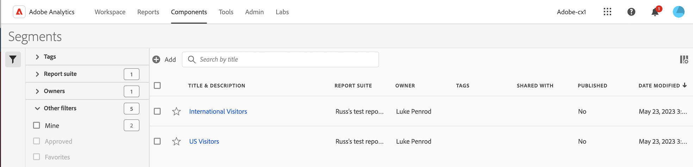

# Segments manager

The Segment Manager offers many ways of curating segments, such as sharing, filtering, tagging, approving, copying, deleting, and marking as favorites.

The Analytics Segment Manager shows you all the segments you own and that have been shared with you. Admin-level users can see all segments in the organization. This overview presents the user interface and the capabilities of the Segment Manager. 

## Access the Segment Manager

1. In Adobe Analytics, select the **[!UICONTROL Components]** tab, then select **[!UICONTROL Segments]**.

   Or 

   In an existing report, select the Segments icon  in the left navigation, then select **[!UICONTROL Manage]**.

## Available actions in the Segment Manager

In the Segment Manager, you can:

* [Filter segments](/help/components/segmentation/segmentation-workflow/t-seg-filter.md)

* [Mark segments as favorites](/help/components/segmentation/segmentation-workflow/t-seg-favorite.md)

* [Approve segments](/help/components/segmentation/segmentation-workflow/seg-approve.md)

* [Tag segments](/help/components/segmentation/segmentation-workflow/seg-tag.md)

* [Share segments](/help/components/segmentation/segmentation-workflow/t-seg-share.md)

* Export a segment to a CSV file.

* [Copy segments](/help/components/segmentation/segmentation-workflow/seg-copy.md)

* [Delete segments](/help/components/segmentation/segmentation-workflow/seg-delete.md)

## Configure columns

You can configure the information displayed for each segment in the Segment Manager by configuring the columns that are displayed.

To configure the visible columns in the Segment Manager:

1. In Adobe Analytics, select the **[!UICONTROL Components]** tab, then select **[!UICONTROL Segments]**. 

1. In the Segment Manager, select the **Customize columns** icon , then select the columns that you want to be displayed in the Segment Manager.

   The following columns are available:

   | Column title | Description  |
   |---|---|
   | Title and description | These values are provided in the Segment builder. To edit the title and description, select the title link to open the Segment builder.  |
   | Favorites  | Displays star icons next to each segment, allowing you to mark segments as favorites. For more information, see [Mark segments as favorites](/help/components/segmentation/segmentation-workflow/t-seg-favorite.md). |
   | Report suites  | This column indicates in which report suite the segment was last saved.  |
   | Owner  | Indicates who owns the segment. As a non-Admin, you can see only segments you own or those that were shared with you.  |
   | Tags (not checked in column selector, hence column not appearing)  | Tags that were applied to the segment, either by you or by people who shared the segment with you.  |
   | Shared with  | Lists individuals or groups (Admin only) or All (Admin only) that you shared the segment with. 
When a segment is being shared by you or with you, a share icon displays next to the segment name.
|
   | Date modified  | Shows the date that the segment was last modified.  |
   | Used in | Shows in which of the following component types the segment is currently being used: <ul><li>Alerts</li><li>Calculated metrics</li><li>Projects</li><li>Scheduled projects</li><li>Segments</li></ul> For example, if the segment is being used in 40 projects and 2 alerts, this column shows [!UICONTROL **Alerts (2), Projects (40)**]. 
This information can help you determine whether a segment is valuable to users in your organization, or whether it should be deleted.

You can use the [Data Dictionary](/help/analyze/analysis-workspace/components/data-dictionary/data-dictionary-overview.md) along with this information to help you keep track of and better understand how components are being used in your organization. |
   | Last used | Shows the date when the segment was last used in any of the following component types: <ul><li>Alerts</li><li>Calculated metrics</li><li>Projects</li><li>Scheduled projects</li><li>Segments</li></ul> 
This information can help you determine whether a component is valuable to users in your organization, or whether it should be deleted.

You can use the [Data Dictionary](/help/analyze/analysis-workspace/components/data-dictionary/data-dictionary-overview.md) along with this information to help you keep track of and better understand how components are being used in your organization. |
   
   {style="table-layout:auto"}

## How-To Video {#section_B3C5DA22DC5248DBA17C56E03DA2D4F2}

This [Adobe Analytics video](https://experienceleague.adobe.com/docs/analytics-learn/tutorials/components/segmentation/segment-management-and-sharing.html) gives a short overview of how to use the Segment Manager.

