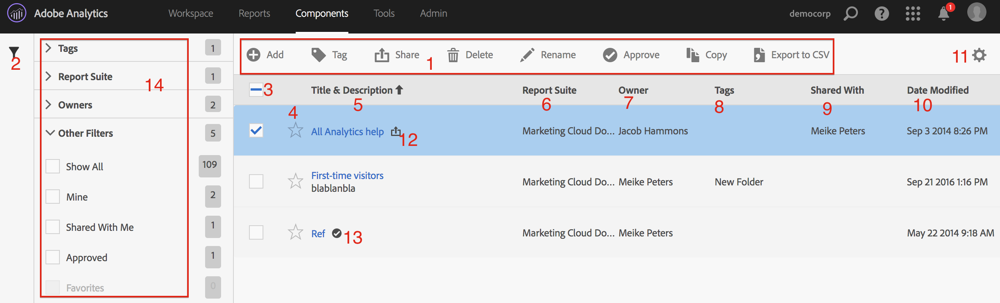

# Manage segments

The Segment Manager offers many ways of curating segments, such as sharing, filtering, tagging, approving, copying, deleting, and marking as favorites.

The Analytics Segment Manager shows you all the segments you own and that have been shared with you. Admin-level users can see all segments in the organization. This overview presents the user interface and the capabilities of the Segment Manager. Access the Segment Manager by

* Going to **[!UICONTROL Analytics]** > **[!UICONTROL Components]** > **[!UICONTROL Segments]** in the top navigation.
* Displaying an existing report and clicking the Segments icon   in the left navigation. Then click **[!UICONTROL Manage]**.

## How-To Video {#section_B3C5DA22DC5248DBA17C56E03DA2D4F2}

This [Adobe Analytics video](https://experienceleague.adobe.com/docs/analytics-learn/tutorials/components/segmentation/segment-management-and-sharing.html) gives a short overview of how to use the Segment Manager.

## Segment Manager User Interface {#section_7FDCD12949BE4741A402DB83AB7B37DF}

|  #  | UI Feature  | Description  |
|---|---|---|
|  1  | Segment Management Tool Bar  | Once you have checked a segment, this tool bar appears. Most management tasks can be completed from this tool bar.  |
|  2  | Show Filters  | Clicking the filter icon brings up the filter menu. You can filter by Tags, Owners, Show All (Admin only), Mine, Favorites, Approved, and Shared with Me.  |
|  3  | Check boxes  | Check a segment in order to manage it.  |
|  4  | Favorites  | Clicking the star next to a segment turns the star yellow and marks the segment as a favorite.  |
|  5  | Segment titles and descriptions  | Provided in the Segment Builder. To edit the title and description, click the title link - this takes you back to the Segment Builder.  |
|  6  | Report Suites  | This column indicates in which report suite the segment was last saved.  |
|  7  | Owner  | Indicates who owns the segment. As a non-Admin, you can see only segments you own or those that were shared with you.  |
|  8  | Tags (not checked in column selector, hence column not appearing)  | Tags that were applied to the segment, either by you or by people who shared the segment with you.  |
|  9  | Shared with  | Lists individuals or groups (Admin only) or All (Admin only) that you shared the segment with.  |
|  10  | Date Modified  | Shows the date that the segment was last modified.  |
|  11  | Column selector  | Lets you select or deselect columns in the Segment Manager.  |
|  12  | Shared icon  | Indicates that this segment is shared by you or with you.  |
|  13  | Approved icon  | Indicates that this segment has been approved by an Administrator.  |
|  14  | Filters  | Lets you see and select the filters under Tags, Report Suites, Owners, and Other (Show All, Mine, Shard with Me, Approved, Favorites.)  |
