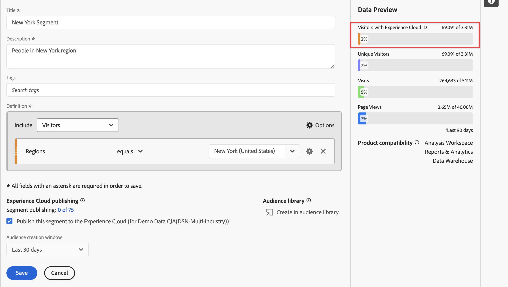
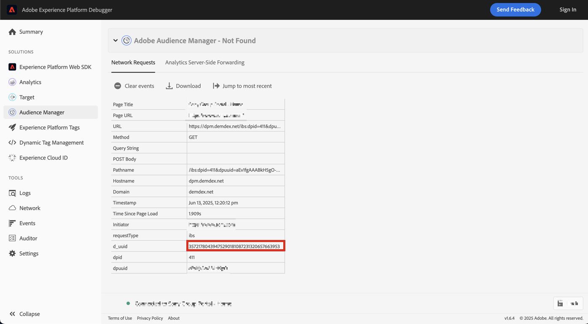
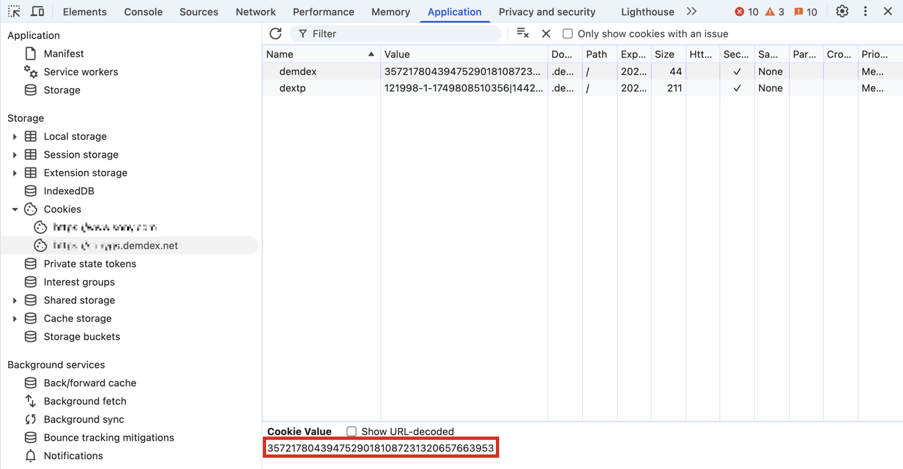
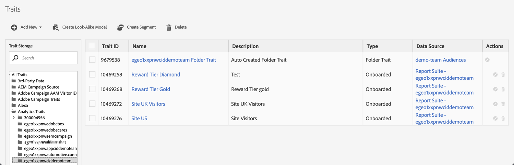
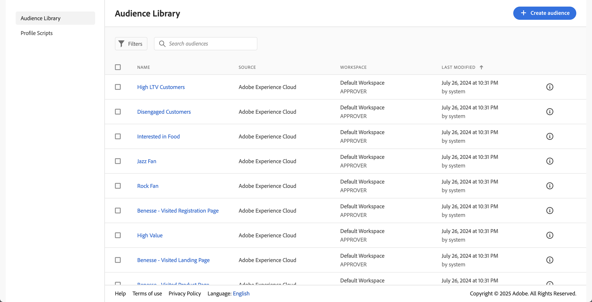

# Publish segments {#publish-segments}

>[!CONTEXTUALHELP]
>id="components_segments_publishing"
>title="Experience Cloud publishing"
>abstract="You can publish the audience to the Audience Library where the audience can be used for marketing activities in Target and other Experience Cloud solutions."

>[!CONTEXTUALHELP]
>id="components_segments_audiencelibrary"
>title="Audience Library"
>abstract="Segments created in Audience Library are available instantly and are not dependent on Analytics updates."

You can publish an Adobe Analytics segment to the Experience Cloud. So, you can use the segment for marketing activity in [!DNL Audience Manager] and in other activation channels, including [!DNL Advertising Cloud], [!DNL Target], and [!DNL Campaign]. 

You can publish Analytics segments to Experience Cloud in under 8 hours. Use these segments to activate audiences in Audience Manager to all downstream destinations. 

>[!BEGINSHADEBOX]

See  [Publish segments](https://experienceleague.adobe.com/en/docs/analytics-learn/tutorials/integrations/experience-cloud/improved-experience-cloud-audience-publishing){target="_blank"} for a demo video.

>[!ENDSHADEBOX]

>[!NOTE]
>
>Adobe Campaign (Classic and Standard) behaves differently in that it incurs an additional 24-hour latency on top of the 8-hour latency.

## Prerequisites

* Ensure that the report suite that you are saving this segment to is [enabled for Experience Cloud](/help/components/segmentation/segmentation-workflow/seg-publish.md). Otherwise, you cannot publish it to Experience Cloud.
* Ensure that your organization is using Experience Cloud IDs.
* Before you can publish segments, your Admin needs to assign the [!UICONTROL Segment Publishing] permission to a product profile in the [Admin Console](https://experienceleague.adobe.com/en/docs/core-services/interface/administration/admin-tool-experience-cloud), and add you to the product profile.

## Considerations

* **Report Suite limits**: You can publish up to 75 segments per report suite. This limit is enforced. If you already have 75 segments published, you cannot publish any additional segments until you un-publish enough segments to get below the 75-segment threshold.
* **Membership limits**: Audiences shared to the [!DNL Experience Cloud] from Adobe Analytics cannot exceed 20 million unique members.
* **Data Privacy**: Audiences are not filtered based on the authentication state of a visitor. A visitor might be able to browse your site in un-authenticated and authenticated states. Actions that occur when a visitor is un-authenticated can still cause a visitor to be included in an audience. Review [Adobe Experience Cloud privacy](https://www.adobe.com/privacy/experience-cloud.html) to understand the full privacy implications of audience sharing.
* For a discussion about the **differences between segments in [!DNL Adobe Analytics] and [!DNL Audience Manager]**, see [Understand segments in Analytics and Audience Manager](/help/integrate/c-audience-analytics/aam-analytics-segments.md).

## Segment publishing timeline

|  What's available  | When it's available | Where it's available |
|---|---|---|
| Meta data (segment title and definition) | Immediately after publishing | [!DNL Audience Manager], [!UICONTROL Experience Cloud Audience Library], [!DNL Target] |
| Usable segment with membership | ~ 8 hours after publishing | Visitor Profile Viewer in [!DNL Audience Manager] |
| Trait and membership population | Within 24-48 hours | [!DNL Audience Manager] |

>[!NOTE]
>Once a week, all data is fully synced to account for any deltas or discrepancies not captured in the previous week.

## Publish segments in [!UICONTROL Segment builder]

1. In Adobe Analytics, go to **[!UICONTROL Components]** > **[!UICONTROL Segments]**
1. Select **[!UICONTROL Add]** to create a new segment.
   
1. Provide a title and a description for the segment. These fields are required before you can save the segment.
1. In the **[!UICONTROL Experience Cloud publishing]** section, select the option **[!UICONTROL Publish this segment to the Experience Cloud (for *report suite*)]**.

   >[!IMPORTANT]
   >
   >Make sure that you monitor **[!UICONTROL Visitors with Experience Cloud ID]** in the **[!UICONTROL Data Preview]** instead of the **[!UICONTROL Unique Visitors]**  when you compare Adobe Analytics numbers to Audience Manager numbers.
   >

|  Element | Description |
|---|---|
| **[!UICONTROL Publish this segment to the Experience Cloud (for *report suite*)]** | When this option is enabled, the segment title and definition are shared with Experience Cloud instantaneously, while the segment membership is evaluated and shared every 4 hours.   When that audience is associated with an activity in [!DNL Target], for example, [!DNL Analytics] begins sending IDs for visitors that qualify for that Experience Cloud and [!DNL Target] audience. At that point, the audience name and corresponding data begin displaying on the [!DNL Audience Library] page in Experience Cloud.   |
| **[!UICONTROL Audience Creation Window]**| The time frame that you select is used to create the audience on a rolling-calendar basis. For example, **[!UICONTROL Last 30 days]** (default) includes visitors that have qualified for the audience over the last 30 days from today's date (NOT from the original date when the segment was created). |
| **[!UICONTROL Create in Audience Library]** | The segments that you create and publish can be made available without latency on the [!DNL Audience Library] page in Experience Cloud. They are not dependent on Analytics updates. These segments do not count against your limit of 75 published segments. |
| **[!UICONTROL x of 75 Published]** | The number of segments that you have published to Experience Cloud. Click the link to see a list of published segments and their associated report suite and owner. |
| **[!UICONTROL Save]** | Saves this segment. |

## Unpublish or delete segments

>[!CAUTION]
>
>To delete a segment that has been published to Experience Cloud, you have to unpublish the segment first. To unpublish a segment, just unselect **[!UICONTROL Publish this segment to the Experience Cloud (for *report suite*)]**.

>[!NOTE]
>
>You **cannot** unpublish a segment that is currently in use by any of the following Adobe solutions: [!DNL Analytics] (in [!DNL Audience Analytics]), [!DNL Campaign], [!DNL Advertising Cloud] (for [!DNL Core Service] & [!DNL Audience Manager] customers) and all other external partners (for [!DNL Audience Manager] customers). You **can** unpublish a segment that is in use by [!DNL Target].

## View the publishing status of segments

The maximum number of publishable Adobe Analytics segments is 75. 

To view published segments:

1. In Adobe Analytics, go to **[!UICONTROL Components]** > **[!UICONTROL Segments]**.

1. View the **[!UICONTROL Published]** column. **[!UICONTROL Yes]** in this column indicates that the segment is published to Experience Cloud. **[!UICONTROL No]** indicates that the segment is not published.

## Retrieve the [!DNL Audience Manager] UUID

There are two ways to capture the Adobe Audience Manager UUID currently associated with the browser:

* Adobe Experience Cloud Debugger
* Native developer tool in browsers (for example, Chrome Developer Tools)

The following screenshots show you how to retrieve the Adobe Audience Manager UUID in your browser and use it in Audience Manager Visitor Profile Viewer to validate trait & segment membership.

### Method 1: Use Adobe Experience Cloud Debugger

1. Download and install [Adobe Experience Cloud Debugger](/help/implement/validate/debugger.md) in the Chrome Web Store.
1. Launch the debugger when loading a page.
1. Scroll to the Audience Manager section and find the Adobe Audience Manager UUID set on the current browser page
(`35721780439475290181087231320657663953` in the example below)

   

### Method 2: Use Chrome Developer Tools (or other browser developer tools)

1. Launch Chrome Developer Tools before loading a page
1. Load the page and check Applications > Cookies. The Adobe Audience Manager UUID should be set in the third-party
Demdex cookie ([adobe.demdex.net](https://experienceleague.adobe.com/en/docs/audience-manager/user-guide/reference/demdex-calls) in the example below). The field demdex is the Adobe Audience Manager UUID set
on the browser (`35721780439475290181087231320657663953` in the example below).

   

## Use Audience Manager [!UICONTROL Visitor Profile Viewer]

The Adobe Audience Manager UUID on the browser is by default when [!UICONTROL Visitor Profile Viewer] is loaded. If you verify trait realizations for other users, input a UUID in the UUID field and click [!UICONTROL Refresh]. Refer to [Visitor Profile Viewer](https://experienceleague.adobe.com/en/docs/audience-manager/user-guide/features/visitor-profile-viewer) for more information.

## View the segment traits in [!DNL Audience Manager]

In Adobe Audience Manager, the list of visitors with ECIDs for a given segment is evaluated while Analytics shares segments with Experience Cloud.

1. In [!DNL Audience Manager], go to **[!UICONTROL Audience Data]** > **[!UICONTROL Traits]** > **[!UICONTROL Analytics Traits]**. You see a folder for each Analytics reports suite that is mapped to your Experience Cloud organization. These folders (for Traits, Segments, and Data Sources) get created when the Profiles and Audiences/People core service gets initiated or provisioned.
1. Select the folder for the report suite in which you previously created the segment you wanted to share with [!DNL Audience Manager]. You see the segment/audience you created. When you share a segment, 2 things happen in [!DNL Audience Manager]:
   * A trait gets created, first with no data in it. Approx. 8 hours after the segment gets published in [!DNL Analytics], the list of ECIDs gets onboarded and shared with [!DNL Audience Manager] and other Experience Cloud solutions.

        

   * A one-trait segment gets created. It uses the data source that is associated with the report suite where you published the segment.
   * Trait expiration is now set to 16 days (previously it was 2 days).

## View the segment in [!DNL Adobe Target]

The **[!UICONTROL Publish this segment to the Experience Cloud]** allows the segment to be available within the Adobe Target's custom audience library. A segment created in Analytics or Audience Manager can be used for activities in Target. For example, you can create campaign activities based on Analytics conversion metrics and audience segments created in Analytics.

In Adobe Target:

1. Select **[!UICONTROL Audiences]**.
1. On the **[!UICONTROL Audiences]** page, locate the audience sourced from the [!DNL Experience Cloud]. These audiences are available for use in [!DNL Target] activities.

   
