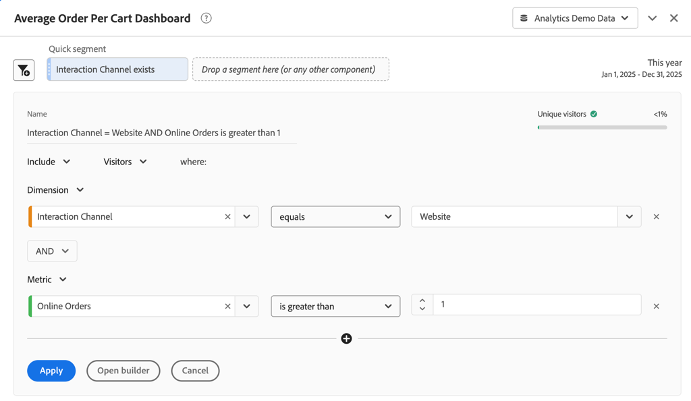

# Quick segments

Quick segments allow you to explore data within a Workspace project quickly, without the need to create a segment in the [Segment builder](seg-create.md). 

>[!BEGINSHADEBOX]

See  [Quick segments in Analysis Workspace](https://video.tv.adobe.com/v/341466/?quality=12&learn=on){target="_blank"} for a demo video.

>[!ENDSHADEBOX]

When you want to use quick segments, please note that:

* Quick segments are created directly in a Workspace project. As a result, a quick segment applies only to the Workspace project in which you create the quick segment. The quick segments in your Workspace project are not available in other projects and cannot be shared to other users. 
* You can only specify three conditions as part of a quick segment.
* Quick segments do not support nested containers or sequential conditions.
* You can edit quick segments within a shared Workspace project. So, other users can edit the quick segments in a Workspace project you have shared with these users.

## Create

Quick segments apply to panels. You can create one or more quick segments for every panel in your Workspace project. Any user in Analysis Workspace can create quick segments. 

To create a quick segment:

* Select  at the top of the panel.  Then, directly edit the segment in the [Quick segment builder](#quick-segment-builder).
* Drag a component from the component panel to the segment drop zone in the panel header. Once dropped, hover over the segment and select  to edit the segment in the [Quick segment builder](#quick-segment-builder).

When you create a quick segment using drag and drop, note that:

* Not all component types are supported. Calculated metrics are not supported, and only dimensions and metrics from which you can build segments are supported.
* For dimensions and metrics components, the [Quick segment builder](#quick-segment-builder) creates automatically an **[!UICONTROL exists]** conditions. For example, if you drag and drop **[!UICONTROL City]**, the condition **[!UICONTROL City]** **[!UICONTROL exists]** is created.
* For dimension values, the [Quick segment builder](#quick-segment-builder) automatically creates an **[!UICONTROL equals]** condition. For example, if you drag and drop **[!UICONTROL amsterdam]** from the **[!UICONTROL City]** dimension items, the condition **[!UICONTROL City]** **[!UICONTROL equals]** `Amsterdam` is created.
* If you drag and drop **[!UICONTROL unspecified]** or **[!UICONTROL none]**, the [Quick segment builder](#quick-segment-builder) automatically creates a **[!UICONTROL does not exist]** condition.

Quick segments you create appear at the top of the panel. Quick segments do have a light blue thin left bar. When a quick segment is in edit mode using the [Quick segment builder](#quick-segment-builder), the background of the Quick segment is light blue.

The results of the quick segments you create in a panel are applied (using AND logic) to all the visualizations that are part of the panel.

## Manage

To manage a quick segment, hover over the specific **[!UICONTROL Quick segment]**.

* Select  to open the [Quick segment builder](#quick-segment-builder) and edit the quick segment.
* Select  to open a popup. The popup displays information about the segment. You can select **[!UICONTROL Make available to all projects and add to your component list]** To add the segment to the  **[!UICONTROL Segments]** component list in the component panel. You see a **[!UICONTROL Save quick segment]** dialog, prompting you to specify a name for the segment. Select **[!UICONTROL Save]** to continue. Your [!UICONTROL Quick segment] turns into a **[!UICONTROL Segment]**. You cannot edit the segment any more using the [Quick segment builder](#quick-segment-builder). Instead, you have to edit the segment as a regular segment, using the [Segment builder](seg-build.md).

## Quick segment builder

See below for an example of the Quick segment builder. In the example, the builder is opened for a quick segment titled `Interaction Channel = Website  AND Online Orders is greater than 1`. The quick segment at the top does apply to the **[!UICONTROL Average Order Value Dashboard]** panel and all visualizations within.

The quick segment builder consists of the following areas and buttons.

### Header area 

The header area determines the name, type and scope of the quick segment. It also displays a visual for the results of the quick segment.

| Element | Description | 
|---|---|
| **[!UICONTROL Name]** | The name is automatically derived from the quick segment definition. |
| **[!UICONTROL People]**    | Preview visual of the data resulting from the quick segment. A bar and percentage provide insight in how much of the overall data is part of the result of the quick segment. A  signals that the quick segment does not return data. |
| **[!UICONTROL Include]** **[!UICONTROL Exclude]** | Select from the drop-down  whether you want to include or exclude the results of the quick segment from the data in the panel. |
| **[!UICONTROL Event]** **[!UICONTROL Session]** **[!UICONTROL Person]** | Select from the drop-down menu  the scope of the quick segment. |

### Condition area 

The condition area specifies the conditions (up to a maximum of three). For each condition you can specify the following:

| Element | Description | 
|---|---|
| **[!UICONTROL Dimension]** **[!UICONTROL Metric]** **[!UICONTROL Date range]** | Select from the drop-down menu  whether you want to specify a condition for a dimension, metric or date range. |
| **[!UICONTROL *component*]** | The component field for the condition. You can [!UICONTROL *Type to add*] a component, select a component from the list, or you can drag and drop a component from the component panel. You can only drop similar components on the component field of the condition. For example, you can only drop a dimension component from the component panel on a dimension condition.  You can also drag and drop to replace an existing component. Select  to delete the component from the component field. | 
| **[!UICONTROL *operator*]** | The operator for the component. See [Operators](../seg-reference/seg-operators.md) for more information. Only available for dimensions and metrics. |
| **[!UICONTROL *value*]** | The value for the condition. Depending on the operator selected, the value can be selected from a list or you enter a value. |
|  | Select to delete a condition from the quick segment. |

### Buttons

| Button | Description |
|---|---|
| **[!UICONTROL AND]** **[!UICONTROL OR]** | Only available when you define more than one condition. Select from the drop-down menu  between the conditions. The selection determines the boolean logic for the quick segment. You cannot mix logic when having three conditions. The boolean logic is either **[!UICONTROL AND]** or **[!UICONTROL OR]**. |
|  | Adds another condition to your quick segment. This button is only available when you have defined one or two conditions for the quick segment. |
| **[!UICONTROL Apply]** | Apply the changes to the quick segment. |
| **[!UICONTROL Open builder]** | You are prompted for confirmation with an **[!UICONTROL Are your sure?]** dialog. If you select **[!UICONTROL OK]**, you can no longer modify your segment in the [Quick segment builder](#quick-segment-builder) Your quick segment is renamed to **[!UICONTROL Segment]** and now has a darker blue thin left bar. The regular [Segment builder](seg-build.md) opens with the option to **[!UICONTROL Make this segment available to all your projects and add it to your component list]**. <ul><li>If you select this option and select **[!UICONTROL Apply]**, the segment is added to the  **[!UICONTROL Segment]** component list in the component panel.</li><li>If you do not select this option and select **[!UICONTROL Apply]**, the segment remains a Workspace project-only segment.</li></ul> | 
| **[!UICONTROL Cancel]** | Select to cancel the creation or edit of a quick segment. |

## Quick segments versus segments

Quick segments are exactly what they are named. You can create and edit quick segments quickly inline and see the effects immediately in your panel. 

Segments do have the following advantages compared to quick segments.

* Segments can be made available across all your Workspace projects
* Segments support more complexity using nested and hierarchical [containers](../seg-containers.md), and sequences (using [sequential segments](seg-sequential-build.md).
