# Sequential segments

You create sequential segments using the [!UICONTROL Then] logical operator between components, containers and components, or containers. The [!UICONTROL Then] logical operator implies that one segment condition occurs, followed by another. 

Additionally, you can constrain sequential segments to a specific duration of time, granularity, and counts between checkpoints using the **[!UICONTROL After]** and **[!UICONTROL Within operators]**.

>[!BEGINSHADEBOX]

See  [Sequential segmentation](https://experienceleague.adobe.com/en/docs/analytics-learn/tutorials/components/segmentation/sequential-segmentation){target="_blank"} for a demo video.

>[!ENDSHADEBOX]

A sequential segment has some [basic functionality](#basics) and additional options that you can configure to add more complexity to the sequential segment:

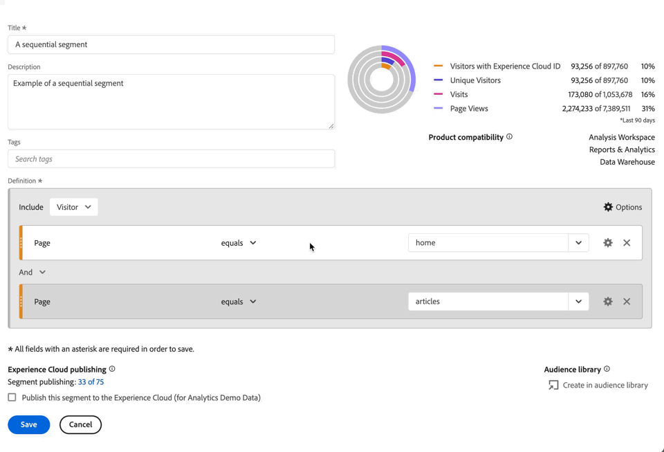

## Basics

The basics of building a sequential segment are no different than building a regular segment using the [Segment builder](seg-build.md). A regular segment becomes a sequential segment automatically as soon as you select the **[!UICONTROL Then]** operator in the main definition or in any of the containers you use within the [Segmentation builder](seg-build.md).

### Examples

The examples below illustrate how you use sequential segments in various use cases.

#### Simple sequence

Identify visitors who viewed a page and then viewed another page. The hit-level data is segmented using this sequence. Irrespective of previous, past, or interim visitor visits, or the time or number of page views occurring between the visits.

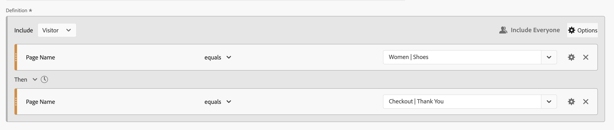

#### Sequence across visits

Identify visitors who viewed a page in one visit, then viewed another page in another visit. To differentiate between visits, use containers to build the sequence and define  **[!UICONTROL Visit]** level for each container.

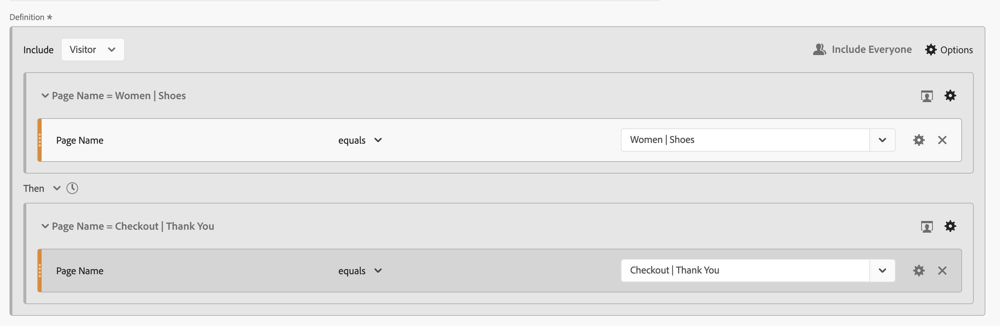

#### Mixed-level sequence

Identify visitors who view two pages across an undetermined number of visits, and then view a third page in a separate visit. Again, use containers to build the sequence and define  **[!UICONTROL Visit]** level on the container that defines the separate visit.

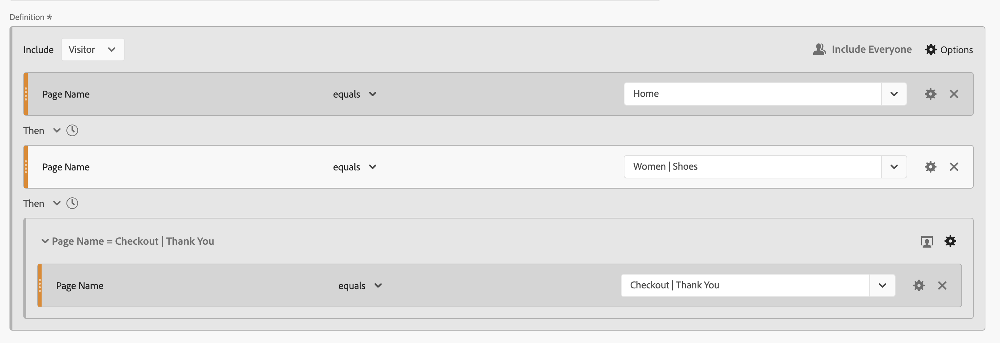

#### Aggregate sequence

Identify visitors who at their first visit visited a specific page and then later visited some other pages. To differentiate between the sequence of hits, use containers to separate the logic on a  **[!UICONTROL Visit]** container level.

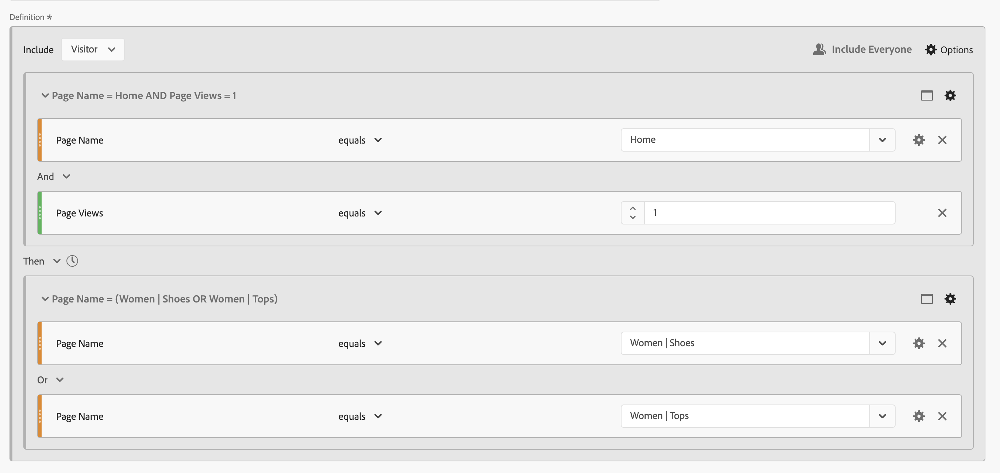

#### Nest a sequence

Identify all visits where a visitor visits one page before another page and then have follow-up visits that involve two other pages. For example, identify all visits where a visitor first visits the home page, then a category 1 page and then has other visits where in each visit the category 2 and category 3 page are visited.

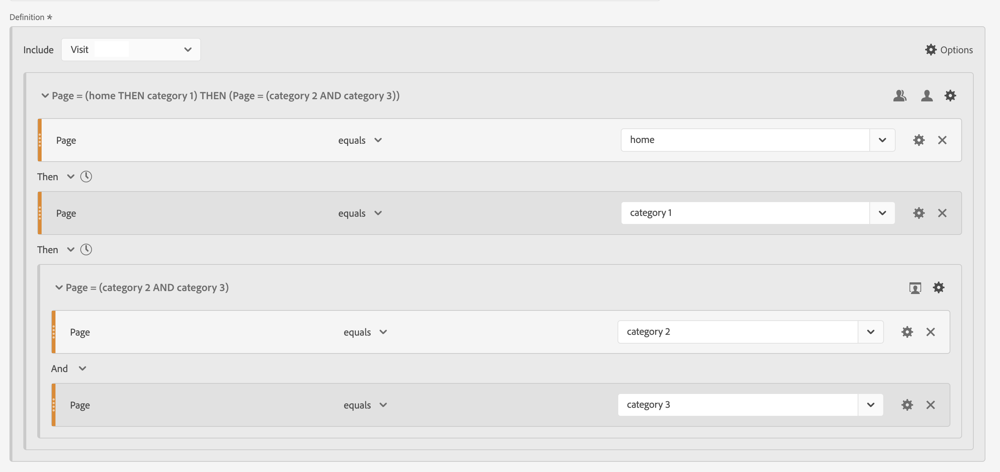

## [!UICONTROL After] and [!UICONTROL Within]

You can use  **[!UICONTROL After]** and  **[!UICONTROL Within]** the **[!UICONTROL Then]** operator to define additional [time constraints](#time-constraints) or [constraints for Hits, Visits or Dimensions](#event-session-and-dimension-constraints).

### Time constraints

To apply time constraints to the **[!UICONTROL Then]** operator:

  1. Select .
  1. Select **[!UICONTROL Within]** or **[!UICONTROL After]** from the context menu.
  1. Specify a time period (**[!UICONTROL Minute]**, **[!UICONTROL Hour]**, up until **[!UICONTROL Years]**). 
  1. Select the  **[!UICONTROL *number*]** to open a popup that allows you to type in or specify a number using **[!UICONTROL -]** or **[!UICONTROL +]**.

To remove a time constraint, use .

The table below explains in more detail the time constraint operators.

|  Operators | Description |
|--- |--- |
| **[!UICONTROL After]** |The [!UICONTROL After] operator is used to specify a minimum limit on the amount of time between two checkpoints. When setting the After values, the time limit begins when the segment is applied. For example, if the [!UICONTROL After] operator is set on a container to identify visitors who visit page A, but don't return to visit page B until after one day, then that day will start when the visitor leaves page A.  For the visitor to be included in the segment, a minimum of 1440 minutes (one day) must transpire after leaving page A to view page B. |
| **[!UICONTROL Within]** | The [!UICONTROL Within] operator is used to specify a maximum limit on the amount of time between two checkpoints. For example, if the [!UICONTROL Within] operator is set on a container to identify visitors who visit page A, and then return to visit page B within one day, then that day begins when the visitor leaves page A. To be included in the segment, the visitor has a maximum time of one day before opening page B. For the visitor to be included in the segment, opening page B must occur within a maximum of 1440 minutes (one day) after leaving page A to view page B.|
| **[!UICONTROL After but Within]** | When using both the [!UICONTROL After] and [!UICONTROL Within] operators, both operators start and end in parallel, not sequentially.  For example, you build a segment with the container set to: `After = 1 Week(s) and Within = 2 Week(s)`. The conditions to identify visitors in this segment are met only between one and two weeks. Both conditions are enforced from the time of the first page view. |

#### Examples

Some examples of using the time constraints.

##### [!UICONTROL After] operator 

Identify visitors that visited one page and then another page only after two weeks. For example, visitors who have visited the Home page, but the Women | Shoes page only after two weeks.

If a page view for the Home happens on June 1, 2024, at 00:01, then a page view to page Women | Shoes will match as long as that page view occurs after June 15, 2024 00:01.

##### [!UICONTROL Within] operator

Identify visitors that visited one page and then another page within five minutes. For example, visitors that visited the Home page and then the Women | Shoes page within 5 minutes.

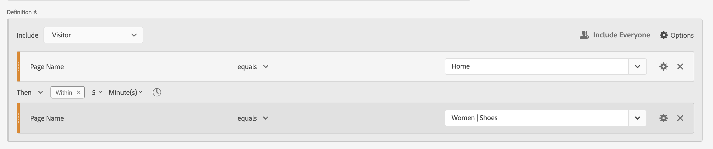

If a page view for the Home happens on June 1, 2024, at 12:01, then a page view to page Women | Shoes will match as long as that page view occurs before June 15, 2024 12:16.

##### [!UICONTROL After] but [!UICONTROL Within] operator

Identify visitors who visited one page then visited another page after two weeks but within one month. For example, visitors who visited the Home page and then after two weeks and within one month the Women | Shoes page.

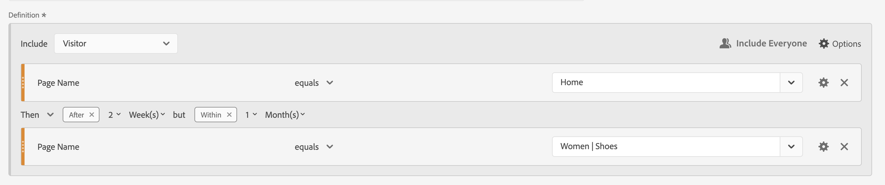

Any visitors hitting the Home page on June 1, 2024 and who are returning to visit the Women | Shoes page after June 15, 2019 00:01, but before July 1, 2019 qualify for the segment.

### [!UICONTROL Hit], [!UICONTROL Visit] and [!UICONTROL Dimension] constraints

The  **[!UICONTROL After]** and  **[!UICONTROL Within]** constraints allow you not only to specify a time constraint but also a hit, visit or dimension constraint. Select **[!UICONTROL Hit(s)]**, **[!UICONTROL Visit(s)]** or **[!UICONTROL Other dimensions]**  **[!UICONTROL *Dimension name*]**. You can use the [!UICONTROL *Search*] field to search for a dimension.

#### Example

Below is an example of a sequential segment looking for visitors that visited one product category page (Women | Shoes), followed by a checkout page (Checkout | Thank You) within one page.

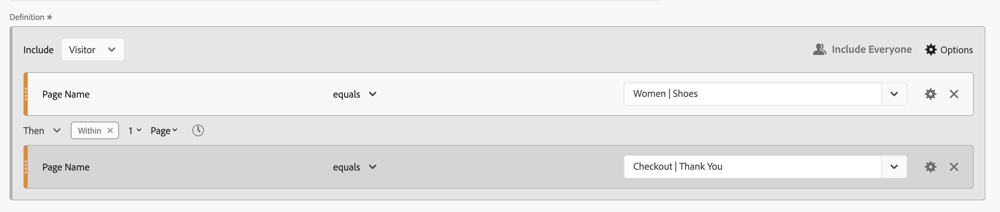

The following example sequences match or do not match:

| Sequence |  |
|--- | :---: |
| Page `Women \| Shoes` followed by page `Checkout \| Thank You` |  |
| Page `Women \| Shoes` followed by page `Women \| Tops` followed by page `Checkout \| Thank You` |  |

## [!UICONTROL Include]

You can specify what data to include in your sequential segment or in a sequential container that is part of your sequential segment. 

### [!UICONTROL Everyone] {#include_everyone}

To create a sequential segment that includes everyone, select the option  **[!UICONTROL Include Everyone]**.

The sequential segment identifies data which matches the given pattern as a whole.  Below is an example of a basic sequence segment looking for visitors who visited one product category page (Women | Shoes), followed by a checkout page (Checkout | Thank You). The segment is set to  **[!UICONTROL Include Everyone]**.

The following example sequences match or do not match:

| | Sequence |  |
|---:|--- | --- |
| 1 | `Women \| Shoes` then `Checkout \| Thank You` in the same visit |  |
| 2 | `Women \| Shoes` then `Men \| Shoes` then `Checkout \| Thank You` (across different visits) |   |
| 3 | `Checkout \| Thank You` then `Women \| Shoes` |  |

### [!UICONTROL Only Before Sequence] and [!UICONTROL Only After Sequence]

The options  **[!UICONTROL Only Before Sequence]** and  **[!UICONTROL Only After Sequence]** segment the data to a subset before or after the specified sequence.

*  **Only Before Sequence**: Includes all data before a sequence and the first data of the sequence itself. If a sequence appears multiple times as part of the data, [!UICONTROL Only Before Sequence] includes the first hit of the last occurrence of the sequence and all prior hits.
*  **Only After Sequence**: Includes all hits after a sequence and the last data of the sequence itself. If a sequence appears multiple times as part of the data, [!UICONTROL Only After Sequence] includes the last hit of the first occurrence of the sequence and all subsequent hits.

Consider a definition specifying a sequence of a component with criteria identified by B, followed (Then) by a component with criteria identified by D. The three options would identify data as follows:

|  B Then D | A  | B  | C  | D  | E  | F  |
|---|:---:|:---:|:---:|:---:|:---:|:---:|
|  Include Everyone  |   |   |   |   |   |   |
|  Only Before Sequence  |   |   |  |  |  |  |
|  Only After Sequence  |  |  |  |   |   |   |

|  B Then D (occurs multiple times)  | A  | B  | C  | D  | B  | C  | D  | E  |
|---|:---:|:---:|:---:|:---:|:---:|:---:|:---:|:---:|
|  Include Everyone  |   |   |   |   |   |   |   |   |
|  Only Before Sequence  |   |   |   |   |   |  |  |  |
|  Only After Sequence  |  |  |  |   |   |   |   |   |

#### Example

You have defined three version of a sequential segment for site sections. One with the option  **[!UICONTROL Include Everyone]**, one with the option  **[!UICONTROL Only Before Sequence]**, and one with the option  **[!UICONTROL Only After Sequence]**. You named the three segments accordingly.

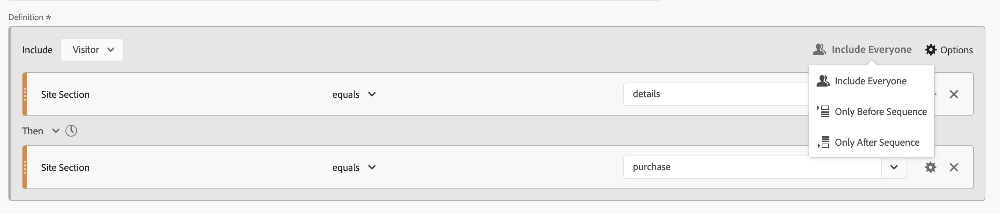

When reporting on site sections using these three segments, the example output in a freeform table looks like:

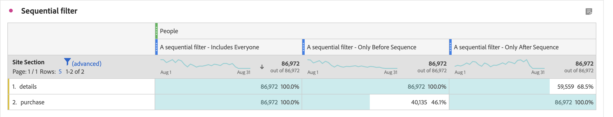

## [!UICONTROL Exclude]

Segment definitions include all data unless you specifically exclude  [!UICONTROL Person],  [!UICONTROL Visit], or  [!UICONTROL Hit] data using **[!UICONTROL Exclude]**. 

[!UICONTROL Exclude] allows you to dismiss common data and create segments with more focus. Exclude also allows you to create segments excluding specific groups of visitors. For example, to define a segment that specifies visitors that placed orders and then excluding that group of visitors to identify *non-purchasers*. A best practice is to create rules that use a broad definition rather than trying to use [!UICONTROL Exclude] to target specific visitors that match specific include values.

Example of exclude definitions are:

* **Exclude pages**. Use a segment definition to strip out a specific page (such as *Home Page*) from a report, create a Hit rule where the page equals `Home Page`, and then exclude the rule. This definition automatically includes all pages except the *Home Page*.
* **Exclude referring domains**. Use a definition that includes only referring domains from Google.com and excludes all others.
* **Identify non-purchasers**. Identify when orders are greater than zero and then exclude the [!UICONTROL Person].

[!UICONTROL Exclude] can be used to identify a sequence where visitors do not be part of specific visits or perform specific hits. [!UICONTROL Exclude] can also be included within a [!UICONTROL Logic Group] (see below).

You can exclude containers, not components. 

### Examples

See below for examples of using [!UICONTROL Exclude].

#### [!UICONTROL Exclude] within

Identify visitors who visited one page, did not visit another page, then visited yet another page. You exclude the container using  [!UICONTROL Exclude]. A thin red bar on the left identifies an excluded container.

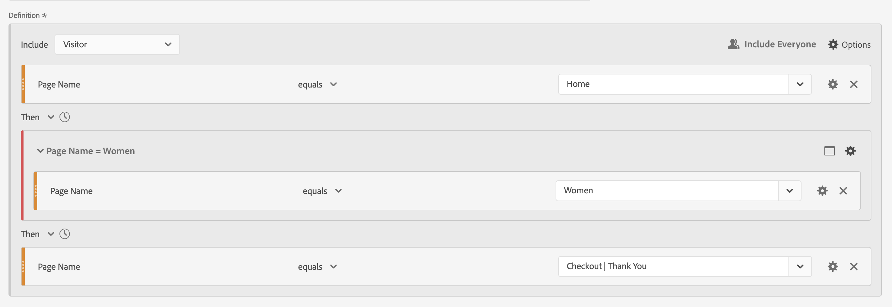

#### [!UICONTROL Exclude] at start

Identify visitors who visited one page without ever going to another page. For example, people that checked out a purchase without ever visited the home page.

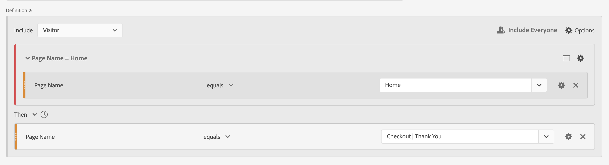

#### [!UICONTROL Exclude] at end

Identify visitors who visited one page but never visited other pages. For example, visitors that visited your home page but never any of your checkout pages.

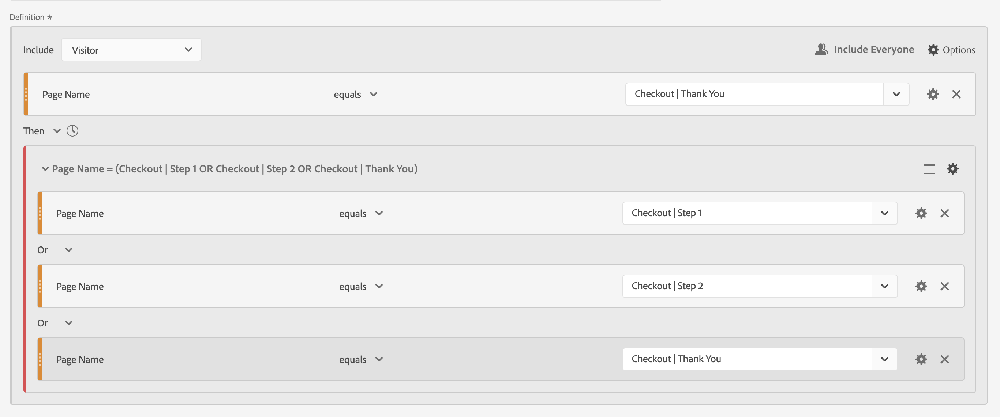

## [!UICONTROL Logic Group]

>[!NOTE]
>
>A [!UICONTROL Logic Group] can only be defined in a sequential segment, meaning that the [!UICONTROL Then] operator is used within the container.

Logic Group enables you to group conditions into a single sequential segment checkpoint. As part of the sequence, the logic defined in the container identified as Logic Group is evaluated after any prior sequential checkpoint and before any following sequential checkpoint. 

The conditions within the Logic Group itself may be met in any order. By contrast, non-sequential containers (hit, visit, visitor) do not require their conditions to be met within the overall sequence, producing possible unintuitive results if used with a **[!UICONTROL Then]** operator.

[!UICONTROL Logic Group] was designed to treat *several conditions as a group, without any ordering* among the grouped conditions. Otherwise stated, the order of the conditions within a Logic Group is irrelevant. 

Some best practices to use Logic Group are:

* To group sequential checkpoints. 
* To simplify the construction of sequential segments.

### Examples

Here are examples on how to use the Logic Group container.

#### Any order

Identify visitors that visited one page, then viewed each page out of another set of pages in any order. For example, visitors that visited the Home page, then visited each of the Men page, the Women page, and the Kids page, irrespective of the order.

You can build this segment without a [!UICONTROL Logic Group], but the construction is going to be complex and laborious. Specify every sequence of pages that the visitor could view. For clarity, only the first container is opened  and the other containers are closed . You can derive the contents of the other containers by the titles.

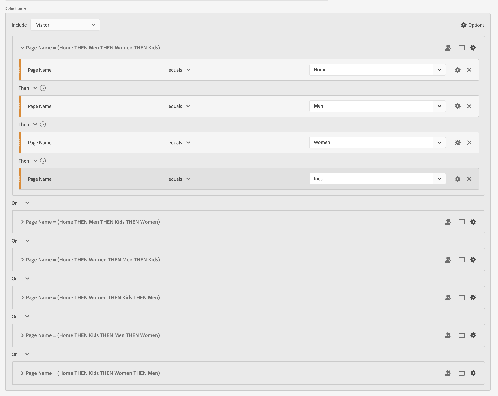

You can use [!UICONTROL Logic Group] to simplify building this segment, as shown below. Ensure you select  **[!UICONTROL Logic Group]** for the container.

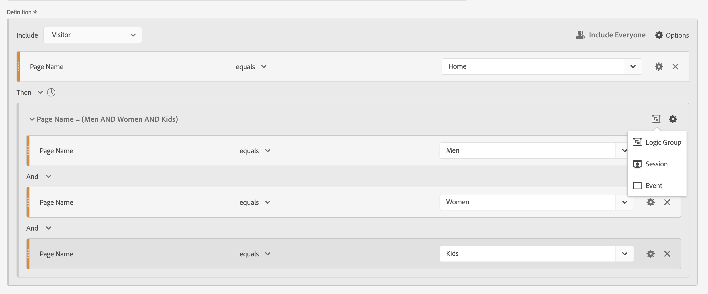

#### First match

Identify visitors that visited one page or another page, then visited yet another page. For example, visitors that visited the Women page or the Men page, then visited the Checkout | Thank You page.

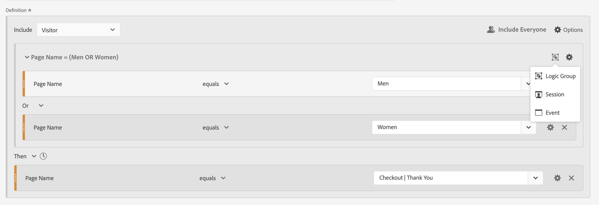

#### [!UICONTROL Exclude] [!UICONTROL And]

Identify visitors that visited one page then explicitly did not visit a set of other pages, but did visit yet another page. For example, visitors that visited the Home Page and did not visit the Men or the Women page but did visit the Kids page.

#### [!UICONTROL Exclude] [!UICONTROL Or]

Identify visitors that visited one page then explicitly did not visit any page of a set of pages, but did visit yet another page. For example, visitors that visited the Home Page and did not visit the Men and the Women page but did visit the Kids page.

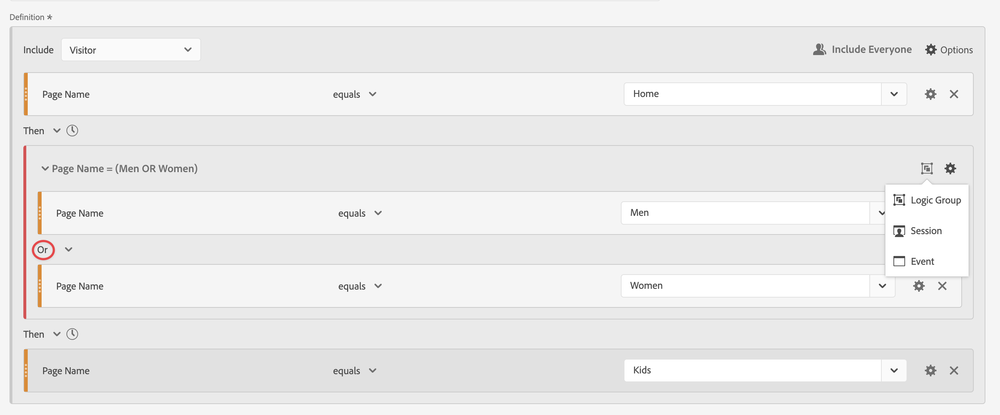

<!--
An example of a complex sequential segment if you want to find the visitors that 

| visit One | visit Two | visit Three |
| --- | --- | --- |
| The visitor went to the main landing page A, excluded the campaign page B, and then viewed the Product page C.| The visitor again went to the main landing page A, excluded the campaign page B, and went again to the Product page C, and then to a new page D. | The visitor entered and followed that same path as in the first and second visits, then excluded page F to go directly to a targeted product on page G. |
-->

## A final example

As a final example, you want to identify visitors that learned about a specific product page, without these visitors ever touched by your Empower Your Move campaign. And in their first visit to your online store viewed the Home page but did not look further at any fitness (gear) products from the Men category. However, on their next visit directly after that, they went to a product page and placed an online order without going through the Home page first.

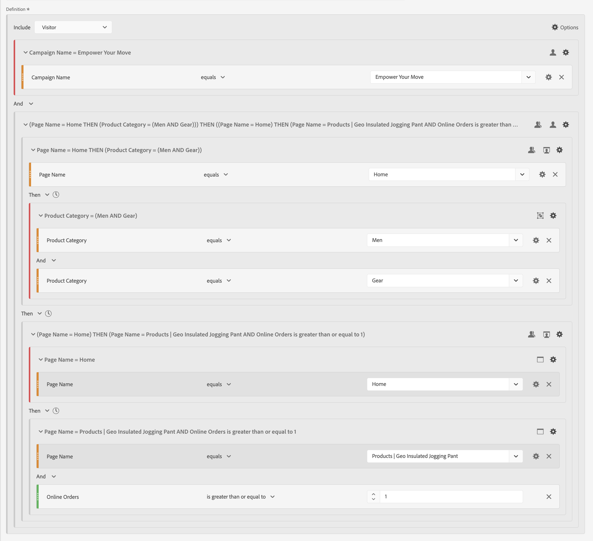

>[!MORELIKETHIS]
>
> * [Mastering Sequential Logic in AA & CJA: Introduction to THEN](https://experienceleaguecommunities.adobe.com/t5/adobe-analytics-blogs/mastering-sequential-logic-in-aa-amp-cja-introduction-to-then/ba-p/738131)
