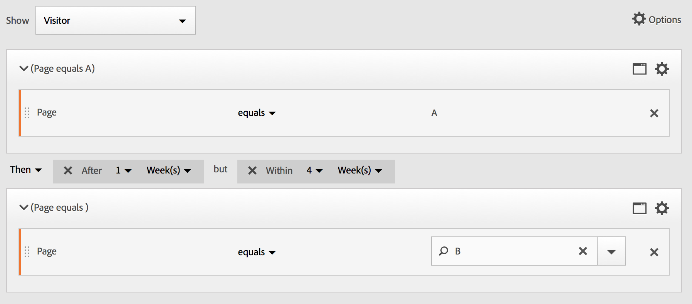

# Build sequential segments

Sequential segments are created by using the THEN operator, instead of AND or OR. THEN implies that one segment criteria occurs, followed by another. By default, a sequential segment identifies all matching data, showing the filter "Include Everyone". Sequential segments can be further filtered to a subset of matching hits using the "Only Before Sequence" and "Only After Sequence" options.

Additionally, you can constrain sequential segments to a&nbsp;specific duration of time, granularity, and counts between checkpoints using the [After and Within operators](/help/components/segmentation/segmentation-workflow/seg-sequential-build.md).

Here is a video on sequential segmentation:

>[!VIDEO](https://video.tv.adobe.com/v/25405/?quality=12)

## Include Everyone {#section_75ADDD5D41F04800A09E592BB2940B35}

When creating a segment where "Include Everyone" is set, the segment identifies paths that match the given pattern as a whole. This is an example of a basic sequence segment looking for one hit (Page A) followed by another (Page B) as visited by the same visitor. The segment is set to Include Everyone.

| If result... | Sequence |
|--- |--- |
| Matches | A then B A then (in a different visit) B A then D then B |
| Does not Match | B then A |

## Only Before Sequence and Only After Sequence {#section_736E255C8CFF43C2A2CAAA6D312ED574}

The options **[!UICONTROL Only Before Sequence]** and **[!UICONTROL Only After Sequence]** filter the segment to a subset of data before or after the specified sequence.

* **Only Before Sequence**: Includes all hits before a sequence + the first hit of the sequence itself (see example 1, 3). If a sequence appears multiple times in a path, "Only Before Sequence" includes the first hit of the last occurrence of the sequence and all prior hits (see example 2).
* **Only After Sequence**: Includes all hits after a sequence + the last hit of the sequence itself (see example 1, 3). If a sequence appears multiple times in a path, "Only After" includes last hit of the first occurrence of the sequence and all subsequent hits (see example 2).

For example, consider a sequence of B -> D. The three filters would identify hits as follows:

**Example 1: B then D appears once** 

|  Example  | A  | B  | C  | D  | E  | F  |
|---|---|---|---|---|---|---|
|  Include Everyone  | A  | B  | C  | D  | E  | F  |
|  Only Before Sequence  | A  | B  |  |  |  |  |
|  Only After Sequence  |  |  |  | D  | E  | F  |

**Example 2: B then D appears multiple times** 

|  Example  | A  | B  | C  | D  | B  | C  | D  | E  |
|---|---|---|---|---|---|---|---|---|
|  Include Everyone  | A  | B  | C  | D  | B  | C  | D  | E  |
|  Only Before Sequence  | A  | B  | C  | D  | B  |  |  |  |
|  Only After Sequence  |  |  |  | D  | B  | C  | D  | E  |

Let's also frame this concept with the Hit Depth dimension.

**Example 3: Hit Depth 3 then 5**

## Dimension Constraints {#section_EAFD755F8E674F32BCE9B642F7F909DB}

In a "within" clause, in between THEN statements, you can add, for example, "within 1 search keyword instance", "within 1 eVar 47 instance". This constrains the segment to within one instance of a dimension.

Setting a 'Within Dimension' clause between rules allows a segment to restrict data to sequences where that clause is satisfied. See the example below, where the constraint is set to "Within 1 page":

| If result... | Sequence |
|--- |--- |
| Matches | A then B |
| Does not Match| A then C then B (because B was not within 1 page of A) **Note:**  If the dimension restriction is taken out, "A then B" and "A then C then B" would both match. |

## Simple Page View sequence

Identify visitors who viewed a page and then viewed another page. The hit-level data will filter this sequence irrespective of previous, past, or interim visit sessions or the time or number of page views occurring between.

**Example**: Visitor viewed page A, then viewed page B in the same or another visit.

**Use cases**

The following are examples of how the segment can be used.

1. Visitors to a sports' site view the football landing page and then view the basketball landing page in sequential order but not necessarily on the same visit. This prompts a campaign to push basketball content to football viewers during the football season.
1. Car retailer identifies a relationship between those who land on the customer loyalty page and then go to the video page at any time during the visit or another visit.

**Create this segment**

You nest two page rules within a top-level [!UICONTROL Visitor] container and sequence the page hits using the [!UICONTROL THEN] operator.

## Visitor sequence across visits

Identify those visitors who fell out of a campaign but then returned to the sequence of page views in another session.

**Example**: Visitor viewed page A in one visit, then viewed page B in another visit.

**Use Cases**

The following are examples of how this type of segment can be used:

* Visitors to the Sports page of a news site then revisits the Sports page in another session.
* A clothes retailer sees a relationship between visitors who land on a landing page in one session, and then go directly to the checkout page in another session.

**Create this Segment**

This example nests two **[!UICONTROL Visit]** containers within the top-level **[!UICONTROL Visitor]** container and sequences the segment using the [!UICONTROL THEN] operator.

## Mixed-level sequence

Identify visitors who view two pages across an undetermined number of visits, but then view a third page in a separate visit.

**Example**: Visitors visit page A and then page B in one or more visits, followed by a visit to page C in a separate visit.

**Use Cases**

The following are examples of how this type of segment can be used:

* Visitors first visit a news site and then view the sports page in the same visit. On another visit the visitor visits the weather page.
* Retailer defines visitors who enter the Main page and then go to the My Account page. In another visit, they visit the View Cart page.

**Create this segment**

1. Drop two Page dimensions from the left panes within a top-level [!UICONTROL Visitor] container.
1. Add the THEN operator between them.
1. Click **[!UICONTROL Options]** > **[!UICONTROL Add container]** and add a [!UICONTROL Visit] container underneath the [!UICONTROL Visitor] level and sequenced using the [!UICONTROL THEN] operator.

## Aggregate containers

Adding multiple [!UICONTROL Hit] containers within a [!UICONTROL Visitor] container lets you employ the appropriate operators between the same type of containers, and to use rules and dimensions such as Page and Visit Number to define the page view and provide a sequence dimension within the [!UICONTROL Hit] container. Applying logic at the Hit-level lets you constrain and combine matches at a same-level of hits within the [!UICONTROL Visitor] container to build a variety of segment types.

**Example**: Visitors visited page A after the first hit in the sequence of page views (page D in the example), then visited either page B or page C without regard to the number of visits.

**Use Cases**

The following are examples of how this type of segment can be used:

* Identify visitors who go to the Main landing page in one visit, then view the Men's clothing page in another visit, then view either the Woman's or Children's landing page in a different visit.
* An e-zine captures those visitors who go to the Home page in one visit, the Sports page in another visit, and the Opinion page in another visit.

**Create this segment**

1. Select the [!UICONTROL Visitor] container as the top-level container.
1. Add two [!UICONTROL Hit]-level containers—a dimension with an appropriate numerical dimension joined at the same [!UICONTROL Hit] level by the [!UICONTROL AND] and [!UICONTROL OR] operator.
1. Within the [!UICONTROL Visit] container, add another [!UICONTROL Hit] container and nest two additional [!UICONTROL Hit] containers joined with an [!UICONTROL OR] or [!UICONTROL AND] operator.

   Sequence these nested [!UICONTROL Hit] containers with the [!UICONTROL THEN] operator.

## "Nesting" in sequential segments

By placing checkpoints at both the [!UICONTROL Visit] and [!UICONTROL Hit] level, you can constrain the segment to meet requirements within a specific visit as well as a specific hit.

**Example**: Visitor visited page A then visited page B in the same visit. In a new visit, the visitor then went to page C.

**Create this segment**

1. Underneath a top-level [!UICONTROL Visit] container, drag in two page dimensions.
1. Multi-select both rules, click **[!UICONTROL Options]** > **[!UICONTROL Add container from selection]** and change it to a [!UICONTROL Visit] container.
1. Join them with a [!UICONTROL THEN] operator.
1. Create a Hit container as a peer to the [!UICONTROL Visit] container and drag in a page dimension.
1. Join the nested sequence in the [!UICONTROL Visit] container with the [!UICONTROL Hit] container using another [!UICONTROL THEN] operator.

## Exclude hits

Segment rules include all data unless you specifically exclude [!UICONTROL Visitor], [!UICONTROL Visit], or [!UICONTROL Hit] data using the [!UICONTROL Exclude] rule. It allows you to dismiss common data and create segments with more focus. Or it allows you to create segments excluding found groups to identify the remaining data set, such as creating a rule that includes successful visitors who placed orders and then excluding them to identify "non-purchasers." However, in most cases it is better to create rules that exclude broad values rather than trying to use the [!UICONTROL Exclude] rule to target specific include values.

For example:

* **Exclude pages**. Use a segment rule to strip out a specific page (such as *`Home Page`*) from a report, create a Hit rule where the page equals "Home Page," and then exclude it. This rule automatically includes all values except the Home Page.
* **Exclude referring domains**. Use a rule that includes only referring domains from Google.com and excludes all others.
* **Identify non-purchasers**. Identify when orders are greater than zero and then exclude the [!UICONTROL Visitor].

The [!UICONTROL Exclude] operator can be employed to identify a sequence where specific visits or hits are not performed by the visitor. [!UICONTROL Exclude Checkpoints] can also be included within a [Logic Group](/help/components/segmentation/segmentation-workflow/seg-sequential-build.md).

### Exclude between checkpoints

Enforce logic to segment visitors where a checkpoint did not explicitly occur between two other checkpoints.

**Example**: Visitors that visited page A and then visited page C—but did not visit page B.

**Use Cases**

The following are examples of how this type of segment can be used:

* Visitors to a Lifestyle page and then the Theater section without going to the Arts page.
* An auto retailer sees a relationship between those who visit the main landing page and then go straight to the No Interest campaign without going to the Vehicle page.

**Create this segment**

Create a segment as you would for a simple, mixed-level, or nested sequential segment and then set the [!UICONTROL EXCLUDE] operator for the container element. The example below is an aggregate segment where the three [!UICONTROL Hit] containers are dragged to the canvas, the [!UICONTROL THEN] operator assigned to join the container logic, then exclude the middle page view container to include only visitors that went from page A to Page C in the sequence.

### Exclude at beginning of sequence

If the exclude checkpoint is at the beginning of a sequential segment, then it ensures that an excluded page view did not occur before the first non-excluded hit.

**Example**: Visitor visited page A and not page B.

**Use Cases**

The following are example use cases of how this type of segment can be used:

* Visitors who visited page A and did not visit page B.
* A restaurant wants to see inveterate users who avoid the main landing page and go directly to the Order Out page.

**Create this segment**

Create two separate Hit containers within a top-level Visitor container. Then set the [!UICONTROL EXCLUDE] operator for the first container.

### Exclude at end of sequence

If the exclude checkpoint is at the end of a sequence, then it ensures that the checkpoint did not happen between the last non-excluded checkpoint and the end of the visitor sequence.

**Example**: Visitors visit page A and then did not visit page B in the current or subsequent visits.

**Use Cases**

The following are examples of how this type of segment can be used:

* Visitors who visited page A and did not visit page B.
* A restaurant wants to see inveterate users who avoid the main landing page and go directly to the Order Out page.

**Create this segment**

Build a simple sequence segment by dragging two [!UICONTROL Hit] containers to the canvas and connecting them using the [!UICONTROL THEN] operator. Then assign the [!UICONTROL EXCLUDE] operator to the second [!UICONTROL Hit] container in the sequence.

## Logic Group containers

Logic Group containers are required to group conditions into a single sequential segment checkpoint. The special Logic Group container is available only in sequential segmentation, to ensure its conditions are met after any prior sequential checkpoint and before any following sequential checkpoint. The conditions within the Logic Group checkpoint itself may be met in any order. By contrast, non-sequential containers (hit, visit, visitor) do not require their conditions to be met within the overall sequence, producing unintuitive results if used with a THEN operator.
The [!UICONTROL Logic Group] container was designed to treat *several checkpoints as a group*, *without any ordering* among the grouped checkpoints. In other words, we don't care about the order of the checkpoints within that group. For example, you can't nest a [!UICONTROL Visitor] container within a [!UICONTROL Visitor] container. But instead, you can nest a [!UICONTROL Logic Group] container within a [!UICONTROL Visitor] container with specific [!UICONTROL Visit]-level and [!UICONTROL Hit]-level checkpoints.

>[!NOTE]
>
>A [!UICONTROL Logic Group] can only be defined in a sequential segment, meaning that the [!UICONTROL THEN] operator is used within the expression.

|Container Hierarchy|Illustration|Definition|
|---|---|---|
|  Standard Container Hierarchy|  |Within the [!UICONTROL Visitor] container, the [!UICONTROL Visit] and [!UICONTROL Hit] containers are nested in sequence to extract segments based on hits, the number of visits, and the visitor.  |
|  Logic Container Hierarchy  |  |The standard container hierarchy is also required outside of the [!UICONTROL Logic Group] container. But inside the [!UICONTROL Logic Group] container, the checkpoints do not require an established order or hierarchy—these checkpoints simply need to be met by the visitor in any order.  |

Logic groups may seem daunting - here are some best practices on how to use them:

**Logic Group or Hit/Visit container?** 
If you want to group sequential checkpoints, then your "container" is Logic Group. However, if those sequential checkpoints must occur within a single hit or visit scope, then a 'hit' or a 'visit' containers are required. (Of course, 'hit' does not make sense for a group of sequential checkpoints, when one hit may credit no more than one checkpoint).

**Do Logic Groups simplify building sequential segments?** 
Yes, they can. Let's assume you are trying to identify this segment of visitors: **Visitors that viewed page A, then viewed each of the pages of B, C, and D**

You can build this segment without a Logic Group container, but it's complex and laborious. You must specify every sequence of pages that the visitor could view:
* `Visitor Container [Page A THEN Page B THEN Page C THEN Page D] or`
* `Visitor Container [Page A THEN Page B THEN Page D THEN Page C] or`
* `Visitor Container [Page A THEN Page C THEN Page B THEN Page D] or`
* `Visitor Container [Page A THEN Page C THEN Page D THEN Page B] or`
* `Visitor Container [Page A THEN Page D THEN Page B THEN Page C] or`
* `Visitor Container [Page A THEN Page D THEN Page C THEN Page B]`

A Logic Group container greatly simplifies building this segment, as shown here:

### Build a Logic Group segment {#section_A5DDC96E72194668AA91BBD89E575D2E}

Like other containers, [!UICONTROL Logic Group] containers can be built in multiple ways within the [!UICONTROL Segment Builder]. Here is a preferred way to nest [!UICONTROL Logic Group] containers:

1. Drag dimensions, events, or segments from the left panes.
1. Change the top container to a [!UICONTROL Visitor] container.
1. Change the [!UICONTROL AND] or [!UICONTROL OR] operator inserted by default to the THEN operator.
1. Select the [!UICONTROL Hit] containers (the Dimension, Event, or Item) and click **[!UICONTROL Options]** > **[!UICONTROL Add container from selection]**.
1. Click the container icon and select **[!UICONTROL Logic Group]**.  
1. You can now set the [!UICONTROL Hit] within the [!UICONTROL Logic Group] container without regard to hierarchy.

### Logic Group checkpoints in any order

Using the [!UICONTROL Logic Group] lets you meet conditions within that group that reside outside of the sequence. This allows you to build segments where a [!UICONTROL Visit] or [!UICONTROL Hit] container happens irrespective of the normal hierarchy.

**Example**: Visitors who visited page A, then visited page B and page C in any order.

**Create this segment** 

Page B and C are nested in a [!UICONTROL Logic Group] container within the outer [!UICONTROL Visitor] container. The [!UICONTROL Hit] container for A is then followed by the [!UICONTROL Logic Group] container with B and C identified using the [!UICONTROL AND] operator. Because it is in the [!UICONTROL Logic Group], the sequence is not defined and hitting both page B and C in any order makes the argument true.

**Another example**: Visitors who visited page B or page C, then visited page A:

The segment must match at lease one of the logic group's checkpoints (B or C). Also, logic group conditions may be met in the same hit or across multiple hits.​

### Logic Group first match

Using the [!UICONTROL Logic Group] lets you meet conditions within that group that reside outside of the sequence. In this unordered first match segment, the [!UICONTROL Logic Group] rules are identified first to be either a page view of page B or page C, then the required view of page A.

**Example**: Visitors that visited either page B or page C, then visited page A.

**Create this segment** 

Page B and page C dimensions are grouped within a [!UICONTROL Logic Group] container with the [!UICONTROL OR] operator selected, then the [!UICONTROL Hit]container identifying a page view of page A as the value.

### Logic Group exclude AND

Build segments using the [!UICONTROL Logic Group] where multiple page views are aggregated to define what pages were necessary to be hit while other pages were specifically missed. ****

**Example**: Visitor visited Page A, then explicitly did not visit page B or C, but hit page D.

**Create this segment** 

Build this segment by dragging Dimensions, Events, and pre-built Segments from the left panes. See [Building a Logic Group Segment](/help/components/segmentation/segmentation-workflow/seg-sequential-build.md).

After nesting the values within the [!UICONTROL Logic Group], click the **[!UICONTROL Exclude]** button within the [!UICONTROL Logic Group] container.

### Logic Group exclude OR

Build segments using the [!UICONTROL Logic Group] where multiple page views are aggregated to define what pages were necessary to be hit while other pages were specifically missed.

**Example**: Visitors that visited page A, but did not visit either Page B or Page C before Page A.

**Create this segment** 

The initial B and C pages are identified in a [!UICONTROL Logic Group] container that is excluded, and then followed by a hit to page A by the visitor.

Build this segment by dragging Dimensions, Events, and pre-built Segments from the left panes.

After nesting the values within the [!UICONTROL Logic Group], click the **[!UICONTROL Exclude]** button within the [!UICONTROL Logic Group] container.

## Build time-within and time-after segments

Use the [!UICONTROL Within] and [!UICONTROL After] operators built in to the header of each container to define the time, events, and count.

You can limit matching to a specified duration of time by using the [!UICONTROL Within] and [!UICONTROL After] containers and specifying a granularity and count. The [!UICONTROL Within] operator is used to specify a max limit on the amount of time between two checkpoints. The [!UICONTROL After] operator is used to specify a minimum limit on the amount of time between two checkpoints.

### After and Within Operators {#section_CCAF5E44719447CFA7DF8DA4192DA6F8}

The duration is specified by a single uppercase letter representing the granularity followed by a number representing the repetition count of the granularity.

**[!UICONTROL Within]** includes the endpoint (less than or equal to).

**[!UICONTROL After]** does not include the endpoint (greater than).

| Operators | Description |
|--- |--- |
|AFTER|The  After operator is used to specify a minimum limit on the amount of time between two checkpoints.. When setting the After values, the time limit will begin when the segment is applied. For example, if the  After operator is set on a container to identify visitors who visit page A but don't return to visit page B until after one day, then that day will begin when the visitor leaves page A.  For the visitor to be included in the segment, a minimum of 1440 minutes (one day) must transpire after leaving page A to viewing page B.|
|WITHIN|The  Within operator is used to specify a maximum limit on the amount of time between two checkpoints. For example, if the  Within operator is set on a container to identify visitors who visit page A and then returned to visit page B within one day, then that day will begin when the visitor leaves page A. To be included in the segment, the visitor will have a maximum time of one day before opening page B.   For the visitor to be included in the segment, the visit to page B must occur within a maximum of 1440 minutes (one day) after leaving page A to viewing page B.|
|AFTER/WITHIN|When using both the  After and  Within operators, it's important to understand that both operators will begin and end in parallel, not sequentially.   For example, if you build a segment with the container set to: `After = 1 Week(s) and Within = 2 Week(s)` Then the conditions to identify visitors in the segment are met only between 1 and 2 weeks. Both conditions are enforced from the time of the first page hit.|

### Use the After operator

* Time After lets you track by year, month, day, hour, and minute to match visits.
* Time After can only be applied to a [!UICONTROL Hit] container because it is the only level for which such fine granularity is defined.

**Example**: Visitors that visited page A then visited page B only after 2 weeks.****

**Create the Segment**: This segment is created by adding a [!UICONTROL Visitor] container with two [!UICONTROL Hit] containers. You can then set the [!UICONTROL THEN] operator, and open the [!UICONTROL AFTER] operator drop down and set the number of weeks.

**Matches**

When given "After 2 weeks", if a hit to page A happens on June 1 2019, at 00:01, then a following hit to page B will match as long as it comes before June 15 2019 00:01 (14 days later).

| Hit A | Hit B | Matching |
|--- |--- |--- |
|**A** hit: June 1, 2019 00:01|**B** hit: Jun 15, 2019 00:01|**Matches:** This time constraint matches because it is After June 1, 2019 (two weeks).|
|**A** hit: June 1, 2019 00:01|**B** hit: June 8, 2019 00:01 B hit: June 15, 2019 00:01|**Does not match:** The first hit on page B does not match because it conflicts with the constraint requiring it after two weeks.|

### Use the Within operator

* [!UICONTROL Within] lets you track by year, month, day, hour, and minute to match visits.
* [!UICONTROL Within] can only be applied to a [!UICONTROL Hit] container because it is the only level for which such fine granularity is defined.

>[!IMPORTANT]
>
>In a "within" clause, in between THEN statements, you can add, for example, "within 1 search keyword instance", "within 1 eVar 47 instance". This constrains the segment to within one instance of a dimension.

**Example**: Visitors who visited page A then visited page B within 5 minutes.

**Create the segment**: This segment is created by adding a [!UICONTROL Visitor] container, then dragging with two [!UICONTROL Hit] containers. You can then set the [!UICONTROL THEN] operator, and open the [!UICONTROL AFTER] operator drop down and set the interval: hits, page views, visits, minutes, hours, days, weeks, months, quarters, or years.

**Matches**

Matches must occur within the time limit. For the expression , if a visitor hits page A happens at 00:01, then a following hit to page B will match as long as it comes on or before 00:06 (five minutes later, including the same minute). Hits within the same minute will also match.

### The Within and After operators

Use [!UICONTROL Within] and [!UICONTROL After] to provide a maximum and minimum endpoint at both ends of a segment.

**Example**: Visitors that visited page A then visited page B after 2 weeks but within 1 month.

**Create the Segment**: Create the segment by sequencing two [!UICONTROL Hit] containers within a [!UICONTROL Visitor] container. Then set the [!UICONTROL After] and [!UICONTROL Within] operators.

**Matches**

Any visitors hitting page A on June 1, 2019 are returning after June 15, 2019 00:01, but *before* July 1, 2019 are included in the segment. Compare with [Time Between Exclusions](/help/components/segmentation/segmentation-workflow/seg-sequential-build.md).

The [!UICONTROL After] and [!UICONTROL Within] operators can be used together to define a sequential segment.

This example depicts a second visit to hit page B after two weeks but within a month.
