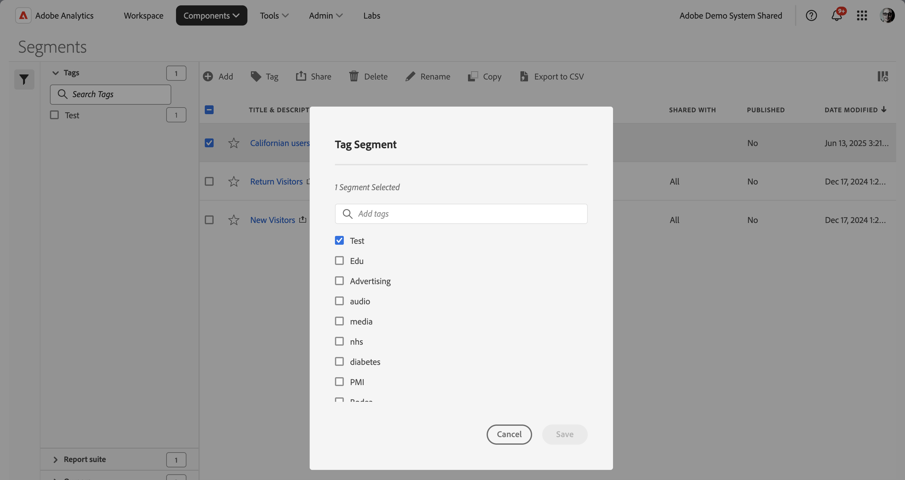

# Tag segments

In the [Segment manager](seg-manage.md), you can use tags to organize segments. Administrators can tag all segments. Non administroators can tags only the segments they create or have been shared with them.

To tag one or more segments:

1. In the [Segment manager](seg-manage.md), select one or more of the segments you want to tag.
1. From the action bar, select  **[!UICONTROL Tag]**.
1. In the **[!UICONTROL Tag Segment]** dialog:
   
   

   1. (optionally) use  to search for and limit the list of tags.

   2. Based on the list of tags:
   
      * select one or more existing tags from the list, or
      * enter a new tag and press **[!UICONTROL ENTER]**. Repeat to add more than one new tag.

1. Select **[!UICONTROL Save]** to save the tags for the segment. Select **[!UICONTROL Cancel]** to cancel.

Once saved, the tags are listed in the [!UICONTROL Tag] field for the selected segments in the [Segment builder](seg-builder.md). 

## Suggestions

Below are some suggestions to organize tags based on:

* **Team**: For example, Social Marketing, Mobile Marketing.
    
* **Project**: For example, Entry-page analysis.
    
* **Category**:. For example, Men, Women, Kids.

* **Geography**: For example: United States, California.
    
* **Workflow**: For example: To be approved,  Curated

<!--
In the [Segment manager](seg-manage.md), you can use tags to organize segments. Administrators can tag all segments. Non administroators can tags only the segments they create or have been shared with them.

To tag one or more segments:

1. In the [Segment manager](seg-manage.md), select one or more of the segments you want to tag.
1. From the action bar, select  **[!UICONTROL Tag]**.
1. In the **[!UICONTROL Tag Segments]** dialog:
   
   

   1. (optionally) use  to search for and limit the list of tags.

   2. Based on the list of tags:
   
      * select one or more existing tags from the list, or
      * enter a new tag and press **[!UICONTROL ENTER]**. Repeat to add more than one new tag.

1. Select **[!UICONTROL Save]** to save the tags for the segment. Select **[!UICONTROL Cancel]** to cancel.

Once saved, the tags are listed in the [!UICONTROL Tag] field for the selected segments in the [Segment builder](seg-builder.md). 

## Suggestions

Below are some suggestions to organize tags based on:

* **Team**: For example, Social Marketing, Mobile Marketing.
    
* **Project**: For example, Entry-page analysis.
    
* **Category**:. For example, Men, Women, Kids.

* **Geography**: For example: United States, California.
    
* **Workflow**: For example: To be approved,  Curated

-->