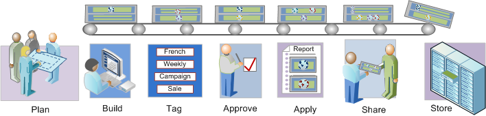

# Segmentation workflow overview

Describes a suggested workflow for segments created with the Segment Builder and managed through the Segment Manager.

 [ Plan Segments](/help/components/segmentation/segmentation-workflow/seg-plan.md)

Have you asked all the right questions before building segments and setting up a segment management environment? Have you designed the segment with its intended purpose and distinct usage in mind?

See the Segment Planning Checklist for help in planning and organizing your segments.

 [Build Segments](/help/components/segmentation/segmentation-workflow/seg-build.md) 

Build and edit segments for use in all Analytics capabilities.

See [Build Sequential Segments](/help/components/segmentation/segmentation-workflow/seg-sequential-build.md) for how to build segments with the THEN operator.

 [ Tag Segments](/help/components/segmentation/segmentation-workflow/seg-tag.md)

Tag segments for ease of organization and sharing. See how to plan and assign tags for simple and advanced searches and organization.

 [ Approve Segments](/help/components/segmentation/segmentation-workflow/seg-approve.md)

Approve segments to make them canonical.

 [ Apply Segments](/help/components/segmentation/segmentation-workflow/t-seg-apply.md)

You can apply segments directly from a report, from the segment rail ( Show Segments).

 [ Share Segments](/help/components/segmentation/segmentation-workflow/t-seg-share.md)

Share your segments with the intended audience in other Analytics tools and to Adobe Target and the Adobe Experience Cloud.

 [ Filter Segments](/help/components/segmentation/segmentation-workflow/t-seg-filter.md)

Filter by tags, owners, and other filters (Show All, Mine, Shared With me, Favorites, and Approved.)

 [ Mark Segment as Favorites](/help/components/segmentation/segmentation-workflow/t-seg-favorite.md)

Marking segments as favorites is another way to organize them for ease of use.

[Manage Segments](/help/components/segmentation/segmentation-workflow/seg-manage.md)

The Segment Manager offers many ways of curating segments, such as sharing, filtering, tagging, approving, copying, deleting, and marking as favorites.
