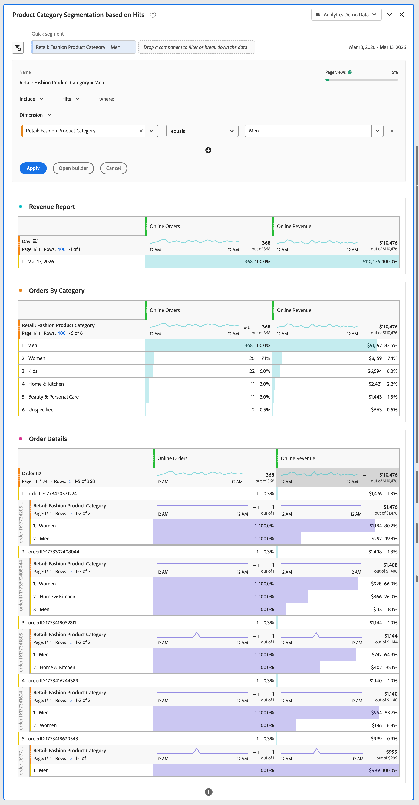
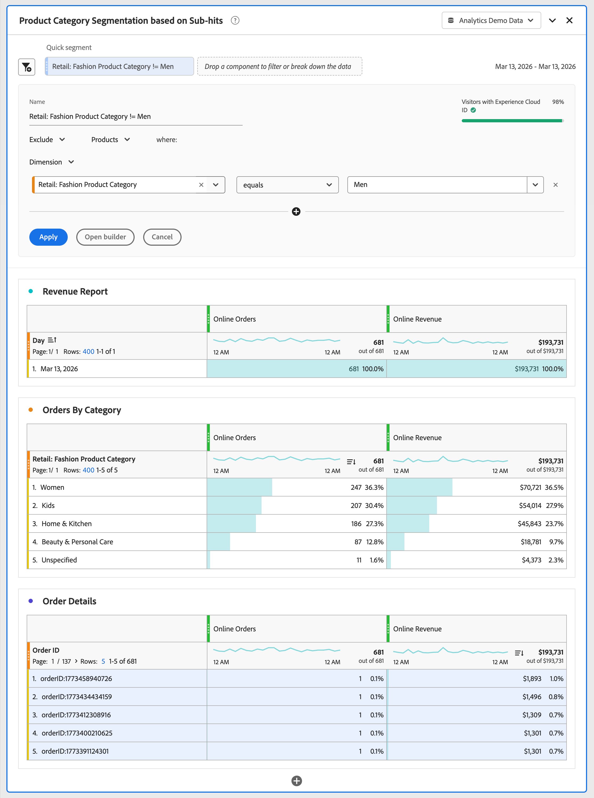

# Sub-hit analysis

Sub-hit analysis lets you analyze product data at a level more granular than the hit level. Instead of filtering on entire hits, you can segment on individual products within hits. For example, segmenting on a specific product category without including all other products purchased in the same order.

In Adobe Analytics, the [Products variable](/help/components/dimensions/product.md) can capture multiple products on a single hit. Without sub-hit analysis, segmenting on a product attribute returns all hits where any product within a hit matches the product attribute. The result is incorrect attribution and inflated revenue metrics. Sub-hit analysis scopes the filter to individual product rows within a hit and solves these issues.

In sub-hit analysis exclude logic behaves differently from standard hit-level exclusion against the Products variable. When you exclude product attributes within the [!UICONTROL Product] container, the segment returns hits that **have products** but don't match your exclusion criteria. The segment does not return hits with no products at all. 

## Example

You want to measure online revenue from the Men category only. Without sub-hit analysis, applying a segment for Men includes revenue from every product on any order (hit) that contains at least one product with the Men category. With sub-hit analysis, you scope the filter to the product level and return only revenue for products of the Men category.

You also want to measure online revenue from all other categories except the Men category.

>[!BEGINTABS]

>[!TAB Hit analysis]

In the segmentation builder or as part of a **[!UICONTROL Quick segment]**, you specify to **[!UICONTROL Include]** the **[!UICONTROL Dimension]** **[!UICONTROL Retail: Fashion Product Category]** **[!UICONTROL equals]** **[!UICONTROL Men]** on the **[!UICONTROL Hits]** container. 

As a result, all orders containing at least one **[!UICONTROL Men]** **[!UICONTROL Retail: Fashion Product Category]** are considered, and revenue from other products in those orders is included in the **[!UICONTROL Online Revenue]** metric.
When you report on categories, all other values for **[!UICONTROL Retail: Fashion Product Category]** are reported that were part of an order that included a product with the **[!UICONTROL Men]** **[!UICONTROL Retail: Fashion Product Category]**.

>[!TAB Sub-hit analysis]

In the segmentation builder or as part of a **[!UICONTROL Quick segment]**, you specify to **[!UICONTROL Include]** the **[!UICONTROL Dimension]** **[!UICONTROL Retail: Fashion Product Category]** **[!UICONTROL equals]** **[!UICONTROL Men]** on the **[!UICONTROL Products]** container. 

As a result, all orders containing at least a **[!UICONTROL Men]** **[!UICONTROL Retail: Fashion Product Category]** are considered, and only the revenue of products belonging to the **[!UICONTROL Men]** **[!UICONTROL Retail: Fashion Product Category]** are included for the **[!UICONTROL Online Revenue]** metric.
When you report on categories, only the **[!UICONTROL Men]** **[!UICONTROL Retail: Fashion Product Category]**  is reported.

>[!TAB Sub-hit analysis (exclude)]

In the segmentation builder or as part of a **[!UICONTROL Quick segment]**, you specify to **[!UICONTROL Exclude]** the **[!UICONTROL Dimension]** **[!UICONTROL Retail: Fashion Product Category]** **[!UICONTROL equals]** **[!UICONTROL Men]** on the **[!UICONTROL Products]** container. 

To exclude at the product level, hits that contain at least one product are included, then the exclusion on sub-hit level is applied within that scope. This exclusion differs from hit-level exclusion, which excludes the entire hit.

>[!ENDTABS]

In Adobe Analytics sub-hit analysis applies specifically to the **[!UICONTROL Products]** variable. The **[!UICONTROL Products]** variable is the only multi-value object in Adobe Analytics that supports sub-hit analysis.

>[!WARNING]
>
>The following sections are going to be moved to their relevant articles (on Segment builder, Quick segment, Histogram, and more) when this feature releases. And these articles will then refer to this article for reference on what sub-hit analysis is. This action is currently not done so as not to confuse customers while the feature is unavailable.

## Container auto-inference

When you drag a product dimension or metric into the Segment Builder or Quick segment panel, the system automatically selects the **[!UICONTROL Product]** container and does not use the default **[!UICONTROL Hit]** container. This behavior keeps the segment scoped to individual products rather than to the entire hit.

## Mixed container behavior

If you drag both product-level and hit-level components into a single segment rule, the system uses the **[!UICONTROL Hit]** container, which is the highest (least granular) shared container. If all components that are part of a segment rule are product-level, the **[!UICONTROL Product]** container is used.

## Product filters in the left rail

The Segment Builder includes a new filter option in the left rail to display only product dimensions and metrics. This makes it easier to find product-level components when building sub-hit segments.

>[!NOTE]
>
>This filter option is available in the Segment Builder only. It is not available in other left rails such as Analysis Workspace panels or visualizations.

## Histogram visualization

The Histogram visualization includes a new sub-hit container drop-down menu. This lets you bucket metric values at the product level. For example, counting product occurrences per order rather than per hit.

The Histogram is the only visualization that requires a sub-hit container selection. All other panels and visualizations work with sub-hit analysis data without additional configuration.
