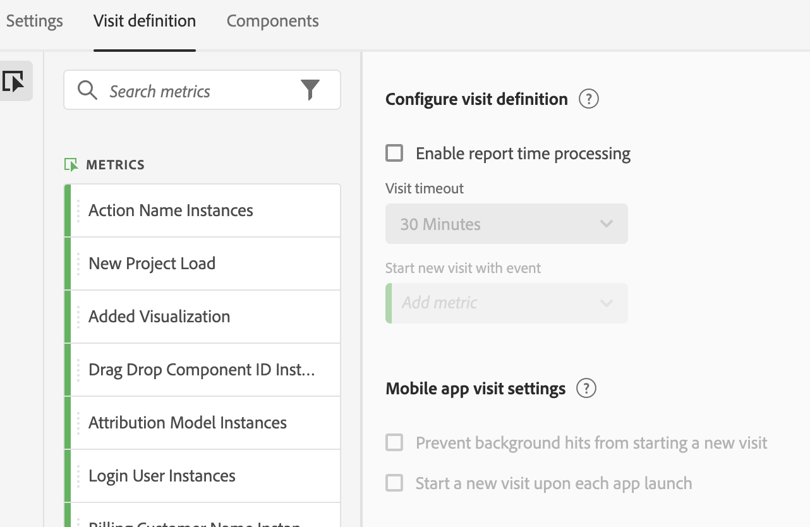
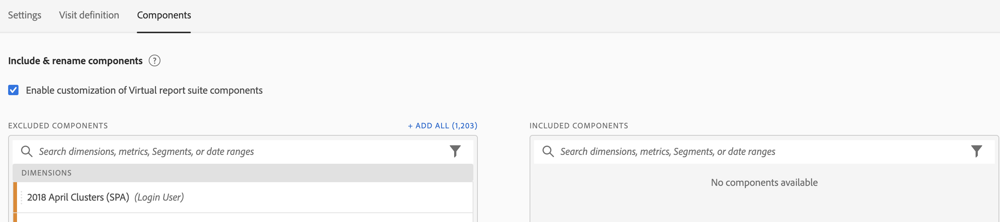

# Create virtual report suites

Before you start creating virtual report suites, here are a few things to keep in mind.

* Non-Admin users cannot see the Virtual Report Suite Manager.
* Virtual report suites cannot be shared. "Sharing" is done via groups/permissions.
* In the Virtual Report Suite Manager, you can see only your own virtual report suites. You have to click "show all" to see everyone else's.

1. Navigate to **[!UICONTROL Components]** > **[!UICONTROL Virtual Report Suites]**.
1. Click **[!UICONTROL Add +]**.

   

## Define Settings

On the [!UICONTROL Settings] tab, define these settings and then click **[!UICONTROL Continue]**.

| Element | Description |
| --- |--- |
| Name | The name of the virtual report suite is not inherited from the parent report suite and should be distinct. |
| Description | Add a good description for the benefit of your business users. |
| Tags | You can add tags to organize your report suites. |
| Source| The report suite from which this virtual report suite inherits the following settings. Most service levels and features (for example, eVar settings, Processing Rules, Classifications, and so on) are inherited. To make a changes to these inherited settings on a VRS, you must edit the parent report suite ( Admin >  Report Suites). |
| Time zone | Choosing a time zone is optional. If you choose a time zone, it is saved along with the VRS. If you do not choose one, the time zone of the parent report suite is used.  When editing a VRS, the time zone saved with the VRS appears in the drop-down selector. If the VRS was created before time zone support was added, the parent report suite's time zone is shown in the drop-down selector. |
| Segments | You can add just one segment or you can  stack segments.   Note:  When stacking two segments, they are joined by an AND statement. This cannot be changed to an OR statement. When you try to delete or modify a segment that is currently used in a virtual report suite, a warning displays.|

## Define Visit Definition

On the [!UICONTROL Visit Definition] tab, define these settings and then click **[!UICONTROL Continue]**.

 

| Element | Description |
| --- |--- |
| **Configure visit definition** |  |
| Enable report time processing | Use report time processing to change the default visit timeout length. These settings are non-destructive and apply in Analysis Workspace only. [Learn more](/help/components/vrs/vrs-report-time-processing.md) |
| Visit timeout | Defines the amount of inactivity a unique visitor must have before a new visit is automatically started. This will affect the visits metric, visit segment container, and eVars that expire on visit. |
| Start new visit with event | Starts a new session when any of the specified events fire regardless of whether a session has timed out. |
| **Mobile app visit settings** | Modify how visits are defined for mobile app hits collected by Adobe’s Mobile SDKs. These settings are non-destructive and apply in Analysis Workspace only. |
| Prevent background hits from starting a new visit | Prevents background hits from starting a new visit and from inflating the visits and unique visitors metrics. |
| Start a new visit upon each app launch | Starts a new session when an app launch occurs. [Learn more](/help/components/vrs/vrs-mobile-visit-processing.md) |

## Include and rename components

1. On the [!UICONTROL Components] tab, select the checkbox to apply curation to include, exclude and rename components for this virtual report suite in Analysis Workspace.
   For more information on VRS curation, see [Virtual Report Suite Component Curation](https://experienceleague.adobe.com/docs/analytics/components/virtual-report-suites/vrs-components.html?lang=en#virtual-report-suites).

1. Drag components (dimensions, metrics, segments, or date ranges) that you want to include in the VRS into the [!UICONTROL Included Components] section.

1. When you are done, click **[!UICONTROL Save]**.

## Preview data

On the right side of each tab, you can preview the total hits, total visits, and total visitors in this Virtual Report Suite, compared to the original report suite.

## View Product compatibility

Some features of Virtual Report Suites are not supported by all Adobe Analytics products. The product compatibility list allows you to see which products within Adobe Analytics are supported based on your current Virtual Report Suite settings.
