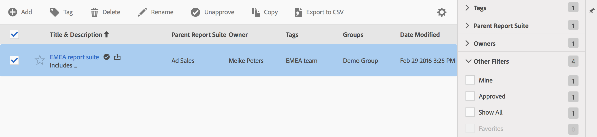

# Manage virtual report suites

The Virtual Report Suite Manager lets Administrators edit, add, tag, delete, rename, approve, copy, export, and filter virtual report suites. It is not visible to non-Admin users.

 **[!UICONTROL Analytics]** > **[!UICONTROL Components]** > **[!UICONTROL Virtual Report Suites]**

>[!NOTE]
>
>In the Virtual Report Suite Manager, you can see only your own virtual report suites. You have to click **[!UICONTROL Show All]** to see everyone else’s.

<table id="table_D5455ED0EC7A40839DB2DC89E1A9E469"> 
 <thead> 
  <tr> 
   <th colname="col1" class="entry"> Task </th> 
   <th colname="col2" class="entry"> Description </th> 
  </tr> 
 </thead>
 <tbody> 
  <tr> 
   <td colname="col1"> Add </td> 
   <td colname="col2"> 
Takes you to the virtual report suite builder where you can create new virtual report suites. 
 </td> 
  </tr> 
  <tr> 
   <td colname="col1"> Tag </td> 
   <td colname="col2"> 
All users can create tags for segments and apply one or more tags to a segment. However, you can see tags only for those segments that you own. What kinds of tags should you create? Here are some suggestions for useful tags: 
 
 
     <ul id="ul_45E9BD37614C493F8C5AFFFB968F12D5"> 
      <li id="li_A909BC1BE7E44C3E84B72200A66F8D12">Tags based on team names, such as Social Marketing, Mobile Marketing </li> 
      <li id="li_82784EF92DF240BD9EE62C879A68FB0D">Project tags (analysis tags), such as Entry-page analysis </li> 
      <li id="li_E9AEE4A9D14B42929CF9CF879BB55913">Category tags: Men's; geography </li> 
      <li id="li_2A8246828B0E42CCA4ED8AE075EB79F7">Workflow tags: Curated for (a specific business unit); Approved </li> 
     </ul> 
 </td> 
  </tr> 
  <tr> 
   <td colname="col1"> Delete </td> 
   <td colname="col2"> 
If you delete a virtual report suite, scheduled reports and dashboards that have this virtual report suite applied continue to work normally. The report or dashboard continues to use the deleted virtual report suite until you re-save the scheduled report. 
 
Scheduled reports do not update when you edit a virtual report suite with the same name. For example: Suppose you have two virtual report suites with the same name and different parent report suites:  

    <table id="table_4B5A76E0AEAC4323A2FFE60F727B33FB">  
    </table> 
You have a bookmark that references the virtual report suite for the mainprod report suite. Then you delete that virtual report suite because it’s a duplicate. The bookmark continues to run, referencing the definition of the deleted VRS. If you change the definition for the remaining VRS, the VRS applied to the bookmark does not change. It uses the old definition. To fix this, update the bookmark to reference the new definition. If you are unsure whether a bookmark, dashboard or scheduled report is using a deleted VRS, you could change the name of the remaining VRS so it’s more clear whether the bookmark is using the remaining VRS. 
 </td> 
  </tr> 
  <tr> 
   <td colname="col1"> Rename </td> 
   <td colname="col2"> Everywhere the virtual report suite is displayed, like in the report suite selector, it shows the new name. </td> 
  </tr> 
  <tr> 
   <td colname="col1"> Approve/Unapprove </td> 
   <td colname="col2"> Approve virtual report suites to make them "official" or "canonical." You can reverse the process by unapproving. </td> 
  </tr> 
  <tr> 
   <td colname="col1"> Copy </td> 
   <td colname="col2"> Creates a distinct copy with its own new report suite ID, but with the same name and definition. </td> 
  </tr> 
  <tr> 
   <td colname="col1"> Export to CSV </td> 
   <td colname="col2"> Export the virtual report suite definition to a .csv file. </td> 
  </tr> 
  <tr> 
   <td colname="col1"> Filter </td> 
   <td colname="col2"> Filter by tags, parent report suite, owners, and other filters (Show All, Mine, Favorites, and Approved). </td> 
  </tr> 
 </tbody> 
</table>

