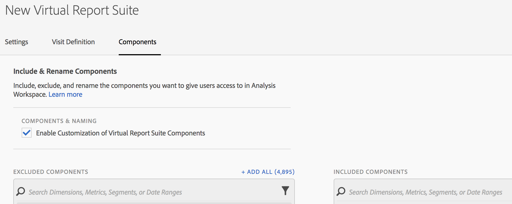
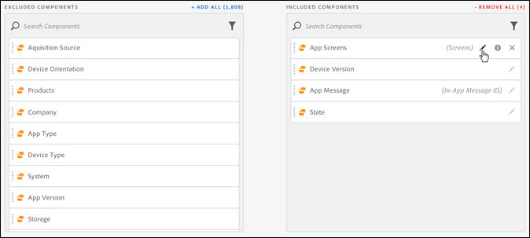

# Virtual Report Suite Component Curation

Virtual report suites can be curated to include and exclude components.in Analysis Workspace.

>[!NOTE]
>
>Changes were made to which components administrators and non-administrators can see in curated Workspace projects and curated virtual reports suites (VRSs). Previously, anyone could see non-curated components by clicking **[!UICONTROL Show all Components]**. The [updated curation experience](/help/analyze/analysis-workspace/curate-share/curate.md) allows for more fine-grained control over which components are visible.

To enable component curation,

1. Go to **[!UICONTROL Analytics]** > **[!UICONTROL Components]** > **[!UICONTROL Virtual Report Suites]** > **[!UICONTROL Create new virtual report suite]**.
1. After defining the **[!UICONTROL Settings]**, click the **[!UICONTROL Components]** tab.

1. Select the checkbox **[!UICONTROL Enable Customization of Virtual Report Suite Components]**:

   

   >[!NOTE]
   >
   >If component customization is enabled, the virtual report suite is accessible **only in Analysis Workspace** and is not accessible in the following:
   >
   >* [!UICONTROL Reports & Analytics] 
   >* [!UICONTROL Data Warehouse] 
   >* [!UICONTROL Report Builder] 
   >* [!UICONTROL Activity Map]
   >* Analytics Reporting API

   Once checked, you can add the components you'd like to be included in the virtual report suite by dragging the applicable components from the "excluded components" column to the "included components" column. The components that can be included and excluded are:

    * Dimensions 
    * Metrics 
    * Segments 
    * Date Ranges

   >[!NOTE]
   >
   >There is no need to *share* curated components (segments, calculated metrics, date ranges). They will always be visible in Analysis Workspace if they are curated for the virtual report suite, even if they are not shared.

1. Additionally, you can filter or search the components and add the entire filtered selection to the included column by clicking **[!UICONTROL Add All]**.

   

## Rename Components {#section_0F7CD9F684FE4765BC00A2AFED56550E}

You can change the display names of included components specific to the virtual report suite. For example, if you want to include Page Name in the virtual report suite, but want to rename it to a more mobile friendly context, you can change it to App Screens. The new name is displayed in Analysis Workspace whenever this virtual report suite is used.

In Analysis Workspace, click the information icon for any included component to reveal the original name of the renamed component:

## Component Groups {#section_483BEC76F49E46ADAAA03F0A12E48426}

Use component groups to make bulk component additions to your virtual report suite. For example, if you'd like to import a default set of components specific to mobile app analysis, select the mobile app group. A corresponding set of dimensions and metrics (already renamed) are automatically added to the virtual report suite Included list.

## Workspace Behavior {#section_6C32F8B642804C0097FCB14E21028D4A}

For more information on curation in Analysis Workspace, see [Curate and Share a Project](https://experienceleague.adobe.com/docs/ analytics/analyze/analysis-workspace/curate-share/curate.html).
