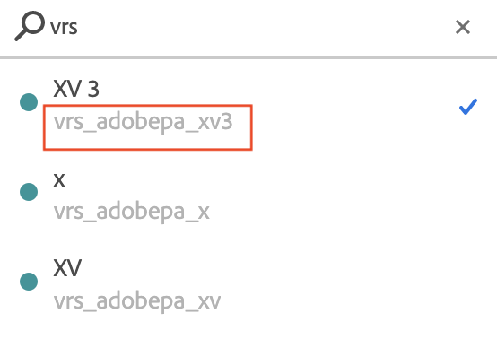

# VRS FAQs

Tips and Best Practices for new users of virtual report suites.

| Question | Answer |
| --- | --- |
| Should I consolidate my implementation from multiple report suites into a single "global" report suite and then use virtual report suites to expose different segments of data to my users? | Maybe. Here are some circumstances under which you should consider continuing with individual report suites:<ul><li>If you have variables/dimensions with a large number of unique values, consolidating into a single report suite may cause you to exceed monthly unique value limits in this global suite, leading to truncation ("Low Traffic" as a line item in reports).</li><li>If you require real-time or "Current Data" reporting for individual segments (e.g. brands, business units, etc.) of your data.</li><li>Your various report suites might each have unique requirements for tracking (i.e., if they use Adobe Analytics variables and events very differently). If this is the case, note that consolidating to a global report suite will not grant you additional variables or events for tracking.</li></ul>|
| Which settings on virtual report suites are inherited from the parent report suite?|A virtual report suite (VRS) inherits most of the service levels of the parent report suite, such as eVar settings, Processing Rules, Classifications, etc.  The following settings are NOT inherited:<ul><li>Report suite ID</li><li>Report suite name </li><li>Permission groups (virtual report suites can be assigned to their own permission groups)</li></ul>**Note**:  This does not include most user-created entities like Bookmarks, Dashboards, Scheduled Reports, etc.; these items are not inherited from the parent and can be created and used against the VRS specifically (more detail in the next question).|
| How does working with a virtual report suite differ from working with a base report suite in the Analytics UI? | Once created, a virtual report suite is treated just like a base report suite throughout the UI and is generally supported for most extended features. For example:<ul><li>Virtual report suites show up in the Report Suite selector and can be selected individually just like any other base report suite.</li><li>Reports, Bookmarks, Dashboards, Targets, Alerts, Segments, Calculated Metrics, etc. can all be created against a virtual report suite and behave independently of the parent.</li><li>Virtual report suites can be individually permissioned just like any other report suite.</li><li>Segments can still be applied when running reports in the context of a VRS; they will automatically be stacked with the virtual report suite's segment(s) when the report data is being retrieved.</li></ul> |
| How are virtual report suites treated in the Admin Console and Admin API? Can I save features against them like base report suites? | No, virtual report suites are not supported for most Admin features. As mentioned above, a VRS inherits most service levels and features from the parent (for example, eVar settings, Processing Rules, Classifications, etc.), so to make a changes to these inherited settings on a VRS, you must alter the parent report suite. As a result, virtual report suites are shown in the UI only here:<ul><li>The Virtual Report Suite Manager, where you create and edit VRSs. (Analytics > Components > Virtual report suites)</li><li>The Adobe [Admin Console](https://helpx.adobe.com/enterprise/admin-guide.html/enterprise/using/welcome.ug.html). For using a VRS in reports or throughout Adobe Analytics, permissions work just like they do for a report suite. That means the VRSs show up in the selection tool for a product profile, and are assigned to product profiles just like report suites.</li></ul>**Note**:  When you use the Web Services API and attempt to save Feature settings against a VRS, an exception will be thrown. Features can only be set against a base report suite.|
| I checked "start new visit on launch." Why do I see visits still much higher than launches? | When "start new visit on launch" is checked, the timeout still applies. So, if a user is using the app for ten minutes with a one minute break in between each action, a new visit starts on launch, then nine additional visits are created when the visit times out. To keep launches and visits as close as possible when using the "start new visit on launch" option, you should use a timeout that is longer than the session timeout set in the SDK. |
| I set "start new visit on launch" and set a longer timeout than my SDK. Why are my launches still much lower than visits? | If the timeout is higher than the value set in the SDK, it is very likely that your app is sending in hits while in the background and these hits are registering as new visits. Check for this by using the hit type dimension on the parent report suite to see if there are any background hits. **Note**: Background and foreground hits are only differentiated in version 4.13.6 and higher of the SDK. If you are on a lower version, all hits show as foreground. If you are on the correct version of the SDK, you should enable the "Prevent background hits from starting a new visit" setting.    Note: If you have disabled legacy processing for background hits in the admin console, they will not show up in the parent report suite but will appear in the virtual report suite.|
| What version of the SDK do I need to have to track background hits? | You must be on version 4.13.6 or higher of the SDK. |
| How do I find out a Virtual Report Suite's ID? | <ul><li>By opening a Workspace project, clicking the Report Suite Selector and searching for the name of a Virtual Report Suite in the search box. The ID appears underneath the name in the search results: </li><li> Or, programmatically, in the [Virtual Report Suite API](https://www.adobe.io/apis/experiencecloud/analytics/docs.html#!AdobeDocs/analytics-2.0-apis/master/vrs.md).</li></ul> |
