# Context-aware sessions

Context-aware sessions in virtual report suites change how Adobe Analytics calculates visits from any device. This article also describes the processing implications of background hits and app launch events (both set by the mobile SDK) to how mobile visits are defined.

You can define a visit any way you want without altering the underlying data, to match the way your visitors interact with your digital experiences.

Here is a video on context-aware sessions:

>[!VIDEO](https://video.tv.adobe.com/v/23545/?quality=12)

## Customer Perspective URL Parameter

The Adobe Analytics data collection process allows you to set a query string parameter specifying the customer perspective (denoted as the "cp" query string parameter). This field specifies the state of the end user's digital application. This helps you know whether a hit was generated while a mobile app was in a background state.

## Background Hit Processing

A background hit is a type of hit sent to Analytics from the Adobe Mobile SDK version 4.13.6 and above when the app makes a tracking request while in a background state. Typical examples of this include:

* Data sent during a geo fence crossing 
* A push notification interaction

The following examples outline the logic used in determining when a visit starts and ends for any visitor when the "Prevent Background Hits from starting a new Visit" setting is or is not enabled for a virtual report suite.

**If "Prevent Background Hits from starting a new Visit" is not enabled:**

If this feature is not enabled for a virtual report suite, background hits are treated the same as any other hit, meaning they start new visits and act just the same as foreground hits. For example, if a background hit occurs less than 30 minutes (the standard session timeout for a report suite) before a set of foreground hits, the background hit is part of the session.

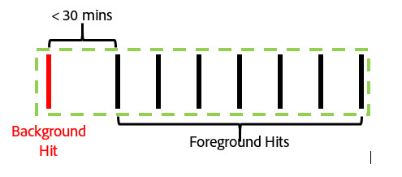

If the background hit occurs more than 30 minutes prior to any foreground hits, the background hit creates its own visit, for a total visit count of 2.

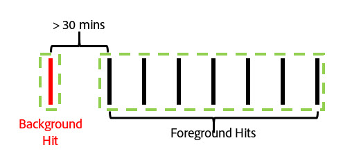

**If "Prevent Background Hits from starting a new Visit" is enabled:**

The following examples illustrate the behavior of background hits when this feature is enabled.

Example 1: A background hit occurs some time period (t) prior to a series of foreground hits.

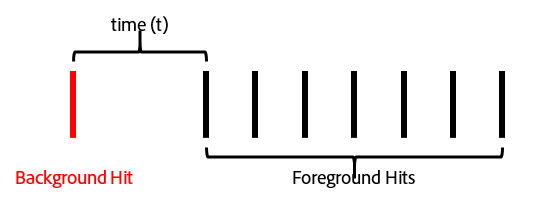

In this example, if *t* is greater than the virtual report suite's configured visit timeout, then the background hit is excluded from the visit formed by the foreground hits. For example, if the virtual report suite visit timeout was set to 15 minutes, and *t* was 20 minutes, the visit formed by this series of hits (shown by the green outline) would exclude the background hit. This means that any eVars set with a "visit" expiration on the background hit would **not** persist into the following visit, and a visit segment container would only include the foreground hits inside the green outline.

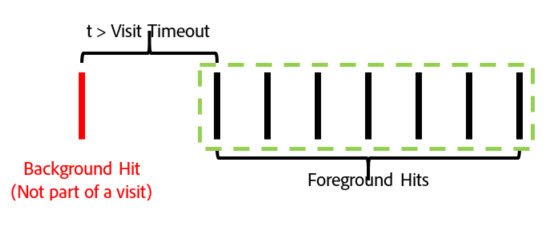

Conversely, if *t* is less than the virtual report suite's configured visit timeout, the background hit is included as part of the visit as if it were a foreground hit (shown by the green outline):

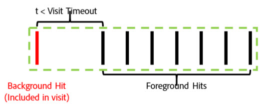

This means that:

* Any eVars set with "visit" expiration on the background hit persist their values onto the other hits in this visit.
* Any values set in the background hit are included in the visit level segment container logic evaluation.

In both cases, the total visit count would be 1.

Example 2: If a background hit occurs after a series of foreground hits, the behavior is similar:

If the background hit occurs after the virtual report suite's configured timeout, the background hit is not part of a session (outlined in green):

Likewise, if the time period *t* was less than the virtual report suite's configured timeout, the background hit is included in the visit formed by the previous foreground hits:

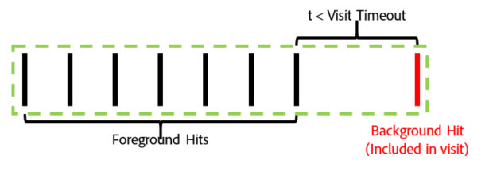

This means that:

* Any eVars set with "visit" expiration on the previous foreground hits persist their values onto the background hit in this visit.
* Any values set in the background hit are included in the visit level segment container logic evaluation.

As before, the total visit count in either case would be 1.

Example 3: In some circumstances, a background hit can cause what were two separate visits to be combined into a single visit. In the following scenario, a background hit is preceded and followed by a series of foreground hits:

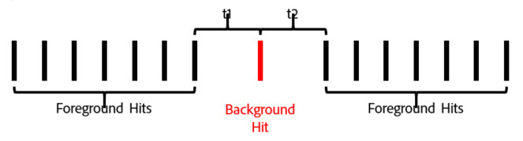

If, in this example, *t1* and *t2* are both less than the virtual report suite configured visit timeout, all of these hits would be combined into a single visit, even if *t1* and *t2* together are greater than the visit timeout:

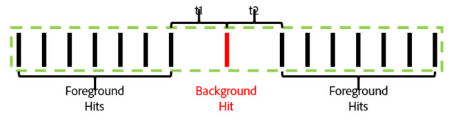

If, however, *t1* and *t2* are greater than the virtual report suite configured timeout, these hits would be separated into two distinct visits:

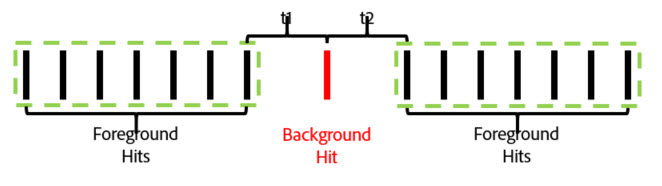

Likewise (as in our previous examples), if *t1* is less than the timeout and *t2* is less than the timeout the background hit would be included in the first visit:

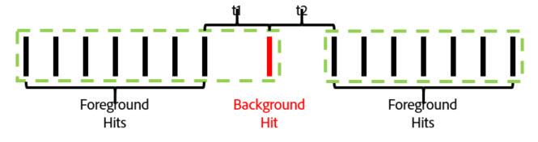

If *t1* is greater than the timeout and *t2* is less than the timeout, then the background hit would be included in the second visit:

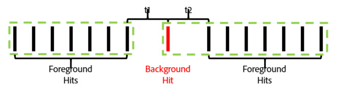

Example 4: In scenarios where a series of background hits occur within the virtual report suite visit timeout period, the hits form an invisible "background visit" that does not count toward the visit count and is not accessible using a visit segmentation container.

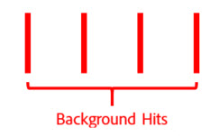

Even though this is not considered a visit, any eVars set that have visit expiration persist their values to the other the background hits in this "background visit".

Example 5: For scenarios where multiple background hits occur in succession following a series of foreground hits, it's possible (depending on the timeout setting) that the background hits keep a visit alive longer than the visit timeout period. For example, if *t1* and *t2* together were greater than the virtual report suite visit timeout but individually less than the timeout, the visit would still extend to include both background hits:

Likewise, if a series of background hits happen prior to a series of foreground events, similar behavior occurs:

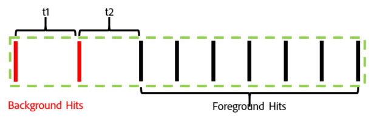

Background hits behave in this manner in order to preserve any attribution effects from eVars or other variables set during background hits. This allows downstream foreground conversion events to be attributed to actions taken while an app was in the background state. It also allows a visit segment container to include background hits that resulted in a downstream foreground session which is useful for measuring push message effectiveness.

## Visit Metric Behavior 

The visit count is based solely on the count of visits that include at least one foreground hit. This means that any orphaned background hits or "background visits" do not count towards the Visit metric.

## Time Spent Per Visit Metric Behavior 

Time spent is still calculated in an analogous way to how it is without background hits using the time between hits. Although, if a visit includes background hits (because they occurred close enough to foreground hits), those hits are included in the time spent per visit calculation as if they were a foreground hit.

## Background Hit Processing Settings 

Because background hit processing is only available to virtual report suites using Report Time Processing, Adobe Analytics supports two ways of processing background hits in order to preserve the visit counts in the base report suite which does not use Report Time Processing. To access this setting navigate to the Adobe Analytics Admin Console, go the settings of the applicable base report suite, then navigate to "Mobile Management" menu, then to the "Mobile Application Reporting" sub menu.

1. "Legacy Processing On": This is the default setting for all report suites. Leaving legacy processing on processes background hits as normal hits in our processing pipeline as far as the non-Report Time Attribution base report suite is concerned. This means that any background hits that appear in the base report suite increment visits as a normal hit. If you do not want background hits to appear in your base report suite, change this setting to "Off".
1. "Legacy Processing Off": With legacy processing for background hits off, any background hits sent to the base report suite are ignored by the base Report Suite and are only accessible when a virtual report suite created on this base report suite is configured to use Report Time Processing. This means that any data captured by background hits sent to this base report suite only appear in a Report Time Processing enabled virtual report suite.

   This setting is intended for customers that wish to take advantage of the new background hit processing without altering the visit counts of their base report suite.

In either case, background hits are billed at the same cost as any other hit sent to Analytics.

## Starting New Visits Upon Each App Launch

In addition to the background hit processing, virtual report suites can force a new visit to start whenever the mobile SDK sends an app launch event. With this setting enabled, any time an App Launch event is sent from the SDK, it forces a new visit to start regardless of whether an open visit has reached its timeout . The hit containing the app launch event is included as the first hit in the next visit, and increments the visit count and creates a distinct visit container for segmentation.
