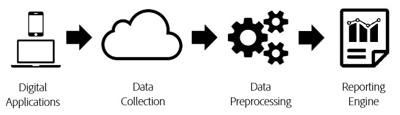
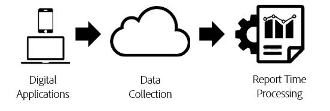

# Report time processing

[!UICONTROL Report time processing] is a virtual report suite setting that allows data in Analysis Workspace to be processed in a non-destructive, retroactive fashion.

[!UICONTROL Report Time Processing] affects only the data in the virtual report suite and does not impact any data or data collection in the base report suite. The difference between [!UICONTROL Report Time Processing] and traditional Analytics processing is best understood using the following diagram:

During Analytics data processing, data flows through the data collection pipeline and into a preprocessing step, which prepares data for reporting. This preprocessing step applies visit expiration logic and eVar persistence logic (among other things) to the data as it is collected. The primary disadvantage of this preprocessing model is that it requires any configuration be done in advance before data is collected. This means that any changes to preprocessing settings apply only to new data from that time forward. This is problematic if data arrives out of order or if settings were misconfigured.

[!UICONTROL Report Time Processing] is a fundamentally different way of processing Analytics data for reporting. Instead of predetermining processing logic before data is collected, Analytics ignores the data set during the preprocessing step and applies this logic each time a report is run:

This processing architecture allows for far more flexible reporting options. For example, you can change the visit timeout period to any length of time you want in a non-destructive way and those changes are reflected in your eVar persistence and segment containers for the full reporting period. Additionally, you can create any number of virtual report suites, each with different Report Time Processing options based on the same base report suite, without altering any of the data in the base report suite.

[!UICONTROL Report Time Processing] also allows Analytics to prevent background hits from starting new visits and allows the [Adobe Experience Platform Mobile SDK](https://experienceleague.adobe.com/docs/mobile.html) to start a new visit whenever an App Launch event is triggered.

## Configuration options

The following configuration options are currently available to virtual report suites with Report Time Processing enabled:

* **[!UICONTROL Visit Timeout]:** The visit timeout setting defines the amount of inactivity a unique visitor must have before a new visit is automatically started. It defaults to 30 minutes. For example, if you set the visit timeout to 15 minutes, a new visit grouping is created for each sequence of hits collected, separated by 15 minutes of inactivity. This setting impacts not only your visit counts, but also how visit segment containers are evaluated, and the visit expiration logic for any eVars expiring on visit. Decreasing the visit timeout will likely increase the total number of visits in your reporting, while increasing the visit timeout will likely decrease the total number of visits in your reporting.
* **[!UICONTROL Mobile App Visit Settings]:** For report suites containing data generated by mobile apps through the [Adobe Mobile SDKs](https://experienceleague.adobe.com/docs/mobile.html), additional visit settings are available. These settings are non-destructive and only affect hits that have been collected via the Mobile SDKs. These settings have no impact to data collected outside of the Mobile SDK.
* **[!UICONTROL Prevent Background Hits from starting a new Visit]:** Background hits are collected by the Mobile SDKs when the app is in a background state.
* **[!UICONTROL Start a New Visit upon each App Launch]:** In addition to the visit timeout, you can force a visit to begin whenever an App Launch event has been recorded from the Mobile SDKs regardless of the inactivity window. This setting affects the visit metric and the visit segment container, as well as visit expiration logic on eVars.
* **[!UICONTROL Start New Visit with Event]:** A new session starts when an event is fired, regardless of whether a session has timed out. The newly created session includes the event that started it. Additionally, you can use multiple events to start a session and a new session fires if any of those events are observed in the data. This setting will impact your visit count, the visit segmentation container, and the visit expiration logic on eVars.

Here is a video on starting a new visit with event:

>[!VIDEO](https://video.tv.adobe.com/v/23129/?quality=12)

## Report Time Processing limitations

Report Time Processing does not support all metrics and dimensions available in traditional Analytics reporting. Virtual report suites utilizing Report Time Processing are only accessible in Analysis Workspace and is not accessible in [!UICONTROL Reports & Analytics], Data Warehouse, Report Builder, Data Feeds, or the reporting API.

In addition, Report Time Processing only processes data that comes from within the reporting date range (referred to as "date windowing" below). This means that eVar values set to "never expire" for a visitor prior to the reporting date range do not persist into the reporting windows and do not appear in reports. This also means that customer loyalty measurements are based exclusively on the data present in the reporting date range and not on the entire history prior to the reporting date range.

The following dimensions and metrics are not supported with Report Time Processing:

* **Analytics for Target**
* **Analytics for Advertising Cloud dimensions/metrics**
* **Counter eVars**
* [**Days Before First Purchase**](/help/components/dimensions/days-before-first-purchase.md)
* [**Days Since Last Purchase**](/help/components/dimensions/days-since-last-purchase.md)
* [**Days Since Last Visit**](/help/components/dimensions/days-since-last-visit.md)
* **Entry Page Original**
* **Linear allocation eVars**
* **List Vars**
* [**Marketing Channels dimensions**](/help/components/dimensions/marketing-channel.md)
* [**Original Referring Domain**](/help/components/dimensions/original-referring-domain.md)
* [**Return Frequency**](/help/components/dimensions/return-frequency.md)
* [**Single Access**](/help/components/metrics/single-access.md)
* **Transaction ID Data Sources**
* [**Visit Number**](/help/components/dimensions/visit-number.md)

## Impacted dimensions and metrics

Below is a list of dimensions and metrics that are impacted depending on the Report Time Processing settings selected:

* If "Prevent Background Hits from starting a New Visit" is enabled, the following changes occur. See [Context-aware sessionization](vrs-mobile-visit-processing.md) for more information.
  * [**Bounces**](/help/components/metrics/bounces.md) / [**Bounce Rate:**](/help/components/metrics/bounce-rate.md) Background hits that are not followed by a foreground hit are not considered a bounce and do not contribute to the bounce rate.
  * [**Time Spent Seconds Per Visit:**](/help/components/metrics/time-spent-per-visit.md) Only visits that include foreground hits contribute to this metric.
  * **Time Spent Per Visit:** Only visits that include foreground hits contribute to this metric.
  * [**Entry metric**](/help/components/metrics/entries.md) / [**Exit metric:**](/help/components/metrics/exits.md) Only entries and exits from visits with foreground hits appear in this dimension.
  * [**Entry dimension**](/help/components/dimensions/entry-dimensions.md) / [**Exit dimensions:**](/help/components/dimensions/exit-dimensions.md) Only entries and exits from visits with foreground hits appear in this dimension.
  * [**Unique Visitors Metric:**](/help/components/metrics/unique-visitors.md) Unique Visitors does not include visitors who had only background hits in the reporting date range.
* [**Visits:**](/help/components/metrics/visits.md) Visits reflects whatever settings the virtual report suite has configured, which can be different from the base report suite.
* **Serialized Events with Event IDs:** Events that use Event Serialization with an event ID are only deduplicated for events that occur within the reporting date range for a visitor. These events are not deduplicated across all dates or visitors globally due to Report Time Processing date windowing.
* **Purchases** / [**Revenue**](/help/components/metrics/revenue.md) / [**Orders**](/help/components/metrics/orders.md) / [**Units:**](/help/components/metrics/units.md) When the purchase ID is used, these metrics are only deduplicated for duplicate purchase IDs that occur within the reporting date range for a visitor rather than across all date or visitors globally due to Report Time Processing date windowing.
* [**Non-merchandising eVars**](/help/components/dimensions/evar.md) / **reserved eVars:** Values set in an eVar persist only if the value was set within the reporting date range due to Report Time Processing date windowing. In addition, time-based expirations can expire an hour early or an hour late if the persistence spans a daylight savings time change.
* [**Merchandising eVars**](/help/components/dimensions/evar-merchandising.md) / **reserved eVars:** See above. In addition, for conversion syntax, where the binding is set to "any event," "any hit" is used instead.
* [**Hit Type:**](/help/components/dimensions/hit-type.md) This dimension specifies whether a hit is foreground or background.
* **Dimensions with (Low-traffic) or "Uniques Exceeded":** The (Low-traffic) line item is determined slightly differently when using Report Time Processing, and is not guaranteed to match what is observed when reporting on the base Report Suite. Dimension line items that are not part of Low-traffic are not guaranteed to represent 100% of the data for that line item. These differences may become more pronounced the higher the number of unique values exist in a dimension.
