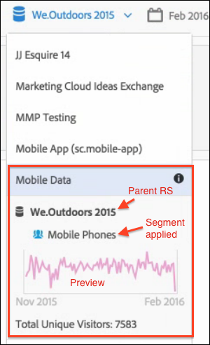

# Viewing Virtual Report Suite Information

## In the Report Suite Selector {#section_74E43B60C1CA4180B5ACA57574C1FA0F}

Clicking the Info icon next to the virtual report suite in the Report Suite selector provides this information: 
* The name of the parent report suite.
* The name of any segments applied to it.
* A simple preview of the report suite with the applied segment.
* Total Unique Visitor count.

 
