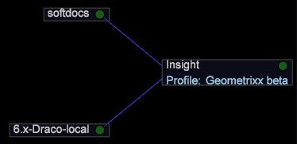

# Configuration option

The Configuration option opens your Insight.cfg file, which controls your connections to various servers.

 

**To edit the Insight.cfg file**

1. In the [!DNL Insight.cfg] window, modify the parameters as desired. For detailed descriptions of the parameters in the [!DNL Insight.cfg] file, see [Insight Configuration Parameters](../../data-workbench-client//c-insght-config-param.md#concept_14DA97D0756348E885C08CA9E866074B). 
1. To save your configuration settings, right-click **[!UICONTROL Insight.cfg (modified)]** at the top of the window and click **[!UICONTROL Save as Insight.cfg]**.

**To add new servers**

1. In the [!DNL Insight.cfg] window, right-click **[!UICONTROL Servers]** and click **[!UICONTROL Add new child]** > **[!UICONTROL Server]**.

   

1. Complete or modify the server parameters to provide Data Workbench with access to the desired server. For detailed descriptions of the parameters in the [!DNL Insight.cfg] file, see [Insight Configuration Parameters](../../data-workbench-client//c-insght-config-param.md#concept_14DA97D0756348E885C08CA9E866074B). 
1. Repeat Step 1 and Step 2 for each server to which you want to configure a connection. 
1. To save your configuration settings, right-click **[!UICONTROL Insight.cfg (modified)]** at the top of the window and click **[!UICONTROL Save as Insight.cfg]**.

[!DNL Data workbench] attempts to connect to the server(s) using the settings that you have specified. If a connection is established, a green node appears in the [!UICONTROL Servers Manager] as shown below. If Data Workbench cannot connect to the server, a red node appears.

