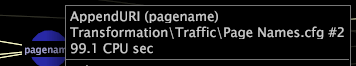

# Display performance data

Information about displaying performance data for a transformation or extended dimension.

* Right-click within the dependency map and click **[!UICONTROL Show Performance Data]**. When enabled, an X appears to the left of [!UICONTROL Show Performance Data]. When you right-click a transformation or extended dimension node, the following performance information displays:

    * Number of CPU seconds required to perform the transformation or create the extended dimension 
    * Amount of memory required to store the extended dimension 
    * Number of elements in the extended dimension 
    * Amount of memory required to store the list of element names in the extended dimension

