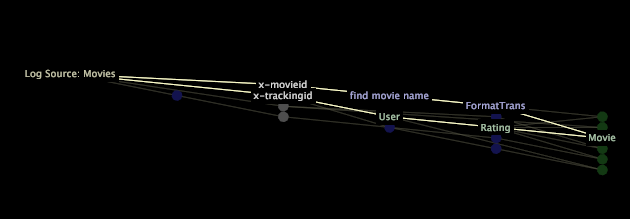

# Display profile components

You can choose to display your profile’s dataset components, query model components, or workspaces, reports, menu options, and globe layers in the dependency map.

 **To select the components to display**

1. Right-click within the dependency map and click **[!UICONTROL Display]**. 
1. Choose one or more of the following options to display on the map. An X appears to the left of each display option that you enable.

    * **Dataset** to display dataset components. See [Dataset Components](../../../../data-workbench-client/c-admin-intrf/c-dataset-mgrs/c-dep-maps/c-dataset-comp.md#concept_4AFE28AD29D14ECA8A5000847254C293). If you choose to display the dataset components, you have the option to [!UICONTROL Include File Blocks] on the map. See [Working with File Blocks](../../../../data-workbench-client/c-admin-intrf/c-dataset-mgrs/c-dep-maps/c-wkg-file-blocks.md#concept_3652BBABFBD34449A5F842D8AA598EFC). 
    
    * **Query Model** to display query model components. See [Query Model Components](../../../../data-workbench-client/c-admin-intrf/c-dataset-mgrs/c-dep-maps/c-qry-mod-comp.md#concept_32C6DADD32F74179B026C7E96D47710F). 
    
    * **Workspaces and Visualizations** to display workspaces, reports, menu options, and globe layers. See [Workspaces and Visualizations](../../../../data-workbench-client/c-admin-intrf/c-dataset-mgrs/c-dep-maps/c-wksps-vis.md#concept_ABBD4FB115FF47F49F879466CE274921). This option works only if the [!UICONTROL Query Model] display option is enabled.

>[!NOTE]
>
>If the [!UICONTROL Query Model] display option is not enabled when you choose the [!UICONTROL Workspaces and Visualizations] display option, an error message appears.

If you cannot see all of the nodes on the map, you can move the map or zoom in or zoom out to display the entire map or to focus on a particular section. For more information about zooming, see [Zooming in Visualizations](../../../../data-workbench-client/c-vis/c-zoom-vis.md#concept_7E33670BB5344F78A316F1A84CC20530).

When you click a node, all of the nodes that depend on that node and all of the nodes on which that node depends are highlighted and their names display.

>[!NOTE]
>
>A highlighted path in a dependency map does not constitute a selection.

When you right-click a node, you can see identifying information about each component shown on the map and choose menu options that enable you to view more detail about the component or to edit the component. In addition, you can perform text searches and display performance information for transformations and extended dimensions. 
