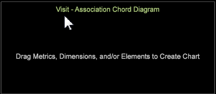

# Association Chord visualization

The Association Chord visualization allows you to show both the proportion and association between metrics, dimensions, and elements, displaying larger chords as an indication of a stronger association.

The Associations Table compares values with Cramer's V calculation rather than using Pearson's correlation coefficient as employed in the [Correlation Matrix](https://marketing.adobe.com/resources/help/en_US/insight/client/?f=c_correlation_analysis) and [Correlation Chord](https://marketing.adobe.com/resources/help/en_US/insight/client/?f=c_chord_visualization) visualizations (these can only compare metrics, while the Association Table and Chord can compare metrics, dimensions, and elements). The Associations Chord also provides another view into a previously built [Associations Table](../../data-workbench-client/c-analysis-vis/associations-visualization.md#concept_9D937DDA38174875B32095C6EAF22F2F).

**To build an Association Chord**

1. In a workspace, right-click **Visualization > Predictive Analytics > Association Chord**.

   A menu will open allowing you to select an extended dimension from the list. 

   

   Once selected, the blank Association Table will open with the selected Dimension identified in the title.  

1. **Select a metric, dimension, or dimension element**.

   Right-click the chord visualization and select **Add Metric** or **Add Dimension**. Select items from the menu to add to the chord.

   You can also drag metrics and dimensions from the **[!UICONTROL Finder]** by clicking ****[!UICONTROL Ctrl-Alt]**** and dragging metrics and dimensions to the chord. Or drag dimension elements directly from an open table to the chord visualization. 

1. **Choose additional metrics, dimensions, and elements to associate**.

   After two or more values are selected, the chart will automatically refresh and begin displaying association data. Continue adding metrics as needed to associate data points.  

   The Chord visualization displays the proportion of the whole represented by the area of each segment. Continue to add metrics/dimensions/elements as need to identify and investigate significant relationships. 

1. **View the Chord visualization**.

   Hover over each value in the visualization to see relationships. 

1. **Change Settings.** Right-click the chord visualization to open a menu to change the metric, dimension, or elements display the dimensions as absolute numbers or as percentages, remove the selected metric or all metrics, edit colors and details, and export values to an Associations Table.

**To build an Association Chord from an Association Table:**

1. Open an **Association Table** visualization. 
1. Right-click and select **Export Chord Visualization**. An Association Chord diagram will open with values selected in the Association Table. 

>[!IMPORTANT]
>
>Exporting an Association Table from an Association Chord Diagram that contains at least one metric will result in duplicated elements in the rows/columns of the Association Table. To avoid duplicated elements, create a new Association Table and add the desired elements rather than exporting the elements from an Association Chord Diagram.

