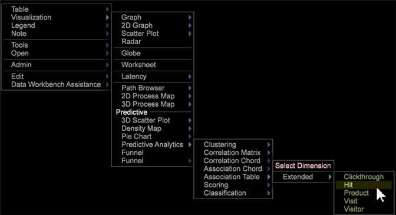
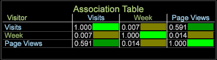

# Association Table visualization

The Association Table visualization let you associate metrics with metrics, dimensions, and dimension elements using Cramer's V algorithm.

The Association Table compares values with Cramer's V calculation rather than using Pearson's correlation coefficient as used in the [Correlation Matrix](https://marketing.adobe.com/resources/help/en_US/insight/client/?f=c_correlation_analysis) and [Correlation Chord](https://marketing.adobe.com/resources/help/en_US/insight/client/?f=c_chord_visualization) visualizations (these can only compare metrics, while the Association Table and [Association Chord](../../data-workbench-client/c-analysis-vis/associations-chord.md#concept_51D0BDA998474DD5946CC2A9B8393445) can compare metrics, dimensions, and elements).

## Build an Association Table {#section_87ED12CCC1AF4196A1B6534E621C4CBB}

The Association Table compares metrics over a countable or non-countable dimension. The table can be modified to highlight associations within the visualization through color picking or to render it as a text map, heat map, or both.

1. Open an Association Table.

   Right-click [!DNL Visualization] > [!DNL Predictive Analytics] > [!DNL Association Table].

   

1. Select an extended dimension—a Clickthrough, Hit, Product, Visit, or Visitor dimension. An Association Table will open with the extended dimension identified in the corner and its associated metric placed in both the row and column.

   

   The Associations Table uses Cramer's V as a symmetrical correlation, resulting in selected metrics, dimensions, and elements values reflected in both the columns and rows of an Association Table. For example, selecting the **Product** extended dimension uses the **[!UICONTROL Visits]** metric as the associated metric in both the row and column of the table, resulting in a perfect yet useless comparison (1.00) because the compared values are identical. 

1. Add more values to the Association Table.

   Right-click in a column or row and select **Add Metric** or **Add Dimension**. You can also drag metrics and dimensions from a **Finder** panel. Dimension elements can also be dragged and dropped from an open table to the table visualization.

   

   >[!NOTE]
   >
   >There is a limit of ten rows and columns allowed in the Association Table.

