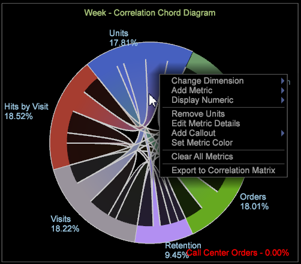

# Correlation Chord visualization

The Correlation Chord visualization allows you to show both the proportion and correlation between metrics, displaying larger chords as an indication of a stronger correlation, and provides another view into the Correlation Matrix.

The Correlation Chord visualization lets you see identify correlations between metrics, allowing you to add and easily evaluate possible correlations. It also provides another view into any previously built [Correlation Matrix](https://marketing.adobe.com/resources/help/en_US/insight/client/?f=c_correlation_analysis). Using the Correlation Chord visualization, you cannot identify a positive or negative correlation between the metrics—only that a correlation exists. In certain cases, determining a direct or inverse relationship can be identified by applying counter metrics.

1. Open the **[!UICONTROL Chord]** visualization.

   In the workspace, right-click [!DNL Visualization > Predictive Analytics > Correlation Chord]. 

1. Select a Dimension from the menu.

   A blank visualization will open allowing you to select a dimension. The dimension name will appear at the top of the blank chord visualization.

   >[!NOTE]
   >
   >If you already have a Correlation Matrix open in the workspace, you can also render it as a Chord visualization.

1. Choose metrics to correlate.

   Drag metrics from the **[!UICONTROL Finder]** by clicking ****[!UICONTROL Ctrl-Alt]****to drag metrics from the table to the chart. After two or more metrics are selected, the chart will automatically refresh and begin displaying correlation data. Continue adding metrics as needed to correlate data points.

   

   The Chord visualization displays the proportion of the whole represented by the area of each segment. Continue to add metrics as need to identify and investigate significant relationships.

   

1. View the Chord visualization.

   Hover over each metric in the visualization to see relationships. In the example, you can see a correlation between Units and most other metrics (except for the **Visit Duration** metric).  

   When you hover over the **Visit Duration** metric on the Chord visualization, you can see there is very little or at most weak correlation between all other metrics.

   

1. Change settings.

   Right-click the Chord visualization to open a menu to change the dimension, display the dimensions as absolute numbers or as percentages, remove the selected metric or all metrics, edit colors and details, and export values to a Correlation Matrix.

   

