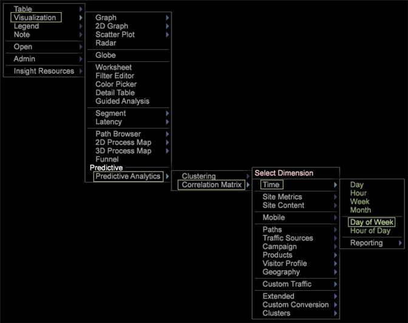
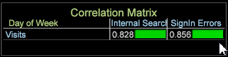
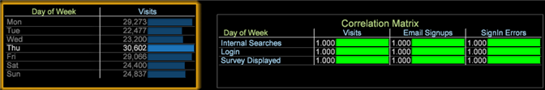
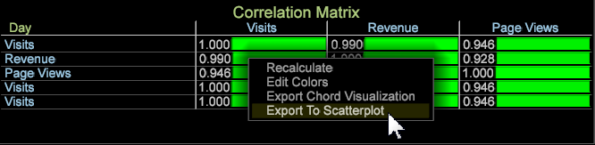
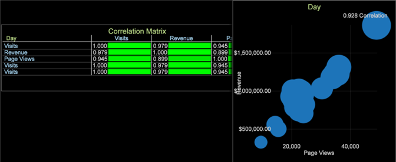

# Correlation Matrix

Statistical correlations measure meaningful relationships to identify opportunities through advanced data mining.

 The Correlation Matrix uses [Pearsons correlation coefficient](../../../data-workbench-client/c-analysis-vis/c-correlation-analysis/c-correlation-pearsons.md#concept_5996CB8C89FD4DF5B47B7318E7A1D29C) to better identify the next steps in a marketing campaign, to improve site design, or to continue in-depth customer analysis for additional correlation dependencies.

## Build a Correlation Matrix {#section_87ED12CCC1AF4196A1B6534E621C4CBB}

The Correlation Matrix compares metrics over a countable or non-countable dimension. The matrix can then be modified to highlight correlations within the visualization through color picking or to render it as a text map, heat map, or both.

1. Open a Correlation Matrix.

   Right-click [!DNL Visualization] > [!DNL Predictive Analytics] > [!DNL Correlation Matrix]. The dimension table will open.

   

   Select a dimension, such as [!DNL Time] > [!DNL Day of the Week] from this menu. The correlation table will open with the dimension identified in the corner of the matrix and its associated metric placed in the row and column. For the Day of the Week dimension, **[!UICONTROL Visits]** is the associated metric.

   

   The correlation is 1.000 because you are comparing a metric against itself (which reflects a perfect, but unusable, correlation.) 

1. Change one of the metrics.

   Right-click and select **[!UICONTROL Change Metric]** to change a metric in either the row or column. This sets up a correlation between two metrics of value.

   For this example, change the **[!UICONTROL Visits]** metric in the column to **[!UICONTROL Internal Searches]**. Right-click and select [!DNL Metric] > [!DNL Custom Events] > [!DNL Custom Event 1-10] > [!DNL Internal Searches].

   

1. Add more metrics to the Correlation Matrix.

   Right-click in a metric column or row. For example, from the Metric menu, add

[!DNL Metric] > [!DNL Custom Events] > [!DNL Custom Event 1-10] > [!DNL Sign in Error].

   

   The new metric will appear in a column with a correlation number. You can add other metrics, such as **[!UICONTROL Email Signups]**, to build out the table.

   

   Or add metrics to rows to compare against metrics in columns.

   

1. (Optional) Constrain a metric by adding a dimension element.

   Right-click in the workspace and select **[!UICONTROL Table]**. From the open dimension table, press Ctrl + Alt and drag the element over a metric in a column or row. The element will appear next to the metric in brackets.

   For example, for the **[!UICONTROL Visits]** metric, you can constrain it by selecting the **[!UICONTROL Country]** as **[!UICONTROL New Zealand]**.

   

   Notice that when you select a dimension element, the correlation changes in all metrics based on the selected dimension element. Only the Visit metric will be constrained for "New Zealand" once the dimension window is closed.

   >[!NOTE]
   >
   >If changing a metric with a dimension constraint (by right-clicking and selecting **[!UICONTROL Change Metric]**), the dimension element constraining the metric will be lost. You will need to add the dimension element again.

1. Create a [Binary Filter](../../../data-workbench-client/c-analysis-vis/c-correlation-analysis/c-correlation-binary-filter.md#concept_24E1DAFF43C540F69019F236976DA31C) to further constrain the metric by right-clicking the metric in the table and select **[!UICONTROL Binary Filter]**from the menu.

## Correlation planning and analysis goals {#section_CC322DA60B7E417BA29E72B0AFEB6F79}

The following are general goals for building a Correlation Matrix.

**Identify the relationship between two metrics against a specified dimension**. In the example, the matrix was built around the core dimension, Day of the Week, with the metrics Visit, Email Signups, and SignIn Errors compared against Internal Searches, Login, and Survey Displayed metric events.

**Develop hypotheses to focus analysis**. After running a correlation analysis, your next step is to look for dependencies and correlation of the metrics. For example, understanding that internal searches has an effect on email sign-ups provides a path to predict that relationship and to modify marketing campaigns or web site navigation design.

**Identify metrics to include more advanced data mining algorithms**. In most cases, the key metrics will be identified because they will be seen affecting multiple correlations. You can now take those key metrics and apply them to additional data mining analysis for deeper insight.

## Correlation Matrix feature notes {#section_EF3626C665EA468A9ECDAD624B4132F5}

**Filtering and selecting on dimension elements within a table compares like values**. For example, using Day of the Week dimension and then clicking into an element of that core dimension, such as clicking on a specific day within the Day of Week dimension table, renders a one to one match at 100% that provides no usable correlation. Because the root dimension was Day of the Week, any selection within the Day of the Week dimension table will alter the matrix to be a one-to-one correlation.

However, the 1 to 1 correlation (when a single selection is made of all elements) is only on that specific day. If you make multiple selections then it does not necessarily remain a 1 to 1 correlation, and will not always yield a 100 percent match regardless of selecting 1 or 1+ days of the week.

**Statistical correlations are not equal to the Correlated Data Model**, the historical reference of Adobe Analytics products. The statistical correlation in Data Workbench is based on the [Pearson Correlation model](../../../data-workbench-client/c-analysis-vis/c-correlation-analysis/c-correlation-pearsons.md#concept_5996CB8C89FD4DF5B47B7318E7A1D29C).

**Display Correlation in a Scatter Plot**. Right-click the title on a Scatter Plot and choose [!UICONTROL Display Correlation] from the [!UICONTROL Visualization] menu. The correlation values will display in the upper-right section of the Scatter Plot.

* You can right-click on a cell in the correlation matrix and open a scatter plot.

  

* The scatter plot visualization uses the row and column metrics of the correlation matrix as the axis of the scatter plot.

  

* Binary Filters are meaningless in scatter plots so they are ignored. However, the element value restricting the metric in the correlation matrix will display in the scatter plot.

>[!NOTE]
>
>The Scatter Plot and Pearsons matrix will display "Calculation Error" if the application is unable to run the Pearsons correlation calculation. This is usually due to insufficient data, which can cause the equation to attempt to divide by 0.

