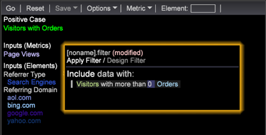
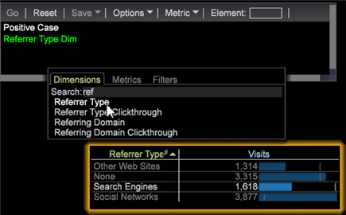
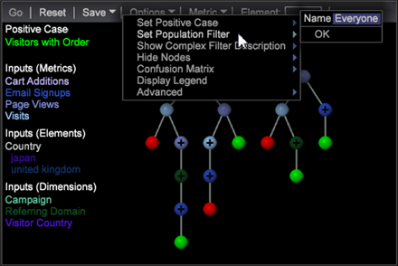
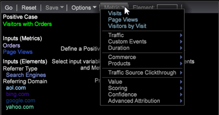
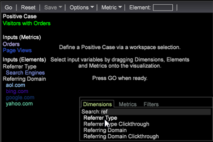
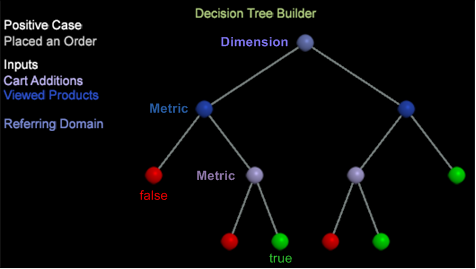
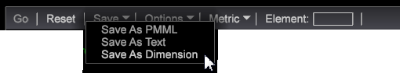

# Build a decision tree

Set up a decision tree by identifying a positive case and adding metric and dimension inputs to evaluate the data and explore the decision tree.

Follow these steps to build a decision tree.

1. Open a new workspace.

   After opening a new workspace, you might need to click **Add** > **Temporarily Unlock**. 

1. To open the Decision Tree Builder, right-click **[!UICONTROL Visualization]** > **Predictive Analytics** > **Classification** > **Decision Tree Builder**. 
1. Set a **Positive Case**.

   You can define a positive case for a decision tree by selecting dimensions in a Finder or dimension elements in a table, or by designing a filter in the Design Filter. In fact, the positive case can be a combination of multiple selections in the workspace including filters, dimensions, elements, and all types of Data Workbench visualization values.

    * **Design and Apply a Filter** as a positive case. Right-click in the workspace and select **[!UICONTROL Tools]** > **[!UICONTROL Filter Editor]** to design and apply a filter.

      

    * Add **Dimensions** as a positive case. In the workspace, right-click and select **Tools** > **Finders** (or select **[!UICONTROL Add]** > **[!UICONTROL Finders]** in the left pane). Type a dimension name in the **Search** field and then select a dimension.

      

    * Add **Metrics** as a positive case. Select from the Metrics menu in the toolbar (or right-click and select **Tools** > **Finders** or select **[!UICONTROL Add]** > **[!UICONTROL Finders]** in the left pane to open a Metrics table). Select a metric as your positive case. 
    * Add **Dimension Elements** as a positive case. Right-click in the workspace and select **[!UICONTROL Table]** to open dimension elements, then select from the dimension elements to set your positive case.

1. Click **[!UICONTROL Options]** > **[!UICONTROL Set Positive Case]**.

   This sets the positive case and lets you name it. The name will appear under the **[!UICONTROL Positive Case]** heading in the workspace.

   >[!NOTE]
   >
   >When you set the positive case the Decision Tree uses the current workspace selection, which can be defined as the Visitors (or whatever top-level countable is defined, but in most cases Visitors) that match the current selection within the workspace. These combine as a single filter for a single positive case (not multiple positive cases).

   Clicking **[!UICONTROL Set Positive Case]** when there is no selection will clear the positive case. 

1. (Optional) Select **[!UICONTROL Set Population Filters]** to define the visitor population to be classified.

   

   If no population filter is applied, then the training set is drawn from all visitors (default is "Everyone").

   >[!NOTE]
   >
   >Click the **[!UICONTROL Show Complex Filter Description]** to view the filtering scripts for the Positive Case and Population Filter.

1. Add **Metrics**, **Dimensions**, and **Dimension Elements** as inputs.

   You can select inputs by dragging and dropping from the Finder panels or from tables for individual dimension elements. You can also select from the **[!UICONTROL Metrics]** menu in the toolbar.

    * Add **Metrics** as inputs.

      Select Metrics from the toolbar. Press **Ctrl** + **Alt** to drag one or more metrics to the Decision Tree Builder.

      The metric will appear in the **Input (Metrics) list** as an input with unique color-coding.

      

    * Add **Dimensions** as inputs.

      In the workspace, right-click and select **Tools** > **Finder** and type the dimension name in the **Search** field. Press **Ctrl** + **Alt**, select a dimension, and drag the dimension to the Decision Tree Builder.

      The dimension will appear in the **Input (Dimensions)** list with a unique color-coding.

      

    * Add **Dimension Elements** as inputs.

      In the workspace, right-click and select a Dimension table. Select Dimension Elements, press **Ctrl** + **Alt**, and drag the selected elements to the Decision Tree Builder.

      The dimension elements will appear in the **Input (Elements)** list with a unique color-coding.

   >[!IMPORTANT]
   >
   >You can select up to a maximum of fourteen inputs to be evaluated. An error message will appear if too many inputs are added.

1. Select **[!UICONTROL Go]** from the toolbar.

   The decision tree will build based on the selected dimensions and metrics. Simple metrics such as Cart Additions will build quickly, while complex dimension such as Visit Duration with multiple data points will build more slowly with a percentage of the completion displayed as it converts. The tree map will then prune and open for user interaction. The dimension and metric inputs will be color-coded consistent with the node names.

   

   The leaf node displays as green (true) or red (false) if the tree has been pruned and if there is a prediction of **True** or **False** following the pruned branches.

   >[!NOTE]
   >
   >The training sample is pulled from the dataset for the tree builder to use. Data Workbench uses 80 percent of the sample to build the tree and the remaining 20 percent to assess the accuracy of the tree model.

1. Verify accuracy using the **[!UICONTROL Confusion Matrix]**.

   Click **[!UICONTROL Options]** > **[!UICONTROL Confusion Matrix]** to view the Accuracy, Recall, Precision and F-Score values. The closer to 100 percent, the better the score.

   The Confusion Matrix gives four counts of accuracy of the model using a combination of values:

    * Actual Positive (AP) 
    * Predicted Positive (PP) 
    * Actual Negative (AN) 
    * Predicted Negative (PN)

   >[!TIP]
   >
   >These numbers are obtained by applying the resulted scoring model of the 20 percent testing data withheld and already known as the true answer. If the score is greater than 50 percent, it is predicted as a positive case (that matches the defined filter). Then, Accuracy = (TP + TN)/(TP + FP + TN + FN), Recall = TP / (TP + FN), and Precision = TP / (TP + FP).

1. Explore the decision tree.

   After generating a decision tree, you can view the path of the prediction and identify all visitors who meet the defined criteria. The tree identifies the input split for each branch based on its position and color-coding. For example, if you select the Referring Domain node, the nodes leading to that split are listed by color-code to the left of the tree.

   You can make selections of the leaf nodes to select branches (rule sets) of the decision tree.

   For this example: If the visit duration is less than 1, no campaign exists, at least one page view exist, no email signups, and there was at least one visit. The projections on this meeting criteria and placing an order is **94.73** percent.

   

   **Decision Tree interaction**: You can select multiple nodes on the tree using the standard **Ctrl-click** to add, or **Shift-click** to delete.

   **Color-coded nodes**: The color of the nodes matches the color of the input dimensions and metrics as assigned by Data Workbench.

   Bright green and red nodes at the leaf-level of a pruned branch predicts the node as True or False.

    *     
    
      (Green) Identifies that the node equals true and that all conditions are met. 
    *     
    
      (Red) Identifies that the node equals false and not all conditions are met.

1. Save the Decision Tree.

   You can save the Decision Tree in different formats: 

   

    * Predictive Markup Language (**PMML**), an XML-based file format used by applications to describe and exchange decision tree models. 
    * **Text** displaying simple columns and rows of true or false, percentages, number of members, and input values. 
    * A **Dimension** with branches corresponding to predicted outcome elements.

