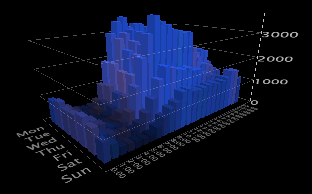

# 2D graphs

Two-dimensional (2D) graphs display a metric across two dimensions.

 See the following example:

**To rotate a graph**

* Right-click the graph and drag the mouse in the desired rotational direction.

**To zoom in or out on the graph**

* With the mouse pointer anywhere in the graph window, press both mouse buttons at the same time and push the mouse away from your to zoom in and toward you to zoom out. You also can use your mouse wheel if one is available.

**To scale the vertical axis**

1. Move the mouse over the vertical axis to highlight a plane of the graph. 
1. While the plane is highlighted, click+drag the mouse up or down to scale the vertical axis of the graph.

See [Zooming in Visualizations](../../../data-workbench-client/c-vis/c-zoom-vis.md#concept_7E33670BB5344F78A316F1A84CC20530). 
