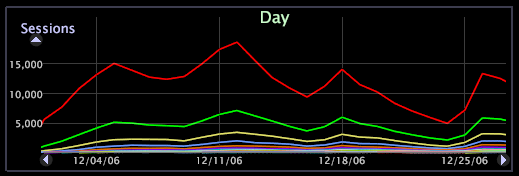

# Change a series

Elements within a dimension can be color-coded as a series within a line graph so that each element can be more easily tracked across other visualizations in the workspace.

 The series feature applies to graphs only when the line graph is displayed as lines, not bars.

When a series is active, data for the different elements of the dimension is shown in alternating colors. It is useful to add a table to the workspace showing the same dimension to provide a series legend for the selected dimension. See [Using Series Legends](../../../data-workbench-client/c-analysis-vis/c-tables/c-srs-leg.md#concept_C48042A705524BC4B63CD6F24874CC12).

**To enable a series**

* Right-click an element or the label of the dimension and click **[!UICONTROL Change Series]** > *< **[!UICONTROL dimension name]**>*.

**To disable a series**

* Right-click an element or the label of the dimension and click **[!UICONTROL Change Series]** > **[!UICONTROL None]**.

