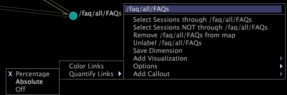
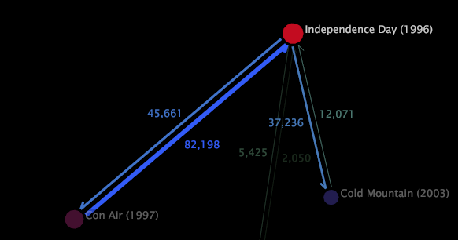
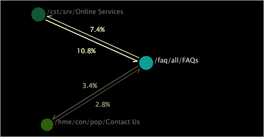

# Display a metric quantity

A 2D process map can display the metric quantities representing the amount of activity to or from a node on the map.

The actual sequence of activity may have included nodes that were not added to this map. This quantity is expressed as a percentage, an absolute value, or no value at all.

>[!NOTE]
>
>You can display metric quantities for 2D process maps only.

**To display metric quantities in a 2D process map**

* Click the desired node. All of the other nodes in the process map dim so that you can more easily see the arrows to and from the highlighted node and the associated metric quantities.

**To choose how the quantity is displayed**

1. Right-click a node and click **[!UICONTROL Options]** > **[!UICONTROL Quantify Links]**. 
1. Click **[!UICONTROL Percentage]**, **[!UICONTROL Absolute Value]**, or **[!UICONTROL Off]**.

   

The following examples show metric quantities for two 2D process maps.

