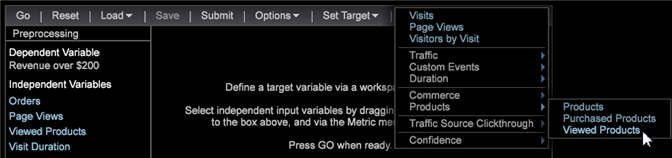

# Set up a propensity score

Follow these steps to use the Propensity Scoring visualization.

1. Open a new workspace and click **Tools** > **[!UICONTROL Predictive Analytics]** > **[!UICONTROL Scoring]** > **[!UICONTROL Propensity Score]**.

1. Set the **[!UICONTROL Target]** (the dependent variable).

   Set the dependent variable by selecting:

* **Dimension elements**: Right-click in the workspace and select **[!UICONTROL Table]**. Then select a Dimension elements as your dependent variable.

  OR 

* **[!UICONTROL Filter Editor]**. Click **[!UICONTROL Add]** > **[!UICONTROL Visualization]** > **[!UICONTROL Filter Editor]** to open the Filter Editor visualization.

   

   After selecting a Dimension element or Filter as the dependent variable, click **[!UICONTROL Set Target]**, enter a name to describe the dependent variable. Then click **[!UICONTROL OK]** (and make sure the filter box is highlighted) to set the Target.

   

   The name you give the target is the dependent variable that will appear in the left pane. 
1. Add independent variables.

   Add the independent variables using Metrics or Dimension Elements.

   

* **Metrics**. From the Propensity Scoring toolbar, select a metric from the **[!UICONTROL Metrics]** menu. 

* **Dimension elements**: Right-click in the workspace and select **[!UICONTROL Table]**. Select one or more Dimension elements and drag to the left column under **[!UICONTROL Independent Variables]** or to the **[!UICONTROL Element]** box using the <Ctrl> + <Alt> keys.

1. Set **[!UICONTROL Training Filter]**. You can define the set of visitors that you want to score by clicking **[!UICONTROL Options]** > **[!UICONTROL Set Training Filter]** from the Propensity Scoring toolbar. This will provide a subset of data built using only the visitors that you want to score. For example, who visited in the last month, visitors who reside in Australia, or visitors who viewed specific products.

   The default filter is **[!UICONTROL Train on Everyone]**, but you can change it by activating **[!UICONTROL Dimension Elements]** in a table or building a filter using the **[!UICONTROL Filter Editor]**.

   After selecting a Dimension element or building a filter and while activated, click **Options** > **Set Training Filter**, enter a name to describe the filter, and then click **[!UICONTROL OK]**. 
1. Once you have identified all your inputs, press **[!UICONTROL Go]**.

   

   The scoring process will begin by passing over the data multiple times. It will then display the results as bar charts over a percentage line. 
1. Save Propensity Score.

   Starting with 6.1, you now have an option when using the Save Propensity Score:

* Dimension 
* Dimension and Metric

   You can end up with two saved files, both a dimension and a defined metric.

   >[!NOTE]
   >
   >If you submit the Propensity Score for processing you will get a dimension only.

   The derived metric is the associated average score metric. 
1. Check for accuracy.

   The system will display **[!UICONTROL Model Complete]** and generate a scoring model when the process is complete.

   Right-clicking on **[!UICONTROL Model Complete]** will identify the accuracy of the scoring model as defined by the system. Values ranging from 0 percent to 100 percent will identify the likelihood of the visitors matching the **[!UICONTROL Target]** variable.

   The [Confusion Matrix](http://marketing.adobe.com/resources/help/en_US/insight/client/?f=c_confusion_matrix)gives four counts by the combination of Actual Positive (AP), Actual Negative (AN), Predicted Positive (PP), and Predicted Negative (PN). These numbers are obtained by applying the resulted scoring model to the 20% withheld testing data of which we know the true answer. If the score is greater than 50%, it is predicted as a positive case (matching the defined event).

   

<table id="table_154BDD6D294C4ED1B8C15EC33B74B199"> 
 <tbody> 
  <tr> 
   <td colname="col1"> 
<b> Accuracy</b> 
 </td> 
   <td colname="col2"> 
Indicates how accurate the model is by identifying the correct predictions over all predictions. 
 
(TP + TN)/(TP + FP + TN + FN) 
 </td> 
  </tr> 
  <tr> 
   <td colname="col1"> 
<b> Recall</b> 
 </td> 
   <td colname="col2"> 
Identifies the ability to re-identify the scoring model. 
 
<b>TP / (TP + FN)</b> 
 </td> 
  </tr> 
  <tr> 
   <td colname="col1"> 
<b> Precision</b> 
 </td> 
   <td colname="col2"> 
Identifies the level of discrepancy. 
 
TP / (TP + FP) 
 </td> 
  </tr> 
 </tbody> 
</table>

1. Open a [Lift or Gain Chart](../../../data-workbench-client/c-analysis-vis/c-visitor-propensity/c-propensity-gain-lift-chart.md#concept_0D049F6BAF534F7FB97F271843BA6C4A), or the [Model Viewer](../../../data-workbench-client/c-analysis-vis/c-visitor-propensity/c-propensity-model-viewer.md#concept_9F2593A8218140B7BD132A4C74E159F9).

   Right-click on the **Model Complete** visualization and select **[!UICONTROL Lift Chart]**, **[!UICONTROL Gain Chart]**, or **[!UICONTROL Model Viewer.]** 
