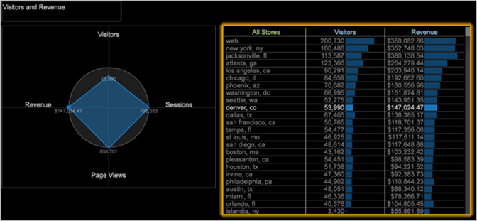

# Radar visualization

Radar charts provide quick focus on the areas that are in most need of attention, by providing a visual view of a set of metrics, and how they relate or differ.

 Many times you need more than one metric to understand and evaluate selected observations in a workspace.

This visualization is useful for comparisons or benchmarks among the table selections. For example, you might add a workspace table that lists stores, then add a radar visualization with metrics like Revenue, Visitors, and Page Views. (As shown in the screen in the following procedure.) As you make store selections in the table, the radar chart footprint shifts, identifying weaknesses or strengths in the metrics for the selected store.

Each radial of a radar chart is a metric, and a minimum of three metrics are required. The metric data is plotted in relation to one anchored metric. The anchored metric and the Scale to Anchor parameter for each metric determine the scaling of the metrics with respect to benchmarks.

**To create a radar visualization** 

1. Right click in the Workspace, then click **[!UICONTROL Visualization]** > **[!UICONTROL Radar]**.

   

1. To add metrics, right-click in the visualization and select **[!UICONTROL Add Metric]**.
1. To anchor a metric to the chart, right click on a metric and choose the following option:

   **Anchor to this metric:** Uses this metric as the benchmark to which other metrics are drawn. You can anchor one metric at a time. Each metric on the chart is filtered by the active workspace selection, or by no filter. The benchmark ratio between these two values is plotted on the axis between the center of the graph and metric name on the radar. Zero is plotted in the center. 

1. To scale a metric with the anchored metric, right-click the metric and choose the following option:

   **Scale with anchor:** When enabled, this metric’s axis is scaled so that the benchmark ratio for the selected anchor metric is plotted in the circle, with zero at the center. When not selected, the circle represents a benchmark ratio of 1. Typically, you turn on Scale with Anchor for countable metrics, such as Visitors or Page Views, and turn it off for ratio metrics, such as Conversion, Average Session Duration, or Page Views per Session. 

