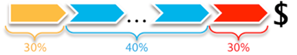
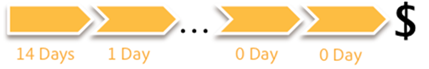
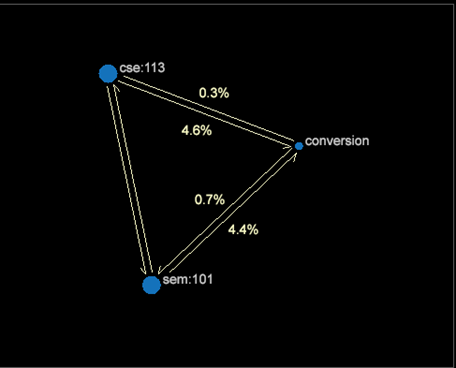

# Attribution models

Seven different attribution models are provided to use with the Attribution profile to help illustrate and quantify the customer-marketing journey.

** First and Last model **

The first attribution models are the traditional **First** and **Last** touches. Understanding the first step into converting a sale or the last touch before checking out and buying a product provides an understanding of campaign types—for awareness, the First touch, and for call-to-action, the Last touch.

**Even model **

The view into the marketing engagement is expanded with the introduction of **Even**. Every qualifying marketing interaction is given an equal share of the subsequent order and revenue generated from the conversion.

**Starter, Player, and Closer model **

And moving beyond an equal allocation the **Starter, Player, & Closer** model provides a position based weighting scheme with adjustable weighting. The weights can be explored while performing analysis.

Consider this example: The starter (or first) gets 30 percent of the converted revenue, closer (or last) gets 30 percent, and all the players (those in-between) share an equal portion of the remaining 40 percent.

>[!NOTE]
>
>It's fairly common to assign the allocation back to marketing interactions based on either revenue or occurrence of the order. These next two models attribute different characteristics to the marketing interactions to expose other dynamics of success.

**Adjacency model**

The Adjacency model provides visibility into the marketing position away from the conversion, answering the question: Is the marketing channel typically the 1 (closest), 5, or 10 marketing channel interaction away from success?

**Latency model**

The **Latency** model helps describe the lag time between the interaction with the marketing channel and the occurrence of success. This is useful in presenting awareness versus call-to-action type campaigns and knowing which levers the business can pull to get a more timely response from a target audience. (A value of zero (0) days means the marketing interaction occurred the same day as the success.)

**Pathing model**

The Pathing model provides different approaches for exploring the customer's engagement with marketing and his or her successful conversion, establishing the relationships between marketing interactions within the customer journey. Explore the process maps to understand high-level flows between supporting marketing channels and success. Evaluate direct sequential marketing interactions with the path browser.

Path Browser visualization

**2D Process Map visualization **

**3D Process Map visualization **

