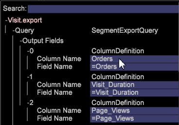
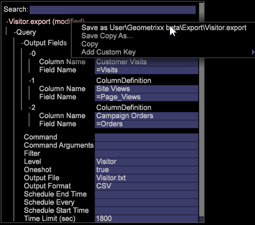

# Export segments with custom headers

Create custom column export headers for your segment export files to add easily understood descriptions for exported segments. This export feature also lets you output as TSV and CSV files.

New functionality has been added to Segment Export, including the ability to export with a header (you can create column headers for your export files), or in CSV and TSV formats.

>[!NOTE]
>
>An SFTP/FTP export was added to the Export Integration framework. You can now use exports such as CSV, TSV, Segment Export, and Segment Export with Header using FTP / SFTP protocols to send files to a different server to be configured from the client (workstation).

1. Open a workspace and right-click **[!UICONTROL Tools]** > **[!UICONTROL Detail Table]**. 
1. Right-click and select **[!UICONTROL Add Level > Extended]** > Choose an item. 
1. Right-click title and select **[!UICONTROL Add Attribute.]**

   Select a dimension from the menu. 

1. Right-click title and select **[!UICONTROL Add Metric.]**

   Select a metric from the menu. 

1. Right-click title and select **[!UICONTROL New Segment Export]**.

   

   **[!UICONTROL New Segment Export with Header]** automatically populates the Column Name with the name of the metric. **[!UICONTROL New Segment Export]** requires you to set a custom name. 

   >[!NOTE]
   >
   >The Column Name field cannot be left empty or the header will not be present.

1. Right-click and name the segment and then click **[!UICONTROL Save Export File]**.

   An export window will open. 

1. Right-click the export name and click **[!UICONTROL Save as <export filename>]**.

   

1. Right-click [!DNL Admin] > [!DNL Profile Manager] > [!DNL Expand Export]. Find the export file you just created and save it to an existing profile.

   

