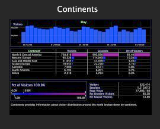

# File versioning

The Worktop makes it easy to determine where each particular workspace is stored, whether it be on the Data Workbench server, your local machine, or both.

## Identifying file versions {#section_D555C96B016344F19B356C12213DD2A9}

**Server**

A server workspace is stored on the connected Data Workbench server and is available to all users who have access to this profile and tab. A server workspace displays as a single thumbnail.

Server workspaces are stored by default in the appropriate sub folder within the Workspaces folder on the connected Data Workbench server.

**Local**

A local workspace is the local version of a server workspace. A local workspace displays as two overlapping thumbnails. The thumbnail on the top initially is surrounded by a glow, which indicates recent changes were made locally to the server workspace. This glow dissipates over time.

Local workspaces are stored by default in the [!DNL User\working profile name\Workspaces\tab] name folder within the Data Workbench (or Insight) installation directory.

>[!NOTE]
>
>When you have a local version of a server workspace, you must revert to the server version before you can download an updated version of the server workspace. To revert back to the server version without local changes, right-click the thumbnail of the local workspace and click **[!UICONTROL Revert to server version]**.

**User**

A user workspace is a workspace that was created on and exists only on the local machine. A user workspace displays as a single thumbnail with a dotted outline of a blank workspace behind it, indicating that there is no source workspace on the connected Data Workbench server.

User workspaces are stored by default in the User\*working profile name*\Workspaces\*tab name* folder within the Insight installation directory. 
