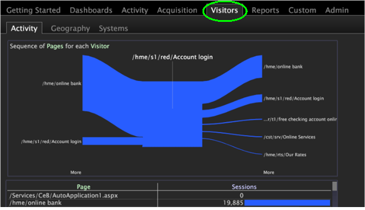

# Add a tab to the worktop

Add a tab to the Worktop to quickly access a workspace.

 You can add a workspace as a tab on the Worktop. For example, you can add a **Visitors** tab for quick access to an overview of your traffic.

**Add a folder in the Profile Manager** 

1. Open the workspace you want to associate with the new tab, then right-click **Admin** > **Profile Manager**.
1. In the [!UICONTROL Profile Manager], click **[!UICONTROL Workspaces]** to view its contents.
1. Right-click in the [!UICONTROL User] column for [!UICONTROL Workspaces] and select **[!UICONTROL Create]** > **[!UICONTROL Folder]**.

   

   This creates a new subfolder to contain the files that you want to be available through your new tab. A new folder appears named New Folder. 
1. To rename, right-click in the [!UICONTROL User] column for the New Folder and type a name in the Dir parameter.

   

   The folder name will appear in the worktop as a tab.

   

1. (Optional) To make the changes available to all users of the working profile, right-click the white check mark for the [!DNL .vw] file in the [!UICONTROL User] column and click **[!UICONTROL Save to]** > *< **[!UICONTROL working profile name]**>*.

   To display only the full-sized version of the description workspace and not the thumbnail of this workspace, you must save the workspace to the working profile. To do so, in the [!UICONTROL Profile Manager], right-click the white check mark for the [!DNL description.vw] file in the [!UICONTROL User] column, then click **[!UICONTROL Save to]** > *< **[!UICONTROL working profile name]**>*. 
