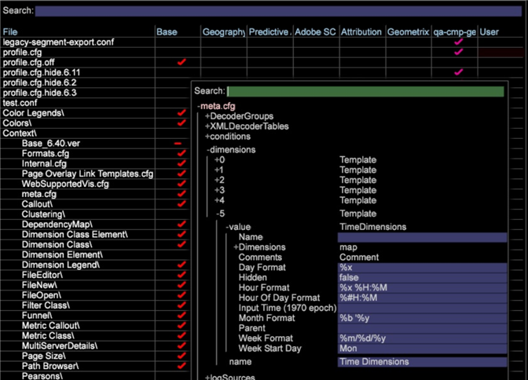

# Localize time dimensions

Configure the time dimensions to display correctly for the locale.

You can configure the displayed format of time dimensions based on locale in the ** [!DNL Standard Time Dimensions.cfg]** file (located by default at ** [!DNL Server/Profiles/<my profile>/Dataset/Transformation/Time/Standard Time Dimensions.cfg]**).

For example, in North America you can express the date May 3rd, 2015 as 5/3/15, or ** `%m/%d/%y`**. However, in other parts of the world this could be interpreted as `%d/%m/%y`, or March 5th, 2015 due to an ambiguity in the values. To avoid this situation, an administrator might want to change the displayed format to match the expectations of the users in a locale.

## 1. Override Default Time Dimensions in Standard Time Dimensions.cfg {#section_7D0B24657BEF4B15ABB3CBEA66CB617F}

To enable this feature, the administrator must override the defaults by either editing the existing time dimensions or by creating new time dimensions with additional parameters.

An example of a modified time dimension follows.

The **Format** values for Week, Hour, Day, Month, and Hour of Day are set to the defaults in the example. 

>[!NOTE]
>
>If these lines are omitted, Data Workbench's behavior won't change and the dimension will be compiled using the defaults.

```
Transformation Include = TransformationInclude:  
  Extended Dimensions = vector: 1 items 
    0 = TimeDimensions:  
      Comments = Comment: 0 items 
      Dimensions = map:  
        Day = string: Day 
        Day of Week = string: Day of Week 
        Hour = string: Hour 
        Hour of Day = string: Hour of Day 
        Month = string: Month 
        Week = string: Week 
      Hidden = bool: false 
      Input Time (1970 epoch) = string: x-unixtime 
      Week Format = string:  
<b>%m/%d/%y</b> 
      Hour Format = string:  
<b>%x %H:%M</b> 
      Day Format = string:  
<b>%x</b> 
      Month Format = string:  
<b>%b '%y</b> 
      Hour Of Day Format = string:  
<b>%#H:%M</b> 
      Name = string: Visit Time 
      Parent = string: Visit 
      Week Start Day = string: Mon 
  Transformations = vector: 0 items
```


## 2. Configure the meta.cfg file {#section_5E077D3298DD48FDA7F7BB16AF9EA00C}

Additionally, it's necessary for the package administrator to add these parameters and their defaults to profile's ** [!DNL meta.cfg]** file. This allows editing from the workstation.

Here's an excerpt from a configured ** [!DNL meta.cfg]**file.

```
dimensions = vector: 6 items 
  0 = Template: 
    ... 
  ... 
  5 = Template: 
    name = string: Time Dimensions 
    value = TimeDimensions: 
      Name = string:  
      Comments = Comment: 0 items 
      Hidden = bool: false 
       
<b>Week Format = string: %d/%m/%y 
       Hour Format = string: %x %H:%M 
       Day Format = string: %x 
       Month Format = string: %b '%y 
       Hour Of Day Format = string: %#H:%M</b> 
      Input Time (1970 epoch) = string:  
      Parent = string:  
      Week Start Day = string: Mon 
      Dimensions = map: 
        Hour of Day = string: Hour of Day 
        Day of Week = string: Day of Week 
        Hour = string: Hour 
        Day = string: Day 
        Week = string: Week 
        Month = string: Month
```

Here is an example of a [!DNL meta.cfg] file in the workstation:



The administrator is then able to go into the **File Manager**, open the file(s) where the time dimensions are configured (e.g., ** [!DNL Standard Time Dimensions.cfg]**), and edit them using in the workstation. 
