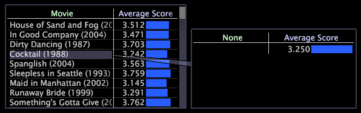
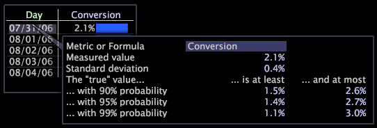

# Adding callouts to a workspace

Callouts are windows that you add to a workspace to bring attention to a particular dimension element by creating a new visualization with a virtual selection of that element.

 [!DNL Data workbench] is delivered with a standard set of callout types. Because your implementation can be fully customized, the available callout types that appear in your implementation may differ from what is documented in this guide.

By default, Data Workbench provides the following callouts:

* [Annotation](../../data-workbench-client/c-vis/c-call-wkspc.md#section_7B6742160B3F4AED872A09C8C023F90D) 
* [Blank Line Graph](../../data-workbench-client/c-vis/c-call-wkspc.md#section_5DCC0504BDB64ED4976F880E2F7B277F) 
* [Blank Scatter Plot](../../data-workbench-client/c-vis/c-call-wkspc.md#section_5DCC0504BDB64ED4976F880E2F7B277F) 
* [Blank Table](../../data-workbench-client/c-vis/c-call-wkspc.md#section_5DCC0504BDB64ED4976F880E2F7B277F) 
* [Confidence Legend](../../data-workbench-client/c-vis/c-call-wkspc.md#section_386D1293DDC24A0C9CCCB332E20DB791) 
* [Metric Legend](../../data-workbench-client/c-vis/c-call-wkspc.md#section_DAA6D372C22246D9827880A9D6E804D8)

>[!NOTE]
>
>Callouts do not function as selections (that is, they do not affect other visualizations within the workspace) unless you make a selection within the callout.

You can add or edit callout definitions by configuring the callout files stored in the *profile name*\Context\Callout folder of the [!DNL Server] installation folder. See [Configuring Callouts](../../data-workbench-client/c-intf-anlys-ftrs/c-config-callouts.md#concept_F6E91E172F5E4C009245C9C549BEB76A).

## To add an annotation callout to a visualization {#section_7B6742160B3F4AED872A09C8C023F90D}

1. Right-click the element for which you want to create a callout, then click **[!UICONTROL Add Callout]** > **[!UICONTROL Annotation]** > **[!UICONTROL Image]** or **[!UICONTROL Add Callout]** > **[!UICONTROL Annotation]** > **[!UICONTROL Text]**. A blank window displays with a visible connection to that element.

   

   To add callouts to Graph visualizations, you need to right-click at the bottom of the visualization (the base axis) to open a menu.

   

1. Depending on your selection, complete the appropriate step:

    * For a text annotation, type or paste the desired text into the callout, then format the text as appropriate. See [Working with Text Annotations](../../data-workbench-client/c-analysis-vis/c-annots/c-text-annots.md#concept_55B4AA3E0C58470B8E3C9D452E12A777). 
    * For an image annotation, paste the desired image into the callout by copying the image, then right-clicking within the callout. Click **[!UICONTROL Paste image]**. See [Working with Image Annotations](../../data-workbench-client/c-analysis-vis/c-annots/c-image-annots.md#concept_02081ED7D91C4FDCB8FC863F2A51C962).

## To add a blank table, line graph, or scatter plot callout to a visualization {#section_5DCC0504BDB64ED4976F880E2F7B277F}

1. Right-click the element for which you want to create a callout and click **[!UICONTROL Add Callout]** > *< **[!UICONTROL callout type]**>*.

   The following example shows a Blank Table callout.

   

1. To select a dimension, right-click **[!UICONTROL None]** and click **[!UICONTROL Change Dimension]** > *< **[!UICONTROL dimension name]**>*.

   >[!NOTE]
   >
   >If you change the dimension within a visualization that has a callout, the callout changes from being connected to the element of the original dimension to being connected to the entire visualization.

## To add a confidence legend callout to a visualization {#section_386D1293DDC24A0C9CCCB332E20DB791}

1. Right-click the element for which you want to create the callout and click **[!UICONTROL Add Callout]** > **[!UICONTROL Confidence Legend]**.

   

1. If desired, change the [!UICONTROL Metric or Formula] field.

For expression syntax rules, see [Query Language Syntax](../../data-workbench-client/c-qry-lang-syntx/c-qry-lang-syntx.md#concept_15D1D3F5164A47D49468C5ACB7299D9F). See [Confidence Legends](../../data-workbench-client/c-analysis-vis/c-legends/c-conf-leg.md#concept_73DB81C2C218427786C04068AA778EFD).

## To add a metric legend callout to a visualization {#section_DAA6D372C22246D9827880A9D6E804D8}

1. Right-click the element for which you want to create the callout and click **[!UICONTROL Add Callout]** > **[!UICONTROL Metric Legend]**.

   

1. If desired, add metrics to or remove metrics from the metric legend.

See [Metric Legends](../../data-workbench-client/c-analysis-vis/c-legends/c-metric-leg.md#concept_E7195BC8F7844AE295BDA3A88B028D5B). 
