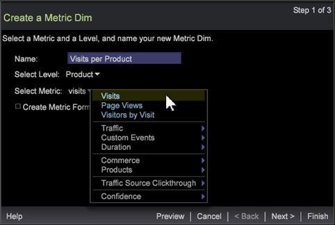
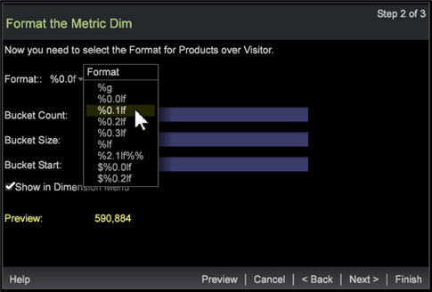
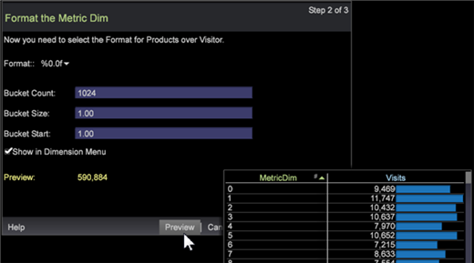

# Metric Dim Wizard

Use the Metric Dim wizard to create a new Metric Dimension.

A Metric Dim converts a metric into a new dimension. For example, a Metric Dim based on a metric of Page Views and level of Visitor will display dimension elements based on the total Page Views for each Visitor. It lets you extend a currently defined metric based on dimension elements to create and save as a new dimension.

## Step 1: select dimension and metric {#section_58B6EA7BBBA5487BA1A3C264AA3DCB95}

1. **Open the Metric Dim Wizard**.

   In a workspace, right-click and select **Tools** > **Create Metric Dim**. 

1. **Name the Metric Dim**.

   As a default, the Name field will auto-populate based on Level and Metric selections. 

1. **Select a Dimension Level.** The dimension level is the parent dimension containing all constituent element values to filter input and define a dimension type.

   Dimension levels include:

    * Clickthrough 
    * Hit 
    * Product 
    * Visit 
    * Visitor

1. **Select a Metric**.

   Select a pre-built metric to extend and save as a metric dim.

   

1. (optional) **Create a Metric Formula**.

   Click the box to enter a custom metric formula. The calculated Preview value will appear validating the expression.

   

   You can add your own [metric expression](https://marketing.adobe.com/resources/help/en_US/insight/client/?f=c_syntx_mtrc_exp) or cut and paste from another metric editor or visualization. Syntax errors, formula errors, undefined filters, and other errors are reported in the wizard. 

1. Click **Next**.

## Step 2: format and set buckets {#section_5BDDF3CD306545D7806A501637F80F77}

You can select the metric format and set the bucket values for a dimension expression.

1. Select a **Format** for the new metric dim.

   

   The format defines how the metric will be presented when opened in a visualization. These formats are selected [printf standards](https://www.cplusplus.com/reference/cstdio/printf/), defined below:

   ```
   %[flags][width][.precision][length][specifier]
   %
<b>0.2lf</b> = % _ [flags] 0 [width] .2 [.precision] l [length] f[ specifier]
   ```

   In the **Preview** field, a value will appear based on the metric and format selected. 

1. Add **Bucket Count** expression.

   You can define a metric dim with various ranges, or buckets. This returns subsets of elements based on size, such as [0-4], [5-10],...). Elements of the Dimension Level relate to the elements whose range contains the value of metric. See the bucket expression description at [Syntax for Dimension Expressions](https://marketing.adobe.com/resources/help/en_US/insight/client/?f=c_syntx_dim_exp). 

1. 

   The table details metric values per metric dim. 

1. Click **Show in Dimension Menu** to add the newly created dimension to the **Dimension** tab in the **Finder**. 
1. Click **Next**.

## Step 3: finish and save {#section_D9043235B18A425F9DE0DB668D4B1683}

1. Select to launch the Metric Dim Editor, graph visualization, or table after saving. 

   |  Field  | Description  |
   |---|---|
   |  Launch Metric Dim Editor  | Open the Metric Dim Editor.  |
   |  Launch Graph  | Launch a PNG graphic of the table.  |
   |  Launch Table  | Launch a table in the workspace with values in columns listing values of the new metric dim compared with values of the selected metric.  |

1. Click **Finish** and save.

   A save dialog will open allowing you to save the file. The selected options to view values will open in the workspace.

