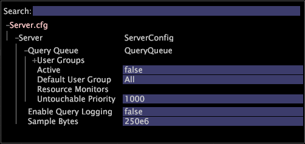

# Query Queue

Normally, the Data Workbench server answers incoming user queries as they are received, and continues to provide results and real-time updates until the user is no longer requesting them.

 At times, particularly on systems with many Data Workbench users, the number of active queries require more system resources than are available from the server. [!UICONTROL Query Queue] allows the server to place some queries temporarily on hold until the resources necessary to provide answers become available. The [!UICONTROL Query Queue] also provides features to prioritize queries based on a variety of parameters, so that in case of resource contention, higher-priority queries are answered first.

Queries from a single client or report server are placed in a bunch and scheduled as a unit. You can configure resource monitors to limit the amount of certain system resources that are used by queries. When the monitored resources permit the scheduling of another query bunch, the highest-priority bunch is scheduled. Users whose queries are not scheduled yet, due to resource limitations, do not receive an error but are notified that their queries are queued, and the user can continue to work on the local sample.

The default configuration includes a simple configuration for the [!UICONTROL Query Queue], but leaves it disabled. Administrators can enable or disable the [!UICONTROL Query Queue], configure resource monitors to determine how much of various resources are used for querying, and configure complex prioritization policies for different users.

**To configure the Server.cfg file for [!UICONTROL Query Queuing]**

1. Open [!DNL Server.cfg] by clicking **[!UICONTROL Admin]** > **[!UICONTROL Profile Manager]** > **[!UICONTROL Dataset]**. 
1. Right-click **[!UICONTROL Server.cfg]** and make it local for editing. 
1. Expand [!UICONTROL Query Queue].

   

1. Configure the following parameters:

    * **User Groups:** Lets you configure policies, users, and the queue priority. See [Query Queue User Groups](../../c-admin-intrf/c-query-que/c-query-que-user-grps.md#concept_5555F51402ED49419C067D61738474C1) for definitions. 
    
    * **Active:** (Vector) Enables or disables the [!UICONTROL Query Queue]. Valid values are true or false. The default setting is false. 
    
    * **Default User Group:** (String) Type a name of the user group to which users are added, if they are not listed in any user group. 
    * **Resource Monitors:** (Vector) Right-click to add a resource monitor. You can specify whether the [!UICONTROL Query Queue] monitors memory or the number of queries. Right-click **[!UICONTROL Resource Monitor]** to choose Memory Budget Monitor or Number of Queries Monitor. See [Query Queue Resource Monitors](../../c-admin-intrf/c-query-que/c-query-que-res-mon.md#concept_0840967B228C4D5BA3B59B4B2759F325) for more information. 
    
    * **Untouchable Priority:** (Int) Specifies that bunches with a priority greater than or equal to this value are never preempted to scheduling of higher priority bunches. Used in conjunction with the [!UICONTROL Memory Budget Monitor] described in the [User Group Parameters Table](../../c-admin-intrf/c-query-que/c-query-que-user-grps.md#concept_5555F51402ED49419C067D61738474C1).

