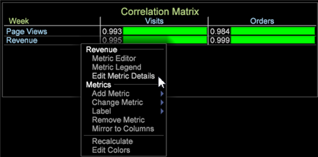
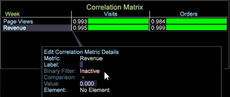
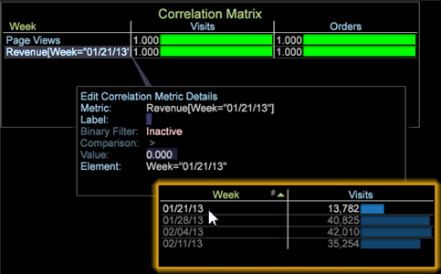

# Binary filter in the Correlation Matrix

A Binary Filter in the Correlation Matrix lets you constrain values for one or both of the correlated metrics to better focus the comparison.

**To set a binary filter on a Correlation Matrix**

1. From the Correlation Matrix, right-click a metric name. 
1. Select **Edit Metric Details**.

   

   The **[!UICONTROL Edit Correlation Metric Details]** window will open.

   

1. Set up a Binary Filter:

    1. Click the **[!UICONTROL Inactive]** setting. This toggles to let you set the filter as **[!UICONTROL Active]** and display the **[!UICONTROL Comparison]** and **[!UICONTROL Value]** fields. 
    1. Select a **[!UICONTROL Comparison]** operator and set its **[!UICONTROL Value]** to set up a filter for the selected metric.

>[!IMPORTANT]
>
>The Binary Filter for Data Workbench 6.2 has been updated with new features, requiring you to rebuild any correlation matrix with a binary filter built in previous versions.

## Add a dimension element {#section_F19F4E0368CA488E92D1E28BCC24417C}

You can also add a dimension element to constrain a metric. A metric can have only one element associated with it.

Right-click in the workspace and select **Table**. Open a dimension with its elements and drag to the **[!UICONTROL Element]** setting in the Edit Correlation Metric Details window, or drop on a metric in the Correlation Matrix. 
