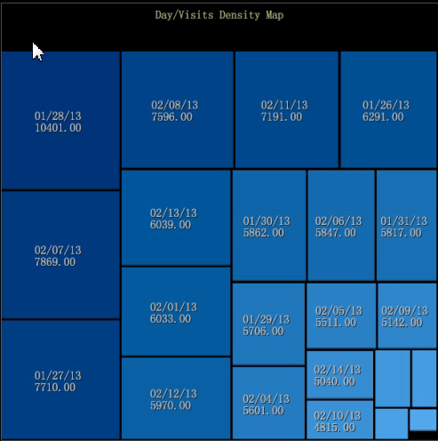
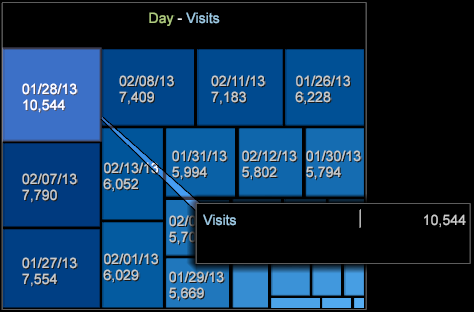
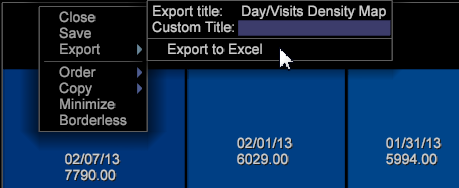

# Density map

The density map visualization displays elements as shaded rectangles within a square map.

The sizes of the rectangles are dependent on element values, where larger values are represented by rectangles of larger area. Similar to a pie chart, this visualization allows you to quickly see which elements constitute the greatest percentage of the selected dimension.

To create a density map:

1. Open a new workspace.

   After opening up a new workspace, you may need to click **Add** > **Temporarily Unlock**. 

1. Click **[!UICONTROL Visualization]** > **[!UICONTROL Density Map]**. 
1. Select a **[!UICONTROL Dimension]** from the menu.

   For example, select **[!UICONTROL Time]** > **[!UICONTROL Days]**.

   In contrast, selecting **[!UICONTROL Time]** > **[!UICONTROL Hours]** would give you more elements with smaller values displaying as smaller rectangles.

   >[!NOTE]
   >
   >You will want to pick a dimension with multiple elements per your needs. The current limit is 200 of the largest elements for each dimension.

1. You can change dimension views by opening **[!UICONTROL Visualization]** > **[!UICONTROL Table]** and selecting across elements from the table to display in the map.

   

   The map will respond to selections from the table. 

1. Hovering over small elements will display their name and value in text that appears near the mouse cursor. 
1. Mask elements by right-clicking and selecting **[!UICONTROL Mask]**, then choose an option.

   

   To display all masked nodes, select **[!UICONTROL Unhide All]**. 

1. Spotlight elements by right-clicking and selecting **[!UICONTROL Spotlight]**, then choose an option. Spotlighting lets you highlight and dim elements in a range. 
1. Add a color legend to the workspace. You can identify values in the map using the color legend.

   You can add a color legend to the workspace and the nodes will change color based on the additional dimension of data. 

1. Change the dimension or metric by right-clicking the map title and selecting from the menu.

   

1. Add callouts by right-clicking a cell and selecting **[!UICONTROL Add Callout]**. You can select from different types or visualizations from the menu.

   

1. As in all visualizations, you can right-click above the title bar for basic commands to Close, Save, Export to Microsoft Excel, Order, Copy, Minimize, and Borderless to display a visualization without a border.

   

1. The Density Map lets you select and deselect multiple elements similar to other visualizations:

* Left-click to select an element. 
* Ctrl + click to select multiple elements. 
* Shift + click to deselect an element. 
* Right-click within selected elements to open a menu. Then choose **[!UICONTROL Deselect]** or **[!UICONTROL Deselect All]** to clear selected elements.

## Additional Options {#section_D77DEFB012424DE4A7CED8E5C93115BC}

Right-click the Density Map to open a menu with these options:

<table id="table_3ADA85031C834792BFD041E186962A41"> 
 <thead> 
  <tr> 
   <th colname="col1" class="entry"> Option </th> 
   <th colname="col2" class="entry"> Description </th> 
  </tr>
 </thead>
 <tbody> 
  <tr> 
   <td colname="col1"> 
Add Callout 
 </td> 
   <td colname="col2" valign="top" align="left"> 
Add a text or graphic as a callout in the visualization to further identify or describe an element. 
 
You can also select a blank Metric Legend, Table, Line Graph, or Scatter Plot based on the selected element in the Density Map. You can then add metrics and dimensions to these blank visualizations as needed. 
 </td> 
  </tr> 
  <tr> 
   <td colname="col1"> 
Mask 
 </td> 
   <td colname="col2" valign="top" align="left"> 
Masking options let you hide selected elements. Right-click to display Mask options. 
 
 Hide This Element—Choose this option to mask a single element that you have selected. 
 
 Hide Selected—Choose this option to mask multiple elements that you have selected. 
 
 Show Top— Choose this option to display only the top 100, 50, 25, or 10 top elements based on the values in the Density Map. 
 
 Show Bottom—Choose this option to display only the bottom 100, 50, 25, or 10 top elements based on the values in the Density Map. 
 </td> 
  </tr> 
  <tr> 
   <td colname="col1"> 
Spotlight 
 </td> 
   <td colname="col2" valign="top" align="left"> 
Spotlighting lets you highlight and dim elements in a range. Right-click to open a menu of options. 
 
 Show Top— Choose this option to highlight only the top 100, 50, 25, or 10 top elements based on values in the Density Map. 
 
 Show Bottom—Choose this option to highlight only the bottom 100, 50, 25, or 10 top elements based on values in the Density Map. 
 </td> 
  </tr> 
  <tr> 
   <td colname="col1"> 
Deselect 
 
Deselect All 
 </td> 
   <td colname="col2" valign="top" align="left"> 
 Select these commands to deselect the current element, if selected, or deselect all elements that are selected. 
 </td> 
  </tr> 
 </tbody> 
</table>

