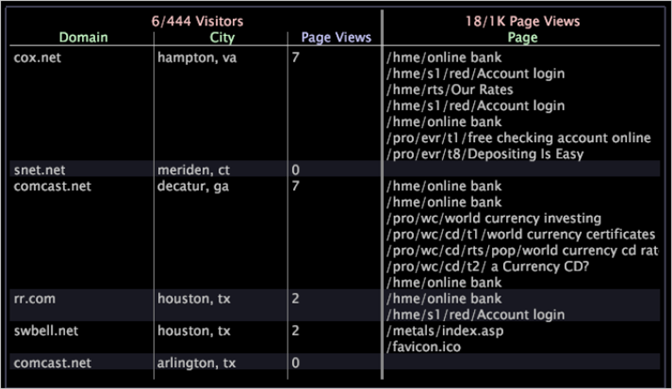
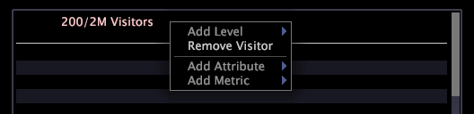

# Detail table

Detail tables enable you to view additional information about a subset of data, which is defined by the selections that you make in other visualizations.

 The additional information that you see is a sampling of all of the available data.

The following table describes the elements of a detail table.

<table id="table_C88C7F7F5AEA4820B908923E45CC0A62"> 
 <desc> 
  <b>Detail Table Elements </b> 
 </desc> 
 <thead> 
  <tr valign="top"> 
   <th colname="col1" class="entry"> Element </th> 
   <th colname="col02" class="entry"> Color </th> 
   <th colname="col2" class="entry"> Description </th> 
  </tr> 
 </thead>
 <tbody> 
  <tr valign="top"> 
   <td colname="col1"> 
Level 
 </td> 
   <td colname="col02"> 
Pink 
 </td> 
   <td colname="col2"> 
Any countable dimension for which you want to view detailed attribute and metric information. The level is preceded by the number of elements displayed out of the number of elements available, for example 6/444 indicates that 6 elements are being displayed out of a possible 444. In the example above, the level Visitors indicates that all of the detail provided is based on visitor. The level Page Views indicates that all of the detail provided is based on page view. Viewing multiple levels at the same time is useful when you want to analyze data that has different countable parents. 
 </td> 
  </tr> 
  <tr valign="top"> 
   <td colname="col1"> 
Attribute 
 </td> 
   <td colname="col02"> 
Green 
 </td> 
   <td colname="col2"> 
Any dimension that is one-to-many or one-to-one with the level, such as City to Visitors. Each row displays the element related to each element of the level you selected. In the example above, the Domain and City attributes list the domain and city for each of the sample visitors. 
 </td> 
  </tr> 
  <tr valign="top"> 
   <td colname="col1"> 
Metric 
 </td> 
   <td colname="col02"> 
Blue 
 </td> 
   <td colname="col2"> 
Metric detail about the level you have selected. In the example above, with the level set to Visitors, the metric Page Views displays the number of page views for an individual visitor, while the Page Views level provides the detail about each of those page views. 
 </td> 
  </tr> 
 </tbody> 
</table>

Let’s say you are working with website data and want to find out what pages visitors in particular cities and from particular domains visited during a particular time frame.

First you need to create a visualization that displays the time frame in which you are interested, then you need to select that time frame. Now you can add a detail table to view the desired details for a sample number of visitors in the dataset.

To view the details described above, you must complete the following steps:

1. Right-click within the details table and click **[!UICONTROL Add Level]** > **[!UICONTROL Visitor]**. 
1. Right-click within the details table and click **[!UICONTROL Add Level]** > **[!UICONTROL Page View]**. 
1. Right-click the **[!UICONTROL Visitors]** level heading and click **[!UICONTROL Add Attribute]** > **[!UICONTROL Geography]** > **[!UICONTROL Domain]**. 
1. Right-click within the Visitors level heading and click **[!UICONTROL Add Attribute]** > **[!UICONTROL Geography]** > **[!UICONTROL City]**. 
1. Right-click within the Visitors level heading and click **[!UICONTROL Add Metric]** > **[!UICONTROL Page Views]**. 
1. Right-click within the Page Views level heading and click **[!UICONTROL Add Attribute]** > **[!UICONTROL Page]** > **[!UICONTROL Page]**.

The following sample workspace shows you the related details for a random sampling of six visitors to the site during the time frame you specified.

## Add a level {#section_F948D3361FD84906AC4D9EBCE520BFD0}

* Right-click within the detail table and click **[!UICONTROL Add Level]** > *< **[!UICONTROL dimension name]**>*.

## Remove a level {#section_A8C820E0B656451E98E5EA75373EDEFC}

* Right-click the existing level heading and click **[!UICONTROL Remove Level]** > *< **[!UICONTROL dimension name]**>*.

## Add attributes and metrics {#section_CDDA2DF3C9A448D5B9770686C8B8EFB3}

* Right-click an attribute or metric heading and click **[!UICONTROL Add Attribute]** > *< **[!UICONTROL attribute name]**>* or **[!UICONTROL Add Metric]** > *< **[!UICONTROL metric name]**>*.

## Remove attributes and metrics {#section_4002AC957A2846678F9940270987D651}

* Right-click the column that you want to remove and click **[!UICONTROL Remove Attribute]** > *< **[!UICONTROL attribute name]**>* or **[!UICONTROL Remove Metric]** > *< **[!UICONTROL metric name]**>*.

## Export to Microsoft Excel {#section_A9EABA63C88A4598836A34669BA8CAC1}

For information about exporting windows, see [Exporting Window Data](../c-get-started/c-wk-win-wksp/c-exp-win-data.md#concept_8DF61D64ED434CC5A499023C44197349). 
