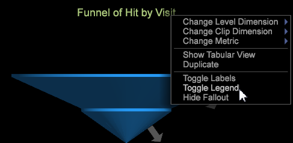

# Funnel features

The Funnel visualization includes features to build a funnel with multiple dimensions, raw visitor numbers, and a percentage of visitors at each step across three separate scopes.

Here are the basic features of the funnel visualization.

<table id="table_49A08740CEE74D64B6F9C37CD91F1AE5"> 
 <tbody> 
  <tr> 
   <td colname="col01"> 
 
 </td> 
   <td colname="col1"> 
First Element 
 </td> 
   <td colname="col2"> 
The first funnel step in the process starts on the Home page. The total number of visits (64,892) is displayed under the page name. 
 </td> 
  </tr> 
  <tr> 
   <td colname="col01"> 
 
 </td> 
   <td colname="col1"> 
Second Element 
 </td> 
   <td colname="col2"> 
The second funnel step identifies visits from the Home page to the Men's page. The number of "fall-through" visits to the second level (13,801) is displayed under the page name. 
 </td> 
  </tr> 
  <tr> 
   <td colname="col01"> 
 
 </td> 
   <td colname="col1"> 
Third Element 
 </td> 
   <td colname="col2"> 
The third funnel step identifies visits from the Men's page to the Men's Surfing page. The number of "fall-through" visits from the second to the third level (4,829) is displayed under the page name. 
 
 
Note:  The selected elements do not have to be from the same dimension. 
 
 </td> 
  </tr> 
  <tr> 
   <td colname="col01"> 
 
 </td> 
   <td colname="col1"> 
Fall-through Percentage 
 </td> 
   <td colname="col2"> Percentage who completed the defined path displayed in three scopes. </td> 
  </tr> 
  <tr> 
   <td colname="col01"> 
 
 </td> 
   <td colname="col1"> 
Fallout Browser 
 </td> 
   <td colname="col2">Fallout arrow. Right-click and select  Add Path Browser to see what other path visitors took. </td> 
  </tr> 
  <tr> 
   <td colname="col01"> 
 
 </td> 
   <td colname="col1"> 
Percent Fallout 
 </td> 
   <td colname="col2">Percentages that describe three scopes of fallout for users that did not complete the path. 
Percentages are presented in three scopes: 
 
 
 
 The percentage of fallout from the step previous to this step. 
 
 The percentage of fallout from the first step in the funnel. 
 
 The percentage of fallout based on the total number of visitors. 
 </td> 
  </tr> 
 </tbody> 
</table>

## Additional funnel features {#section_22A3582DB8114CA8BCE77F50BBBF296A}

After the funnel is created, you can right-click on the title to open a menu with additional options.

<table id="table_15291EC8A87D4F43BF68A62AB2E0776E"> 
 <thead> 
  <tr> 
   <th colname="col1" align="center" class="entry"> Menu Command </th> 
   <th colname="col2" align="center" class="entry"> Description </th> 
  </tr>
 </thead>
 <tbody> 
  <tr> 
   <td colname="col1"> 
Change Level Dimension 
 </td> 
   <td colname="col2"> 
After the funnel is created, you can right-click on the title to adjust the level to any countable dimension in your system. 
 </td> 
  </tr> 
  <tr> 
   <td colname="col1"> 
Change Clip Dimension 
 </td> 
   <td colname="col2"> 
After the funnel is created, you can right-click on the title to adjust the clip to any countable dimension in your system. 
 </td> 
  </tr> 
  <tr> 
   <td colname="col1"> 
Change Metric 
 </td> 
   <td colname="col2"> 
Change the metric for the visualization. 
 </td> 
  </tr> 
  <tr> 
   <td colname="col1"> 
Show Tabular View 
 </td> 
   <td colname="col2" align="left"> 
Toggle between  Show Graphical View of the funnel or  Show Tabular View, a table with numeric values identifying fallthrough and fallout values. 
 
 
 </td> 
  </tr> 
  <tr> 
   <td colname="col1"> 
Duplicate 
 </td> 
   <td colname="col2"> 
Select to duplicate the funnel visualization. This allows you to take an existing funnel visualization and copy it within the workspace to extend or change settings. 
 </td> 
  </tr> 
  <tr> 
   <td colname="col1"> 
Toggle Labels 
 </td> 
   <td colname="col2"> 
Toggle all labels on or off in the Funnel visualization. 
 
 The percentage of fallout from the step previous to this step. 
 
 The percentage of fallout from the first step in the funnel. 
 
 The percentage of fallout based on the total number of visitors. 
 </td> 
  </tr> 
  <tr> 
   <td colname="col1"> 
Toggle Legend 
 </td> 
   <td colname="col2"> 
Right-click the Funnel heading and select  Toggle Legend. A legend for fallout labels will toggle on and off in the lower-right corner of the workspace. 
 
 
 </td> 
  </tr> 
  <tr> 
   <td colname="col1"> 
Hide Fallout 
 </td> 
   <td colname="col2"> 
Hide the fallout labels (where visitors are identified as no longer engaged, or "fall out" of the path). 
 </td> 
  </tr> 
 </tbody> 
</table>

## Advanced funnel options {#section_DA6DA1B641A245299609F01F27EBE040}

Below are additional features to set up and view the funnel visualization:

* **Drag more elements**. Add more elements to your funnel by dragging and dropping them from the Dimension table to the funnel using the **Ctrl** + **Alt** keys. You can drag multiple steps at the same time from the Dimension table by selecting multiple items (using **Ctrl** + click) and then dragging them to the Funnel visualization using the **Ctrl** + **Alt** keys.. 

* **Delete a step**: Delete elements by right-clicking on the step in the visualization and clicking **Yes**.

  

* **Rearrange the steps you have dragged to the funnel**. Simply click the step to select it and drag it to another position to rearrange the steps. 
* **Open a Path Browser**. You can see more detail about where customers fall through or fall out of the process through the [Add a Path Browser](../../c-analysis-vis/c-funnel-visualization/c-path-browser-funnel.md#concept_B0CEDF7A28AE422696DED1258C9A4119) feature. 

* **Add more steps**. You can add a maximum of eight steps to each funnel visualization. 
* **Change the metric**. The metric can be changed so the steps are counting visits or some other metric at each step. Available options vary by dataset. 
* **Display in a tabular view**. Right-click the title to display the Funnel Visualization menu and click **[!UICONTROL Show Tabular View]**. Once in tabular view, you can select **[!UICONTROL Show Graph View]** to return to graphic representation of the funnel. To open the Tabular View, right-click on the title and select Show Tabular View from the menu. 

* **Compare sequences**. An efficient way to compare two similar sequences is to display their two visualizations side-by-side. You can also display both the tabular view and the graph view side-by-side using the Duplicate feature. To open, right-click on the title and select Duplicate from the menu.

