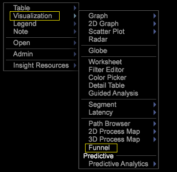
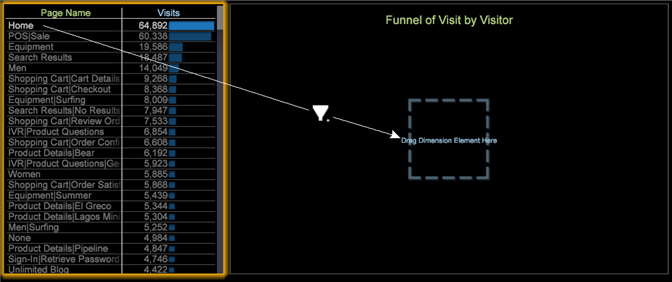

# Build a funnel

Follow these steps to build a new funnel visualization

1. From a new workspace, open a dimension table.

   

   For example, right-click on the workspace and select **[!UICONTROL Table > Site Content > Page Name]** 

1. Open a funnel visualization.

   Right-click on the workspace and select **[!UICONTROL Visualization > Funnel]**.

   

1. Add a dimension by selecting the element, then drag while holding **[!UICONTROL Ctrl]** + **[!UICONTROL Alt]**. 
1. Drag the element into position over the target zone, **[!UICONTROL Drag Dimension Element Here]**.

   

1. Add additional dimensions.

   You can add up to a total of eight steps to your funnel. 

1. Release the table selection you made to view your funnel based on a total audience.

   Funnel visualizations follow the pattern of all other visualizations, allowing the selected element to control the segment of data that you are visualizing. 

1. Modify the Funnel clip dimension, level dimension, and metric.

   Right-click on the title to adjust these options based on the metrics and dimensions defined in your custom profile.

   

From the Funnel, you can identify your fall out and fall through rates and the percentage of customers converting sales and following campaigns or content paths. For additional information, you can open a [Path Browser](../../c-analysis-vis/c-funnel-visualization/c-path-browser-funnel.md#concept_B0CEDF7A28AE422696DED1258C9A4119) to see a detailed list of the pages taken before arriving at the selected page, and the paths taken after they left.

See additional [Funnel features](../../c-analysis-vis/c-funnel-visualization/c-funnel-visualization-features.md#concept_E65C81FE17794ACD8D00D796B1780DC3). 
