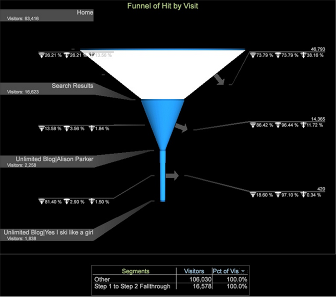

# Funnel

The Funnel visualization lets you identify where customers abandon a marketing campaign or divert from a defined conversion path while interacting with your website or cross-channel campaign.

The funnel visualization identifies converting page views to purchases, and lets you see where customers fall out of the process. Gaining visibility into customer decisions at each step lets you understand where they are being deterred, what path they tend to follow, when customers leave your site and where they go.

Proper understanding of customer navigation allows architects to design and target web pages based on trended interest, and lets marketers better interpret customer interactions for specified campaigns.

## About the Funnel {#section_BF0EE36BB8CE47EC910CA23629E7C53A}

The Funnel visualization is much like the Path Browser in building a path to analyze your visitor's sequence of hits, to identify who is falling out (who left the path), or who is falling through (who followed the path). It also identifies where visitors go after each step along the campaign path, and where they navigate to after falling out or falling through the defined steps.

In addition to web data, you can perform funnel analysis across all types of cross-channel data supported by the platform. Any data element from any source can be represented in the Funnel visualization.

>[!NOTE]
>
>In the Funnel visualization, you can apply any dimension at the countable level. This is in contrast to the Path Browser and Process Maps that restrict your choice of metrics. Analysts have multiple choices when applying a metric in the Funnel visualization.

The Funnel visualization provides various levels of data:

* **[!UICONTROL Funnel by Visit]**. This funnel is based on a "per visit" interaction. 
* **[!UICONTROL Funnel by Visitor]**. This funnel is based on a "per visitor" interaction. This view shows the data based on the visit organized by visitor. 
* The **Clip** dimension and **Level** dimension. Funnel dimensions can be modified by choosing Clickthrough, Hit, Product, Visit or Visitor Level dimensions. 

* **Metrics**. You can change the underlying Funnel metrics from Visits used to build the funnel to any metric in your profile. The Funnel visualization allows you to drill into you data and analyze the patterns of visitors with multiple baseline metrics.

>[!NOTE]
>
>For example, the Funnel visualization below is showing the count of non-unique visitors who fell through the first step by Visit. The Segment is showing unique Visitors who fell through. The difference is the Visitors who had more than one visit also fell through the funnel.

