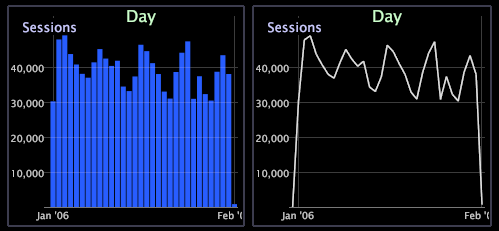

# Change a graph display

By default, graph visualizations display bars, but you can easily display the bars as lines and vice versa.

 Both display types are shown in the following example.

**To select the display type**

Right-click the dimension label at the bottom of the graph and click **[!UICONTROL Display]** > **[!UICONTROL Draw lines]** or **[!UICONTROL Display]** > **[!UICONTROL Draw bars]**. An X appears to the left of the active display mode.

**Gradient Overlay on a Graph**

You can right-click and select a **Gradient Overlay** from the menu to better view graph elements.

* **No Gradient Overlay**. Select to show bars without gradient overlay applied. 
* **Background from Left**. Select to show gradation of colors across all bars from left to right. 
* **Background from Right**. Select to show gradation of colors across all bars from right to left. 
* **Cylinder**. Select to show gradation of colors from the center of each bar to the edge of each bar.

