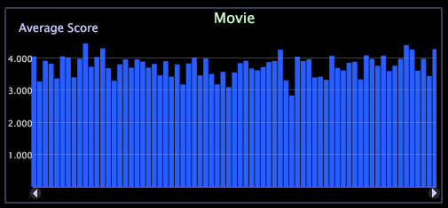

# Graphs

A graph can display one or more metrics across one or two dimensions of data.

 Graphs are very powerful visualizations, and learning to use them enables you to answer a large variety of questions.

Graphs lets you easily see trends in business metrics over continuous data because you can select a subset of a dimension over which the metrics are graphed (such as a specific time frame) and zoom in to look at the data for that period in greater detail. For instructions to zoom in a graph or table, see [Zooming in Visualizations](../../c-vis/c-zoom-vis.md#concept_7E33670BB5344F78A316F1A84CC20530).

In the following example, you see a bar graph in which the number of sessions associated with each day is depicted by the length of the bar. When you move the mouse pointer over the bar for a particular day, the numerical value represented by the bar displays.

**Gradient Overlay on a Graph**

You can right-click and select a **Gradient Overlay** from the menu to better view graph elements.

* **No Gradient Overlay** (default). Select to show bars without gradient overlay applied. 
* **Background from Left**. Select to show gradation of colors across all bars from left to right. 
* **Background from Right**. Select to show gradation of colors across all bars from right to left. 
* **Cylinder**. Select to show gradation of colors from the center of each bar to the edge of each bar.

**Adding Callouts to a Graph**

You can also add callouts to linear graphs. See [Adding Callouts to a Workspace](../../c-vis/c-call-wkspc.md#concept_212B09E763044D938987B4A9C658ADC0).

To add a callout to Graph visualizations, you need to right-click at the bottom of the visualization (the base axis) to open a menu and select **Add Callout**.

