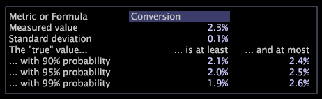

# Confidence legends

Confidence legends help you to determine the likelihood that the numbers you are seeing are due to chance and to understand the possible deviations in the data.

 Even if you are not sampling data, you cannot extrapolate the numbers from a specific time period or subset to other time periods or subsets with full confidence. The confidence legend lets you explore the probability that the numbers fall within a particular range.

If you think of real world data as being a big experiment, the real world still involves chance, even when working with exact numbers. For example, knowing the number of people who completed a transaction between 8 AM and 12 PM on one Tuesday does not mean that the exact same number will do so on the following Tuesday.

The following confidence legend displays confidence details about the Conversion metric, while the following table provides more information about what each data point means.

<table id="table_387F22C7EF4E4DE9AD810D3D9204676F"> 
 <desc> 
  <b>Confidence Legend Fields </b> 
 </desc> 
 <thead> 
  <tr valign="top"> 
   <th colname="col1" class="entry"> Field </th> 
   <th colname="col2" class="entry"> Description </th> 
  </tr> 
 </thead>
 <tbody> 
  <tr valign="top"> 
   <td colname="col1"> 
Metric or Formula 
 </td> 
   <td colname="col2"> 
The metric name or metric expression for which you want to view confidence information. Any selections that you make in your workspace are reflected in the legend. This example displays details about the Conversion metric. 
 
For information about syntax rules for entering an expression, see <a href="../../c-qry-lang-syntx/c-qry-lang-syntx.md#concept_15D1D3F5164A47D49468C5ACB7299D9F" format="dita" scope="local"> Query Language Syntax</a>. 
 </td> 
  </tr> 
  <tr valign="top"> 
   <td colname="col1"> 
Measured value 
 </td> 
   <td colname="col2"> 
The value of the actual data collected. In this example, the conversion rate for the current selection is 2.3%. 
 </td> 
  </tr> 
  <tr valign="top"> 
   <td colname="col1"> 
Standard deviation 
 </td> 
   <td colname="col2"> 
The standard deviation of the Measured Value. In this example, the standard deviation of the conversion rate for the current selection is 0.1%. 
 </td> 
  </tr> 
  <tr valign="top"> 
   <td colname="col1"> 
The “true” value 
 </td> 
   <td colname="col2"> 
The likelihood that the Measured Value falls within the range listed for each probability. In this example, if this “real-world experiment” were repeated again and again, you could be 90% sure that the Measured Value would be between 2.1% and 2.4%. 
 </td> 
  </tr> 
 </tbody> 
</table>

>[!NOTE]
>
>When analyzing the results of any calculations, you must take into account the following caveats: >
>* The numbers are estimates. If you repeated the same calculations with a different dataset you would get a different result. This is known as random variation. 
>* Extrapolations to higher probabilities depend on an assumption of normality that is not correct for all metrics. Therefore, the values for 99% probability are less reliable than the values for 90% probability. 
>
>If you need more exact numbers, you should consult an expert in statistics.

## Change metrics or formulas {#section_7F09FF84C3514F26B78D29294E1F03D9}

* In the confidence legend, click in the **[!UICONTROL Metric or Formula]** field and type the desired metric or expression. For expression syntax rules, see [Query Language Syntax](../../c-qry-lang-syntx/c-qry-lang-syntx.md#concept_15D1D3F5164A47D49468C5ACB7299D9F).

## Export to Microsoft Excel {#section_F36E2DB7273740B7AF278F8A2B79D564}

For information about exporting windows, see [Exporting Window Data](../../c-get-started/c-wk-win-wksp/c-exp-win-data.md#concept_8DF61D64ED434CC5A499023C44197349). 
