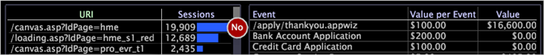
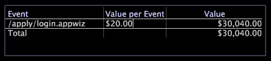
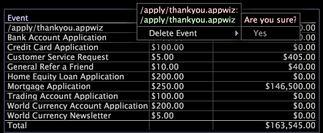

# Value legends

A value legend displays defined value events.

The value legend is configured only in the HBX and [!UICONTROL Site] applications, but they can be configured for other applications. For more information, contact Adobe Consulting Services.

In HBX and [!UICONTROL Site], a value event is defined as a session that generated business value. For example, the event data records associated with particular page views (for example, an order thank-you page or an application completion page) might represent value events to a business organization.

With value events, you can measure and track the amount of value generated by the website. You can assess business value in dollars for each event and answer such questions as:

* What is the most profitable path through the website? 
* What referrer or campaign has generated the most value?

For each event, the legend displays the event’s unit value (value per event) and the total value generated by the event. You use the legend to define and change value events and to assign unit values to them.

The following table lists the metrics related to value events.

|  Metric  | Description  |
|---|---|
|  Conversion  | The percentage of sessions that generated business value  |
|  Value  | The total business value generated, in dollars  |
|  Avg. Value  | The average business value generated, in dollars, per session  |

You easily can define anything that visitors do in the website as a value event: posting a customer service request, completing an application, viewing a piece of content, or completing a purchase. Each value event corresponds to a user accessing a particular page or set of pages on the website, and is associated with a business value in dollars. For example, you might assume that every user reaching the “Thank you for purchasing” page generates a contribution margin of $20 on average. You would define a value event for that page that has a value of $20.

## Define new value events {#section_2EA4D168336E4D2E98B22B636ED43853}

**To define a new value event in HBX or [!UICONTROL Site]**

When you create a value event, you drag website pages that represent value from a visualization to a value legend.

1. Open a value legend.

   

1. Add value events to the legend from process maps, URI page tables, or page hierarchy views:

    * From a process map, drag nodes from the process map to the legend. 
    * From a URI page table, press Ctrl+Alt and drag a page from the table to the legend. 
    * From a page hierarchy view, click to the left of a node (folder, page, or group) and drag the it onto the legend.

   

   Your mouse pointer displays the word "No" until your mouse reaches the legend. 

1. In the value legend, assign a business value to each session for which the event occurs:

    1. In the [!UICONTROL Value per Event] column, click the cell that corresponds to the page you have added as a value event. 
    1. Type the dollar amount to assign for the value of that event and press Enter.

   

   By default, the URL of the page you defined as a value event appears in the value legend. If desired, you can double-click this URL in the legend to enter edit mode and rename the event. You also can edit the value of a particular event at any time. The Data Workbench server automatically recalculates value event-based metrics such as average value and conversion.

After you have defined at least one value event, the Value Segment dimension becomes available for use. This dimension represents the total value that a visitor has generated in all sessions.

## Remove value events {#section_25CD90A859384CA183C0FC0998F888CF}

* Right-click the desired event and click **[!UICONTROL Delete Event]**.

  

>[!NOTE]
>
>The Data Workbench server calculates metrics across the entire set of data accessible to the profile you are using. By default, the [!DNL Data Workbench Server] calculates such metrics as Value, Value Events, Average Value, and Conversion across all data in the analysis dataset, even if the data is not from the same logical source.

## Export to Microsoft Excel {#section_FEAA7A8EB8124FAFBC74169BEBAED6D8}

For information about exporting windows, see [Exporting Window Data](../../c-get-started/c-wk-win-wksp/c-exp-win-data.md#concept_8DF61D64ED434CC5A499023C44197349). 
