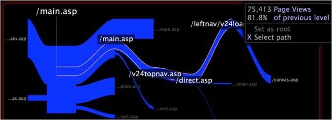

# Select a path

You can select a path within a path browser to create filters that include data associated with the elements in the path.

 When you select a path of base dimension elements within a path browser, you are selecting data for the corresponding elements of the level dimension.

For example, suppose that you have created a path browser showing pages of a website. Each page is an element of the Page dimension, and the level dimension for Page is Page View. When you select a path of pages in a path browser, you are selecting data for the page views associated with those pages.

>[!NOTE]
>
>You can change the default level dimension for a path browser. For instructions to configure a path browser, see [Configuring Path Browsers](../../c-intf-anlys-ftrs/t-config-path-brwsr.md#task_BBB3DDAA140A414F984B697C2B8202A3).

1. Click an element in the path browser to extend the displayed path to the left or right of the root.
1. Right-click the desired element and click **[!UICONTROL Select path]**. The selected path is outlined in white.

   >[!NOTE]
   >
   >You cannot select a start or end node.

1. Repeat Step 1 for each element that you wish to add to the path.

   For example, if you are working with website data, you could select a path of pages on your website.

   

   This path constitutes a selection, and all other open visualizations in the workspace (including legends) update to display data associated with the path created by the selected elements. See [Making Selections in Visualizations](../../c-vis/c-sel-vis/c-sel-vis.md#concept_012870EC22C7476E9AFBF3B8B2515746). 

