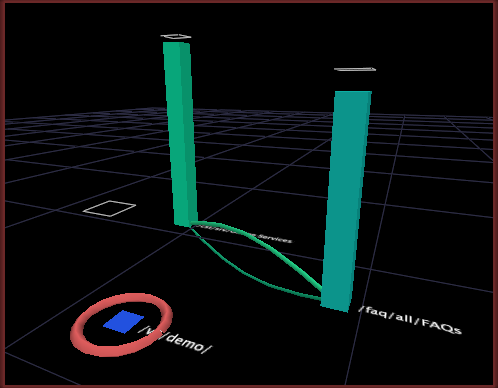

# Make a selection from a process map

You can make selections within process maps to create filters that include or exclude data associated with a particular node.

 Making a selection within a process map involves the map’s group dimension, which determines how the elements of the base dimension (that is, the nodes in your map) are grouped to form the connections between nodes.

>[!NOTE]
>
>You can change the default group dimension for a process map. See [Configuring Process Maps](../../c-intf-anlys-ftrs/t-config-proc-maps.md#task_4A95730B18A14BC790A77C013832B2D6).

When you make a selection based on a node within a process map, you are selecting all of the elements of the group dimension that involved that node. To better understand the role of the group dimension, consider the following examples:

* Movies can be grouped by the viewers who rated them. Each viewer is an element of the User dimension, so the User dimension would be the group dimension for the process map. When you make a selection from a node for a particular movie, you create a filter that shows data for the users that did or did not rate that movie. 
* Website pages can be grouped by the sessions in which they were viewed. Each session is an element of the Session dimension, so the Session dimension would be the group dimension for the process map. When you make a selection from a node for a particular page, you create a filter that shows data for the sessions during which that page was or was not viewed.

**To make a selection**

1. Right-click any node in a process map. 
1. Click one of the following options to make a selection based on the node:

    * **[!UICONTROL Select]*** **[!UICONTROL group dimension name +s]*** **[!UICONTROL through node name]**: Filters the data to include all elements of the group dimension that passed through the node by filtering out all sessions that did not pass through the node. 
    
    * **[!UICONTROL Select]*** **[!UICONTROL group dimension name +s]*** **[!UICONTROL NOT through node name]**: Filters the data to include all elements of the group dimension that did not pass through the node by filtering out all sessions that passed through the node.

When you make a selection in a 3D process map, the node for which the selection is made is circled. Benchmarks appear around each bar help you compare metric values with and without the selection. See [Understanding Benchmarks](../../c-vis/c-ustd-benchmks.md#concept_C7B0F4102E92458096F8C4765CBE2914).

