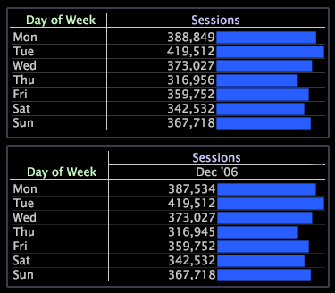

# Add, change, and move a dimension

You can add multiple dimensions to a table to attain a more detailed cross-tabulation of the data.

 You can add dimensions to either axis of the table.

**To add a new dimension**

* Right-click an element or the label of any dimension or the label of any metric and click **[!UICONTROL Add Dimension]** > *< **[!UICONTROL dimension name]**>.* The dimension is added to the visualization on the chosen axis.

The following example shows the Sessions metric graphed over the Day of Week dimension (in the top table) and the same table with a second dimension, This Month, added to the top axis (in the bottom table).

**To change a dimension**

* Right-click an element or the label of the dimension you want to change and click **[!UICONTROL Change Dimension]** > *< **[!UICONTROL dimension name]**>*.

**To move a dimension to another location**

You can move a dimension to a different position on the same axis or to the opposing axis.

* Right-click an element or the label of the dimension that you want to move, click **[!UICONTROL Move]***< **[!UICONTROL dimension name]**>*, then complete the appropriate step:

    * To move a dimension to the opposing axis, click to top axis or to left axis. 
    * To swap locations with another dimension on the same axis, click **[!UICONTROL (move here)]**.

